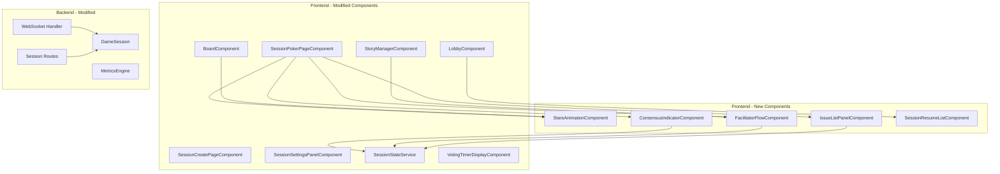
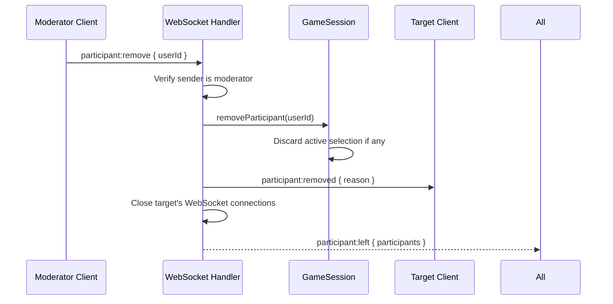
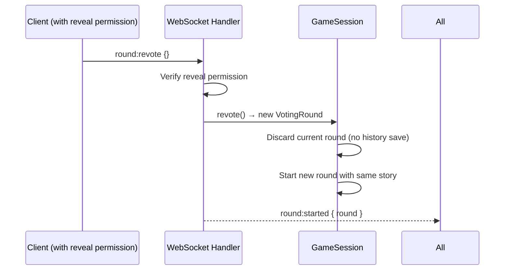
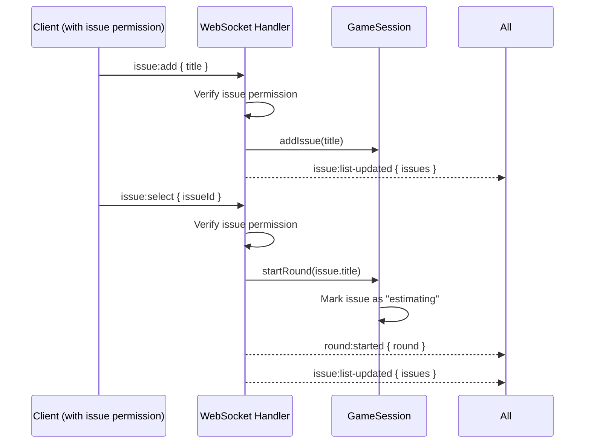

# Design Document: Multi-Session Improvements (Phase 1)

## Overview

This document describes the technical design for a set of improvements and new features to the existing Scrum Poker multi-session application. The improvements span moderator controls, session integrity, UX enhancements, workflow features, and reliability fixes.

The design extends the existing architecture established in the multi-team-sessions spec. The core patterns remain: `SessionRegistry` → `GameSession` class on the backend, Angular signals + standalone components on the frontend, session-scoped WebSocket routing, and shared types in `shared/types.ts`.

### Key Design Decisions

1. **Moderator user removal via WebSocket event**: The `participant:remove` event is handled server-side to disconnect the target user and broadcast the updated participant list. This keeps the removal atomic and consistent with existing participant management.

2. **Duplicate display name validation at connection time**: The WebSocket handler checks name uniqueness after token validation but before adding the participant. This prevents race conditions and keeps the validation server-authoritative.

3. **Timer stops on reveal event processing**: The `VotingTimerDisplayComponent` already uses `revealedAt` to freeze the display. The server computes `votingDurationMs` authoritatively. No client-side timer logic changes needed — the existing design handles this correctly.

4. **Stars animation as a pure CSS/canvas overlay**: A lightweight `StarsAnimationComponent` triggers on `cards:revealed` and auto-removes after 3 seconds. Respects `prefers-reduced-motion`.

5. **Issue list as session-level state**: The `GameSession` class gains an `issueList` array that persists for the session lifetime and is included in `session:state` on reconnect. This keeps the issue list synchronized across all participants.

6. **Re-vote reuses the same story description**: Triggering a re-vote calls `startRound` with the current story description without saving the previous round to history. This is a new `revote` action distinct from `board:clear`.

7. **Consensus indicator computed from existing metrics**: The `VotingMetrics` already contains `spread` and `distribution`. The consensus level is derived client-side from these values — no new server computation needed.

8. **Facilitator flow as a computed state machine**: The flow state (idle → voting → revealed → discuss) is derived from existing signals (`currentRound`, `isRevealed`). No new backend state needed.

9. **Session history resume via REST endpoint**: A new `GET /api/sessions/mine` endpoint returns sessions owned by the authenticated user that haven't been cleaned up. The frontend displays these in the lobby.

10. **Advanced settings grouping is UI-only**: The collapsible "Advanced" section is a presentation concern in `SessionCreatePageComponent` and `SessionSettingsPanelComponent`. No backend changes needed.

11. **WebSocket reconnection state restoration already works**: The existing `session:state` event on reconnect sends full state. The design validates this covers all new state (issue list, timer position).

## Architecture

### Extended Component Architecture



### Request Flow: Moderator User Removal



### Request Flow: Re-Vote



### Request Flow: Issue List Management



## Components and Interfaces

### Backend Components

#### GameSession (`services/game-session.ts`) — MODIFIED

New methods and state:

```typescript
class GameSession {
  // Existing methods unchanged...

  // NEW: Issue list management
  private issueList: IssueItem[] = [];

  addIssue(title: string): IssueItem;
  addIssues(titles: string[]): IssueItem[];
  removeIssue(issueId: string): void;
  reorderIssues(orderedIds: string[]): void;
  getIssueList(): IssueItem[];
  markIssueEstimated(issueId: string, historyEntryId: string): void;
  selectIssueForEstimation(issueId: string): VotingRound;

  // NEW: Re-vote (start new round with same story, discard current)
  revote(): VotingRound;

  // NEW: Moderator removal (removes participant + discards their selection)
  removeParticipantByModerator(userId: string): void;

  // NEW: Display name uniqueness check
  hasDisplayName(displayName: string): boolean;

  // MODIFIED: getSessionState() now includes issueList
  getSessionState(): GameSessionState;
}
```

#### WebSocket Handler (`websocket/handler.ts`) — MODIFIED

New event handlers:

```typescript
// New client → server events handled:
// 'participant:remove' — moderator removes a participant
// 'round:revote' — re-vote on current story
// 'issue:add' — add issue(s) to the list
// 'issue:remove' — remove an issue
// 'issue:reorder' — reorder the issue list
// 'issue:select' — select an issue to estimate

// New server → client events:
// 'participant:removed' — sent to the removed user before disconnect
// 'issue:list-updated' — broadcast when issue list changes

// MODIFIED: Connection validation now checks display name uniqueness
function handleWebSocket(ws: WebSocket, request: IncomingMessage): void {
  // ... existing auth + session validation ...
  // NEW: Check display name uniqueness (case-insensitive)
  if (session.hasDisplayName(participant.displayName)) {
    ws.close(4009, 'Display name already in use in this session');
    return;
  }
  // ... rest of connection setup ...
}
```

#### Session Routes (`routes/sessions.ts`) — MODIFIED

New endpoint:

```typescript
// GET /api/sessions/mine — Get sessions owned by the authenticated user
// Response: { sessions: SessionSummary[] }
// Auth: Required
// Returns sessions that haven't been cleaned up, ordered by lastActivityAt desc

interface SessionSummary {
  sessionId: string;
  createdAt: string;
  lastActivityAt: string;
  completedRounds: number;
  participantCount: number;
  config: SessionConfiguration;
}
```

#### SessionRegistry (`services/session-registry.ts`) — MODIFIED

New method:

```typescript
class SessionRegistry {
  // NEW: Get all sessions owned by a specific user
  getSessionsByOwner(ownerId: string): GameSession[];
}
```

### Frontend Components

#### StarsAnimationComponent — NEW

- Triggered when `isRevealed` transitions from `false` to `true`
- Renders a canvas-based particle animation (stars/confetti) overlaying the board
- Duration: 3 seconds, then fades out
- Does not block pointer events (uses `pointer-events: none`)
- Respects `prefers-reduced-motion`: skips entirely
- No frame drops below 30fps: uses `requestAnimationFrame` with particle count capped at 50

```typescript
@Component({
  selector: 'app-stars-animation',
  standalone: true,
  template: `<canvas #canvas class="stars-canvas" aria-hidden="true"></canvas>`,
})
export class StarsAnimationComponent {
  readonly active = input<boolean>(false);
  // Triggers animation when active becomes true
  // Auto-cleans up after 3 seconds
}
```

#### ConsensusIndicatorComponent — NEW

- Displays consensus level after card reveal
- Three states: "Full Agreement" (green ✓), "Partial Agreement" (yellow ~), "High Divergence" (red ⚠)
- Logic:
  - Full Agreement: all numeric voters selected the same value (spread === 0 with ≥2 numeric votes)
  - High Divergence: spread > 5 (numeric) or position difference > 2 (non-numeric)
  - Partial Agreement: everything in between
- Input: `metrics: VotingMetrics | null`, `votingSystem: VotingSystemType`
- Accessible: uses `role="status"` with descriptive text

```typescript
// Pure function for testability
export type ConsensusLevel = 'full' | 'partial' | 'high-divergence' | 'none';

export function computeConsensusLevel(
  metrics: VotingMetrics | null,
  votingSystem: VotingSystemType
): ConsensusLevel {
  if (!metrics || metrics.insufficientData) return 'none';
  if (metrics.spread === 0) return 'full';
  if (votingSystem === 't-shirt') {
    // For t-shirt: use distribution to check position spread
    const positions = getPositionSpread(metrics.distribution, votingSystem);
    return positions > 2 ? 'high-divergence' : 'partial';
  }
  // For numeric systems: spread > 5 is high divergence
  if (metrics.spread !== null && metrics.spread > 5) return 'high-divergence';
  return 'partial';
}
```

#### FacilitatorFlowComponent — NEW

- Displays contextual prompts and actions for the moderator based on session state
- States derived from signals:
  - **Idle** (no round): "Select or enter the next story"
  - **Voting** (round active, not revealed): Shows vote count, "Reveal Cards" button
  - **Revealed** (round revealed): Shows "Re-Vote", "Clear & Next Story" buttons
- Shows progress indicator: `{estimated} / {total}` stories from issue list
- Only visible to moderators (or users with reveal permission for the reveal button)

```typescript
@Component({
  selector: 'app-facilitator-flow',
  standalone: true,
})
export class FacilitatorFlowComponent {
  // Computed flow state from SessionStateService signals
  readonly flowState = computed<'idle' | 'voting' | 'revealed'>(() => { ... });
  readonly progress = computed<{ estimated: number; total: number }>(() => { ... });
}
```

#### IssueListPanelComponent — NEW

- Sidebar panel (collapsible on mobile) displaying the session's issue list
- Features:
  - Add single issue via text input
  - Bulk import via textarea (newline-separated)
  - Drag-and-drop reorder (using CDK DragDrop or native HTML5 drag)
  - Visual distinction: estimated issues show a checkmark and are grayed out
  - Click to select an issue for estimation (starts a new round)
- Permission-gated: only users with issue permission can add/reorder/select
- All participants can view the list

```typescript
@Component({
  selector: 'app-issue-list-panel',
  standalone: true,
  imports: [CommonModule, FormsModule, CdkDragDrop],
})
export class IssueListPanelComponent {
  readonly issues = computed(() => this.sessionState.issueList());
  readonly canManage = computed(() => this.sessionState.hasIssuePermission());
}
```

#### SessionResumeListComponent — NEW

- Displayed in the lobby below the "Start New Game" / "Join Session" cards
- Shows a list of the user's previously created sessions
- Each entry shows: session ID, creation date, completed rounds count, last activity
- Click navigates to `/session/{sessionId}`
- Handles expired sessions gracefully (shows "Session expired" if the API returns 404)

```typescript
@Component({
  selector: 'app-session-resume-list',
  standalone: true,
})
export class SessionResumeListComponent implements OnInit {
  readonly sessions = signal<SessionSummary[]>([]);
  // Fetches GET /api/sessions/mine on init
}
```

#### SessionCreatePageComponent — MODIFIED

- Groups reveal permission, issue permission, auto-reveal, and countdown into a collapsible "Advanced Settings" section
- Advanced section is collapsed by default
- Toggle button has `aria-expanded` attribute
- Primary visible fields: voting system selection only (story description is entered during the session)

#### SessionSettingsPanelComponent — MODIFIED

- Same advanced settings grouping as the create page
- Auto-reveal toggle shows a visual indicator (badge) when enabled
- Adds the auto-reveal status indicator near the voting area

#### StoryManagerComponent — MODIFIED

- Adds "Re-Vote" button (visible when cards are revealed, for users with reveal permission)
- Re-vote sends `round:revote` WebSocket event
- "Clear & Next Story" replaces the current "Clear Board" button label in the facilitator flow context

#### SessionStateService — MODIFIED

- New signals:
  - `_issueList = signal<IssueItem[]>([])`
  - `issueList: Signal<IssueItem[]>`
- New event subscriptions:
  - `issue:list-updated` → updates `_issueList`
  - `participant:removed` → shows toast notification to removed user
- Modified `session:state` handler to restore `issueList` from state

#### LobbyComponent — MODIFIED

- Adds `SessionResumeListComponent` below the existing cards
- Shows "Your Previous Sessions" section when the user has sessions to resume

#### BoardComponent — MODIFIED

- Integrates `StarsAnimationComponent` triggered on reveal
- Only triggers when `isRevealed` transitions from false to true (not on reconnect to an already-revealed state)

#### VotingTimerDisplayComponent — NO CHANGES NEEDED

- The existing implementation already stops on reveal (uses `revealedAt` input)
- The server-computed `votingDurationMs` is authoritative
- Timer uses UTC timestamps for cross-timezone accuracy

### Updated WebSocket Event Protocol

**New Client → Server Events:**

| Event | Data | Permission | Description |
|-------|------|-----------|-------------|
| `participant:remove` | `{ userId: string }` | Moderator only | Remove a participant from the session |
| `round:revote` | `{}` | Reveal permission | Re-vote on the current revealed story |
| `issue:add` | `{ titles: string[] }` | Issue permission | Add one or more issues to the list |
| `issue:remove` | `{ issueId: string }` | Issue permission | Remove an issue from the list |
| `issue:reorder` | `{ orderedIds: string[] }` | Issue permission | Reorder the issue list |
| `issue:select` | `{ issueId: string }` | Issue permission | Select an issue to start estimation |

**New Server → Client Events:**

| Event | Data | Description |
|-------|------|-------------|
| `participant:removed` | `{ reason: string }` | Sent to the removed user before disconnect |
| `issue:list-updated` | `{ issues: IssueItem[] }` | Broadcast when issue list changes |

**Modified Server → Client Events:**

| Event | Change | Description |
|-------|--------|-------------|
| `session:state` | Now includes `issueList: IssueItem[]` | Full state sync includes issue list |
| `cards:revealed` | Now includes `votingDurationMs: number` | Includes authoritative voting duration |

### Updated REST API Endpoints

| Method | Path | Auth | Description |
|--------|------|------|-------------|
| GET | `/api/sessions/mine` | Required | Get sessions owned by authenticated user |

**GET /api/sessions/mine Response:**
```json
{
  "sessions": [
    {
      "sessionId": "abc12345",
      "createdAt": "2024-01-15T10:00:00Z",
      "lastActivityAt": "2024-01-15T11:30:00Z",
      "completedRounds": 5,
      "participantCount": 0,
      "config": { ... }
    }
  ]
}
```

## Data Models

### New Types (`shared/types.ts` additions)

```typescript
// Issue item in the session's issue list
export interface IssueItem {
  id: string;           // UUID
  title: string;
  status: 'pending' | 'estimating' | 'estimated';
  historyEntryId?: string;  // Links to the HistoryEntry when estimated
  createdAt: string;    // ISO 8601
}

// Session summary for the "my sessions" list
export interface SessionSummary {
  sessionId: string;
  createdAt: string;
  lastActivityAt: string;
  completedRounds: number;
  participantCount: number;
  config: SessionConfiguration;
}

// Consensus level type
export type ConsensusLevel = 'full' | 'partial' | 'high-divergence' | 'none';
```

### Modified Types

```typescript
// GameSessionState — extended to include issue list
export interface GameSessionState extends SessionState {
  sessionId: string;
  config: SessionConfiguration;
  ownerId: string;
  createdAt: string;
  issueList: IssueItem[];  // NEW
}
```

### Consensus Computation Logic

```typescript
/**
 * Compute consensus level from voting metrics.
 * - 'full': all numeric voters agree (spread === 0, numericVoteCount >= 2)
 * - 'high-divergence': spread > 5 for numeric systems, or position diff > 2 for t-shirt
 * - 'partial': between full and high-divergence
 * - 'none': insufficient data or no metrics
 */
export function computeConsensusLevel(
  metrics: VotingMetrics | null,
  votingSystem: VotingSystemType
): ConsensusLevel {
  if (!metrics || metrics.insufficientData) return 'none';
  if (metrics.spread === null) return 'none';
  if (metrics.spread === 0 && metrics.numericVoteCount >= 2) return 'full';

  if (votingSystem === 't-shirt') {
    const T_SHIRT_ORDER = ['XS', 'S', 'M', 'L', 'XL', 'XXL'];
    const votedPositions = Object.keys(metrics.distribution)
      .filter(k => T_SHIRT_ORDER.includes(k))
      .map(k => T_SHIRT_ORDER.indexOf(k));
    if (votedPositions.length < 2) return 'none';
    const posSpread = Math.max(...votedPositions) - Math.min(...votedPositions);
    return posSpread > 2 ? 'high-divergence' : 'partial';
  }

  return metrics.spread > 5 ? 'high-divergence' : 'partial';
}
```

### Display Name Uniqueness Check

```typescript
// In GameSession class
hasDisplayName(displayName: string): boolean {
  const normalized = displayName.trim().toLowerCase();
  for (const participant of this.participants.values()) {
    if (participant.displayName.trim().toLowerCase() === normalized) {
      return true;
    }
  }
  return false;
}
```

### Re-Vote Logic

```typescript
// In GameSession class
revote(): VotingRound {
  if (!this.currentRound) {
    throw new Error('No active round to re-vote');
  }
  if (this.currentRound.status !== 'revealed') {
    throw new Error('Can only re-vote after cards are revealed');
  }

  // Discard current round without saving to history
  const storyDescription = this.currentRound.storyDescription;
  this.currentRound = null;
  this.votingDurationMs = undefined;

  // Start a fresh round with the same story
  return this.startRound(storyDescription);
}
```

### Moderator Removal Logic

```typescript
// In GameSession class
removeParticipantByModerator(userId: string): void {
  // Discard any active selection
  if (this.currentRound && this.currentRound.selections.has(userId)) {
    this.currentRound.selections.delete(userId);
  }
  // Remove from participants
  this.participants.delete(userId);
  this.touch();
}
```


## Correctness Properties

*A property is a characteristic or behavior that should hold true across all valid executions of a system — essentially, a formal statement about what the system should do. Properties serve as the bridge between human-readable specifications and machine-verifiable correctness guarantees.*

### Property 1: Removable participants excludes self

*For any* participant list containing a moderator, the set of participants eligible for removal SHALL include all participants except the moderator themselves. The moderator's own ID SHALL never appear in the removable set.

**Validates: Requirements 1.1, 1.5**

### Property 2: Participant removal discards selection and removes from list

*For any* game session with an active voting round and a set of participants (some of whom have voted), when a participant is removed by a moderator, that participant SHALL no longer appear in the participant list AND their card selection (if any) SHALL no longer exist in the current round's selections map.

**Validates: Requirements 1.2, 1.6**

### Property 3: Display name uniqueness with case-insensitive comparison

*For any* game session with a set of participants, `hasDisplayName(name)` SHALL return `true` if and only if there exists a participant whose display name, when trimmed and lowercased, equals the trimmed and lowercased input name. Furthermore, after removing a participant, `hasDisplayName` with that participant's name SHALL return `false`.

**Validates: Requirements 2.1, 2.4, 2.5**

### Property 4: Voting duration computation

*For any* voting round with valid `startedAt` and `revealedAt` ISO 8601 timestamps where `revealedAt` is after `startedAt`, the computed `votingDurationMs` SHALL equal the difference in milliseconds between the two timestamps.

**Validates: Requirements 3.3, 14.3**

### Property 5: Issue list add appends correctly

*For any* game session with an existing issue list of length N, adding a new issue with a non-empty title SHALL result in an issue list of length N+1 where the last item has the given title and status 'pending'.

**Validates: Requirements 7.2**

### Property 6: Bulk import parsing splits on newlines

*For any* string containing newline characters, bulk importing SHALL produce one issue for each non-empty, non-whitespace-only line. The number of resulting issues SHALL equal the number of non-empty trimmed lines, and each issue's title SHALL equal the corresponding trimmed line.

**Validates: Requirements 7.3**

### Property 7: Issue list reorder produces correct order

*For any* issue list and *for any* valid permutation of issue IDs (containing exactly the same IDs as the current list), reordering SHALL produce a list where the issues appear in the order specified by the permutation, with all issue data preserved.

**Validates: Requirements 7.4**

### Property 8: Issue selection starts round with correct description

*For any* game session with an issue list containing at least one pending issue, selecting that issue for estimation SHALL start a new voting round whose `storyDescription` equals the selected issue's title, and the issue's status SHALL change to 'estimating'.

**Validates: Requirements 7.6**

### Property 9: Issue list included in session state

*For any* game session with an issue list, `getSessionState()` SHALL return a `GameSessionState` object whose `issueList` field is equal to the session's current issue list (same items, same order).

**Validates: Requirements 7.7**

### Property 10: Re-vote preserves story, resets state, does not save history

*For any* game session with a revealed round, calling `revote()` SHALL produce a new voting round with the same `storyDescription` as the previous round, with status 'voting', an empty selections map, and the session's history length SHALL remain unchanged (the previous round is NOT saved to history).

**Validates: Requirements 8.2, 8.3, 8.4**

### Property 11: Consensus level computation

*For any* `VotingMetrics` and voting system type, `computeConsensusLevel` SHALL return:
- `'full'` if and only if `spread === 0` and `numericVoteCount >= 2`
- `'high-divergence'` if and only if `spread > 5` (for numeric systems) or position difference > 2 (for t-shirt system)
- `'partial'` if and only if `0 < spread <= 5` (numeric) or `0 < positionDiff <= 2` (t-shirt)
- `'none'` if metrics is null or `insufficientData` is true

**Validates: Requirements 9.2, 9.3, 9.4**

### Property 12: Facilitator progress computation

*For any* issue list, the progress indicator SHALL report `estimated` as the count of issues with status `'estimated'` and `total` as the total number of issues in the list.

**Validates: Requirements 10.5**

### Property 13: Timestamps stored in UTC ISO 8601 format

*For any* voting round created by `startRound()`, the `startedAt` timestamp SHALL be a valid ISO 8601 string ending with 'Z' (UTC). Similarly, after `revealCards()`, the `revealedAt` timestamp SHALL be a valid ISO 8601 string ending with 'Z'.

**Validates: Requirements 14.1**

## Error Handling

### Moderator Removal Errors

| Error Condition | Handling Strategy |
|----------------|-------------------|
| Non-moderator attempts to remove a participant | Send WebSocket `error` event: `{ code: 'UNAUTHORIZED', message: 'Only moderators can remove participants' }` |
| Moderator attempts to remove themselves | Send WebSocket `error` event: `{ code: 'INVALID_ACTION', message: 'Cannot remove yourself from the session' }` |
| Target user ID not found in session | Send WebSocket `error` event: `{ code: 'USER_NOT_FOUND', message: 'User not found in session' }` |
| Removed user attempts to rejoin immediately | Allow rejoin (no cooldown) — the removal is not a ban |

### Display Name Errors

| Error Condition | Handling Strategy |
|----------------|-------------------|
| Duplicate display name on WebSocket connect | Close WebSocket with code 4009 and message "Display name already in use in this session" |
| Client receives close code 4009 | Display toast: "This name is already taken in the session. Please choose a different name." and redirect to login |

### Issue List Errors

| Error Condition | Handling Strategy |
|----------------|-------------------|
| Empty issue title on add | Send WebSocket `error` event: `{ code: 'EMPTY_ISSUE', message: 'Issue title must not be empty' }` |
| Issue ID not found on remove/select | Send WebSocket `error` event: `{ code: 'ISSUE_NOT_FOUND', message: 'Issue not found in list' }` |
| Invalid reorder (IDs don't match current list) | Send WebSocket `error` event: `{ code: 'INVALID_REORDER', message: 'Reorder IDs must match current issue list' }` |
| User without issue permission attempts issue operation | Send WebSocket `error` event: `{ code: 'UNAUTHORIZED', message: 'You do not have permission to manage issues' }` |

### Re-Vote Errors

| Error Condition | Handling Strategy |
|----------------|-------------------|
| Re-vote when no round is active | Send WebSocket `error` event: `{ code: 'NO_ACTIVE_ROUND', message: 'No active round to re-vote' }` |
| Re-vote when round is still in voting state | Send WebSocket `error` event: `{ code: 'ROUND_NOT_REVEALED', message: 'Can only re-vote after cards are revealed' }` |
| User without reveal permission attempts re-vote | Send WebSocket `error` event: `{ code: 'UNAUTHORIZED', message: 'You do not have permission to trigger a re-vote' }` |

### Session Resume Errors

| Error Condition | Handling Strategy |
|----------------|-------------------|
| GET /api/sessions/mine with invalid token | Return HTTP 401 |
| User has no previous sessions | Return empty array `{ sessions: [] }` |
| Attempt to resume a cleaned-up session | Frontend shows "This session has expired" message (existing 404 handling) |

### Existing Error Handling (Preserved)

All existing error handling from the multi-team-sessions design remains unchanged. The new events follow the same patterns: permission checks before action, descriptive error codes, and WebSocket `error` events for client notification.

## Testing Strategy

### Unit Tests

Unit tests verify specific examples, edge cases, and error conditions using concrete inputs.

**Backend unit tests (Vitest):**
- `GameSession.removeParticipantByModerator`: removes participant, discards selection, handles missing user
- `GameSession.hasDisplayName`: case-insensitive matching, trimming, release on remove
- `GameSession.revote`: preserves story, resets state, throws on invalid state
- `GameSession.addIssue / addIssues`: appends correctly, rejects empty titles
- `GameSession.reorderIssues`: valid reorder, invalid IDs rejected
- `GameSession.selectIssueForEstimation`: starts round, marks issue as estimating
- `GameSession.getSessionState`: includes issueList
- `SessionRegistry.getSessionsByOwner`: returns correct sessions, empty for unknown owner
- `WebSocket handler`: participant:remove event handling, display name rejection on connect, new event routing
- `Session routes`: GET /api/sessions/mine endpoint

**Frontend unit tests (Vitest):**
- `StarsAnimationComponent`: triggers on reveal, respects reduced-motion, auto-cleans after 3s
- `ConsensusIndicatorComponent`: displays correct state for each consensus level
- `computeConsensusLevel`: full agreement, partial, high divergence, none, t-shirt system
- `FacilitatorFlowComponent`: correct state derivation (idle/voting/revealed), progress computation
- `IssueListPanelComponent`: add issue, bulk import, reorder, select for estimation, permission gating
- `SessionResumeListComponent`: displays sessions, handles empty state, handles expired session
- `SessionCreatePageComponent (updated)`: advanced settings collapsed by default, toggle behavior, aria-expanded
- `SessionSettingsPanelComponent (updated)`: advanced settings grouping, auto-reveal indicator
- `StoryManagerComponent (updated)`: re-vote button visibility, re-vote action
- `SessionStateService (updated)`: issue list signal, participant:removed handling
- `BoardComponent (updated)`: stars animation triggers on reveal transition only

### Property-Based Tests

Property-based tests verify universal properties across randomly generated inputs using **fast-check**. Each property test runs a minimum of 100 iterations.

**Configuration:**
- Library: `fast-check` (already installed in both client and server)
- Minimum iterations: 100 per property
- Each test is tagged with a comment referencing the design property

**Property test implementations:**

| Property | Test Description | Generator Strategy |
|----------|-----------------|-------------------|
| Property 1: Removable participants excludes self | Generate random participant lists with one moderator, verify removable set excludes moderator ID | `fc.record({ moderatorId: fc.uuid(), participants: fc.array(fc.record({ id: fc.uuid(), displayName: fc.string(), role: fc.constantFrom('moderator', 'participant') }), { minLength: 1, maxLength: 20 }) })` |
| Property 2: Removal discards selection | Generate sessions with active rounds and random selections, remove a participant, verify list and selections | `fc.record({ participants: arbParticipants(), selections: arbSelections(), targetIndex: fc.nat() })` |
| Property 3: Display name uniqueness | Generate participant lists and candidate names with case variations, verify hasDisplayName | `fc.record({ existingNames: fc.array(fc.string({ minLength: 1 })), candidateName: fc.string({ minLength: 1 }) })` with case transformations |
| Property 4: Voting duration computation | Generate random start/reveal timestamp pairs, verify duration | `fc.record({ startMs: fc.integer({ min: 0, max: 2000000000000 }), durationMs: fc.integer({ min: 1, max: 3600000 }) })` |
| Property 5: Issue list add | Generate random issue lists and new titles, verify append | `fc.record({ existingIssues: fc.array(arbIssueItem()), newTitle: fc.string({ minLength: 1, maxLength: 200 }) })` |
| Property 6: Bulk import parsing | Generate random multi-line strings with empty lines, verify correct splitting | `fc.array(fc.oneof(fc.string({ minLength: 1 }), fc.constant('')), { minLength: 0, maxLength: 30 })` joined with newlines |
| Property 7: Issue list reorder | Generate random issue lists and random permutations, verify order preserved | `fc.array(arbIssueItem(), { minLength: 1, maxLength: 20 })` then shuffle IDs |
| Property 8: Issue selection starts round | Generate sessions with issue lists, select one, verify round description | `fc.record({ issues: fc.array(arbIssueItem({ status: 'pending' }), { minLength: 1 }), selectIndex: fc.nat() })` |
| Property 9: Issue list in session state | Generate sessions with random issue lists, verify getSessionState includes them | `fc.array(arbIssueItem(), { minLength: 0, maxLength: 20 })` |
| Property 10: Re-vote preserves story | Generate sessions with revealed rounds, call revote, verify story + state + history | `fc.record({ storyDescription: fc.string({ minLength: 1 }), selections: arbSelections(), historyLength: fc.nat({ max: 10 }) })` |
| Property 11: Consensus level computation | Generate random VotingMetrics and voting systems, verify consensus level matches specification | `fc.record({ spread: fc.oneof(fc.constant(0), fc.integer({ min: 1, max: 5 }), fc.integer({ min: 6, max: 100 })), numericVoteCount: fc.integer({ min: 0, max: 20 }), insufficientData: fc.boolean(), votingSystem: fc.constantFrom('fibonacci', 'modified-fibonacci', 't-shirt', 'power-of-2') })` |
| Property 12: Progress computation | Generate random issue lists with mixed statuses, verify progress counts | `fc.array(fc.record({ status: fc.constantFrom('pending', 'estimating', 'estimated') }), { minLength: 0, maxLength: 30 })` |
| Property 13: UTC timestamp format | Generate random rounds via startRound/revealCards, verify ISO 8601 Z format | `fc.string({ minLength: 1 })` as story descriptions to trigger round creation |

### Integration Tests

- **Moderator removal flow**: Moderator removes participant → participant receives notification → participant disconnected → remaining participants see updated list → removed user's vote discarded
- **Duplicate name rejection**: User A joins with "Alice" → User B attempts to join with "alice" → connection rejected with 4009 → User B shown error
- **Re-vote flow**: Start round → all vote → reveal → click re-vote → new round with same story → board reset → no history entry added
- **Issue list management**: Add issues → reorder → select for estimation → round starts → reveal → clear → issue marked estimated
- **Session resume**: Create session → estimate some stories → disconnect → lobby shows session in list → click resume → reconnect → full state restored including issue list
- **Stars animation**: Start round → vote → reveal → animation plays → animation ends after 3s → no animation on board clear
- **Consensus indicator**: All same vote → full agreement shown; spread > 5 → high divergence shown; moderate spread → partial shown
- **Facilitator flow**: No round → idle prompt → submit story → voting state → reveal → revealed actions → clear & next → back to idle
- **Advanced settings**: Create session form → advanced collapsed → click toggle → expanded → settings visible → collapse again
- **Permission broadcast**: Moderator changes reveal permission to all-players → all participants immediately see reveal button

### Accessibility Tests

- `StarsAnimationComponent`: uses `aria-hidden="true"`, no focus trap, respects reduced-motion
- `ConsensusIndicatorComponent`: uses `role="status"` with descriptive text
- `FacilitatorFlowComponent`: action buttons have descriptive aria-labels
- `IssueListPanelComponent`: drag-and-drop has keyboard alternative, list uses proper ARIA roles
- `SessionResumeListComponent`: list items are keyboard-navigable
- Advanced settings toggle: `aria-expanded` attribute reflects state
- Remove participant button: `aria-label="Remove {displayName} from session"`

### Smoke Tests

- Moderator can remove a participant without errors
- Duplicate name is rejected on join
- Re-vote button appears after reveal and works
- Issue list persists across reconnection
- Session resume list loads on lobby page
- Stars animation plays on reveal without console errors
- Consensus indicator displays after reveal
