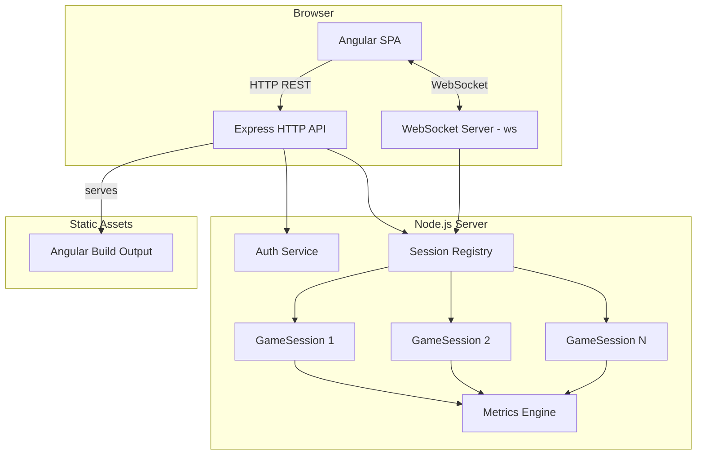
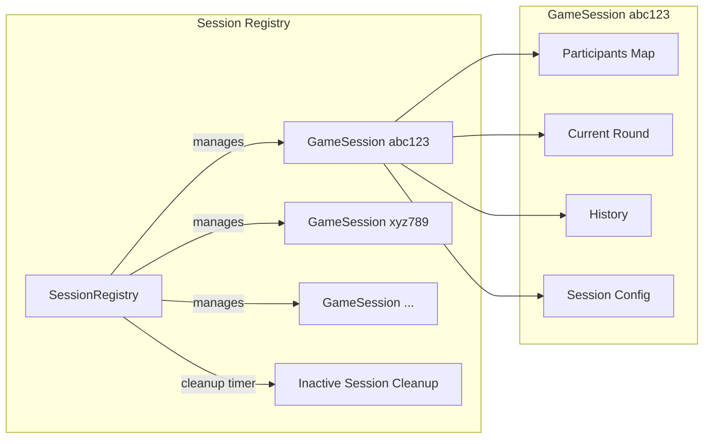
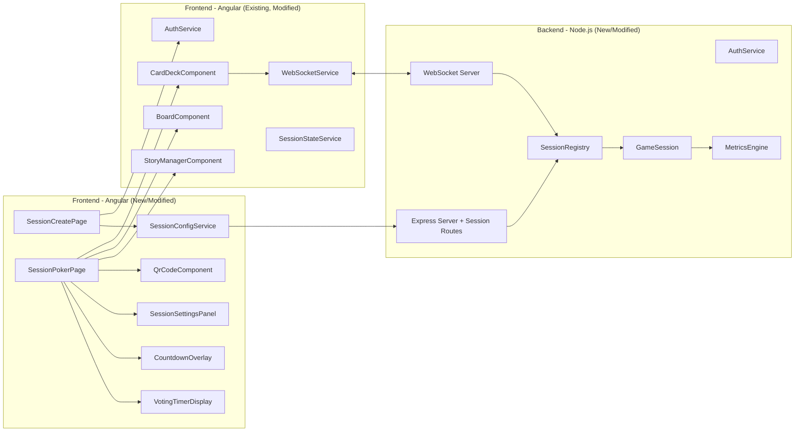

# Design Document: Multi-Team Sessions

## Overview

This document describes the technical design for extending the existing Scrum Poker application from a single shared session to a multi-team session architecture. The current application uses a single in-memory `SessionManager` module (module-level state) shared by all connected users. This feature introduces a `SessionRegistry` that manages multiple isolated `GameSession` instances, each identified by a unique session ID.

The design extends the existing architecture rather than replacing it. The core voting logic (rounds, card selections, reveals, metrics) remains unchanged inside each `GameSession`. The key changes are:

1. **SessionRegistry layer**: A new service that creates, stores, retrieves, and deletes `GameSession` instances. Each `GameSession` encapsulates the same state that the current `SessionManager` holds (participants, current round, history) plus new session configuration.

2. **Session-scoped WebSocket routing**: The existing `WebSocketHandler` is extended to associate each connection with a session ID and route events only within that session's scope.

3. **REST API for session CRUD**: New endpoints for creating sessions, retrieving session info, and updating session configuration.

4. **Session configuration**: Voting system selection, card reveal permissions, issue management permissions, auto-reveal, countdown animation, and voting timer.

5. **New Angular components and routes**: Session creation page, session-scoped poker page, QR code display, session settings panel, countdown overlay, and voting timer display.

6. **Session lifecycle management**: Automatic cleanup of inactive sessions after 30 minutes of zero participants.

### Key Design Decisions

1. **Extend, don't replace**: The existing `SessionManager` logic is refactored into a `GameSession` class. The `SessionRegistry` manages a `Map<string, GameSession>`. This preserves all existing voting, metrics, and history logic.

2. **Session ID as URL path parameter**: Sessions are accessed via `/session/{sessionId}`. The session ID is a short alphanumeric code (8 characters, base-36) for URL-friendliness and easy sharing, with uniqueness guaranteed by the registry.

3. **QR code generation on the client**: The `angularx-qrcode` library generates QR codes client-side from the session URL. No server-side image generation needed.

4. **WebSocket session scoping via query parameter**: The WebSocket connection URL includes both `token` and `sessionId` as query parameters. The handler validates both before accepting the connection.

5. **Configuration stored per-session**: Each `GameSession` holds a `SessionConfiguration` object. Configuration changes are broadcast to all session participants via WebSocket.

6. **Voting system as a shared type**: Voting system definitions (card values per system) are defined in `shared/types.ts` so both frontend and backend use the same card value sets.

7. **Auto-reveal with server-side check**: When auto-reveal is enabled, the server checks after each card selection whether all participants have voted. If so, it triggers reveal automatically after a brief delay.

8. **Countdown animation is client-side only**: The countdown is a visual effect triggered by the client when it receives a reveal event (if countdown is enabled in session config). The server broadcasts the reveal; the client delays showing results behind the countdown.

9. **Voting timer tracked server-side**: The round `startedAt` and `revealedAt` timestamps already exist. The client computes elapsed time from `startedAt` for the running timer display, and the final duration from `revealedAt - startedAt`.

## Architecture

### High-Level Architecture (Extended)



### Session Registry Architecture



### Updated Component Architecture



### Request Flow Updates

**Session Creation Flow:**
1. Moderator fills out session creation form (voting system, permissions, auto-reveal, countdown)
2. Frontend sends POST to `/api/sessions` with configuration
3. Backend `SessionRegistry` generates a unique session ID, creates a `GameSession` with the configuration
4. Backend returns `{ sessionId, sessionConfig }` 
5. Frontend redirects to `/session/{sessionId}`

**Session Join Flow (via link):**
1. User navigates to `/session/{sessionId}`
2. Angular route guard checks authentication
3. If not authenticated, redirect to `/login?returnTo=/session/{sessionId}`
4. After login, redirect back to `/session/{sessionId}`
5. Frontend `WebSocketService` connects with `token` and `sessionId` query parameters
6. Backend validates token, validates session exists, adds user to the `GameSession`
7. Backend sends `session:state` with full session state including configuration

**Session Configuration Update Flow:**
1. Moderator changes a setting in the session settings panel
2. Frontend sends PUT to `/api/sessions/{sessionId}/config` with updated configuration
3. Backend `SessionRegistry` updates the `GameSession` configuration
4. Backend broadcasts `session:config-updated` to all participants in the session
5. All clients update their local configuration state

## Components and Interfaces

### Backend Components

#### Session Registry (`services/session-registry.ts`) — NEW

The central manager for all game sessions. Replaces the module-level state in the current `session-manager.ts`.

```typescript
interface SessionRegistry {
  createSession(ownerId: string, config: SessionConfiguration): GameSessionInfo;
  getSession(sessionId: string): GameSession | undefined;
  deleteSession(sessionId: string): boolean;
  hasSession(sessionId: string): boolean;
  getActiveSessionCount(): number;
  updateSessionConfig(sessionId: string, config: Partial<SessionConfiguration>): SessionConfiguration;
  startCleanupTimer(): void;
  stopCleanupTimer(): void;
}

interface GameSessionInfo {
  sessionId: string;
  ownerId: string;
  config: SessionConfiguration;
  createdAt: string; // ISO 8601
}
```

**Session ID generation**: Uses `crypto.randomBytes(4).toString('base36').slice(0, 8)` padded to 8 characters. Uniqueness is checked against active sessions before assignment.

**Cleanup timer**: Runs every 5 minutes. For each session with zero participants, checks if the `lastActivityAt` timestamp is older than 30 minutes. If so, removes the session and logs the removal.

#### GameSession (`services/game-session.ts`) — NEW

Encapsulates the per-session state. This is a refactoring of the current `session-manager.ts` module-level functions into a class instance.

```typescript
class GameSession {
  readonly sessionId: string;
  readonly ownerId: string;
  readonly createdAt: string;
  config: SessionConfiguration;
  lastActivityAt: string;

  // Same interface as current SessionManager, but instance-scoped
  addParticipant(user: User): void;
  removeParticipant(userId: string): void;
  getParticipants(): User[];
  getParticipantCount(): number;

  startRound(storyDescription: string): VotingRound;
  getCurrentRound(): VotingRound | null;

  selectCard(userId: string, cardValue: CardValue): void;
  getSelections(): Map<string, CardValue>;
  checkAutoReveal(): boolean; // returns true if all voted and auto-reveal is on

  revealCards(): RevealResult;
  clearBoard(): HistoryEntry;

  getHistory(): HistoryEntry[];
  clearHistory(): void;

  getSessionState(): GameSessionState;
  updateConfig(config: Partial<SessionConfiguration>): SessionConfiguration;

  hasPermission(userId: string, permission: 'reveal' | 'issue'): boolean;
}
```

#### Updated WebSocket Handler (`websocket/handler.ts`) — MODIFIED

The handler is updated to:
- Parse `sessionId` from the WebSocket connection query parameters
- Validate the session exists before accepting the connection
- Store connections in a `Map<string, Map<string, Set<WebSocket>>>` (sessionId → userId → sockets)
- Scope all broadcasts to the session
- Route all events through the `SessionRegistry` to the correct `GameSession`

```typescript
// Updated client map structure
// sessionId -> userId -> Set<WebSocket>
const sessionClients = new Map<string, Map<string, Set<WebSocket>>>();

function broadcastToSession(sessionId: string, event: string, data: any): void;
function sendToUserInSession(sessionId: string, userId: string, event: string, data: any): void;
```

#### Session REST Routes (`routes/sessions.ts`) — NEW

New Express router for session CRUD operations.

```typescript
// POST /api/sessions — Create a new session
// Request: { config: SessionConfiguration }
// Response: { sessionId: string, config: SessionConfiguration, createdAt: string }
// Auth: Required (token in Authorization header)

// GET /api/sessions/:sessionId — Get session info
// Response: { sessionId: string, config: SessionConfiguration, participantCount: number, createdAt: string }
// Auth: Required

// PUT /api/sessions/:sessionId/config — Update session configuration
// Request: { config: Partial<SessionConfiguration> }
// Response: { config: SessionConfiguration }
// Auth: Required (must be session owner or moderator in session)

// GET /api/sessions/:sessionId/exists — Check if session exists (lightweight)
// Response: { exists: boolean }
// Auth: Not required (used for pre-login session link validation)
```

### Frontend Components

#### SessionCreatePageComponent — NEW

- Route: `/create-session`
- Displays a form with all session configuration options
- Voting system selector (dropdown with Fibonacci, Modified Fibonacci, T-Shirt, Power of 2)
- Reveal permission selector (radio group: Moderator only, All players, Select specific)
- Issue permission selector (radio group: Moderator only, All players, Select specific)
- Auto-reveal toggle
- Countdown animation toggle
- "Create Session" submit button
- On submit, calls POST `/api/sessions`, then navigates to `/session/{sessionId}`
- Accessible: all form controls have labels, fieldsets group related options

#### SessionPokerPageComponent — NEW (extends PokerPageComponent pattern)

- Route: `/session/:sessionId`
- Reads `sessionId` from route params
- Connects WebSocket with both `token` and `sessionId`
- Composes all existing poker components plus new ones: `QrCodeComponent`, `SessionSettingsPanel`, `CountdownOverlay`, `VotingTimerDisplay`
- Displays session link and copy button in the header area
- Shows QR code in a collapsible panel
- Passes session configuration to child components

#### QrCodeComponent — NEW

- Input: `url: string` (the full session URL)
- Uses `angularx-qrcode` library to render a QR code
- Renders at minimum 150×150 CSS pixels
- Includes `alt` text: "QR code for session link: {url}"
- Reactive: regenerates when the input URL changes

#### SessionSettingsPanel — NEW

- Displayed as a collapsible side panel or modal within the session page
- Shows current session configuration values
- Allows moderator to update settings (voting system, permissions, auto-reveal, countdown)
- Warns when changing voting system during an active round
- Sends PUT to `/api/sessions/{sessionId}/config` on change
- Listens for `session:config-updated` WebSocket events to stay in sync

#### CountdownOverlay — NEW

- Input: `enabled: boolean`, `onComplete: EventEmitter`
- When triggered, displays a full-screen semi-transparent overlay with countdown numbers (3, 2, 1)
- Each number displays for 1 second (total 3 seconds)
- Respects `prefers-reduced-motion`: shows static number changes without animation effects
- Emits `onComplete` when countdown finishes, allowing the parent to proceed with card reveal display
- Accessible: countdown numbers announced via ARIA live region

#### VotingTimerDisplay — NEW

- Displays elapsed time since the current round started
- Format: `MM:SS` (e.g., "02:45")
- Updates every second using `setInterval`
- Stops when cards are revealed, showing final elapsed time
- Resets when board is cleared
- Input: `startedAt: string | null`, `revealedAt: string | null`

#### Updated Components

**CardDeckComponent** — MODIFIED:
- Accepts `votingSystem: VotingSystemType` input to determine which cards to display
- Replaces hardcoded `ALL_CARDS` with dynamic card set from session configuration
- Special cards (coffee, no-clue, break) are always included regardless of voting system

**StoryManagerComponent** — MODIFIED:
- Checks `hasIssuePermission` signal to show/hide story submission controls
- Checks `hasRevealPermission` signal to enable/disable reveal button
- Permissions come from `SessionStateService` based on session configuration

**WebSocketService** — MODIFIED:
- `connect(token: string, sessionId?: string)` — adds optional `sessionId` to connection URL
- Connection URL becomes `ws://host?token={token}&sessionId={sessionId}`

**SessionStateService** — MODIFIED:
- New signals: `sessionConfig`, `votingTimer`, `countdownActive`
- Subscribes to `session:config-updated` events
- Computes `hasRevealPermission` and `hasIssuePermission` from config and current user

**AuthService** — MODIFIED:
- `login()` accepts optional `returnTo` parameter for post-login redirect
- Stores `returnTo` in session storage during login flow

### Frontend Routes (Updated)

```typescript
export const routes: Routes = [
  { path: 'login', component: LoginComponent },
  {
    path: 'create-session',
    loadComponent: () =>
      import('./components/session-create/session-create-page.component').then(
        (m) => m.SessionCreatePageComponent
      ),
    canActivate: [authGuard],
  },
  {
    path: 'session/:sessionId',
    loadComponent: () =>
      import('./components/session-poker-page/session-poker-page.component').then(
        (m) => m.SessionPokerPageComponent
      ),
    canActivate: [sessionAuthGuard],
  },
  // Legacy route preserved for backward compatibility
  {
    path: 'poker',
    redirectTo: 'create-session',
    pathMatch: 'full',
  },
  { path: '', redirectTo: 'login', pathMatch: 'full' },
  { path: '**', redirectTo: 'login' },
];
```

**sessionAuthGuard** — NEW:
- Checks if user is authenticated (same as `authGuard`)
- If not authenticated, redirects to `/login?returnTo=/session/{sessionId}`
- After login, the login component reads `returnTo` and redirects accordingly

### Updated REST API Endpoints

| Method | Path | Request Body | Response | Description |
|--------|------|-------------|----------|-------------|
| POST | `/api/auth/login` | `{ username, isAnonymous }` | `{ token, user }` | Authenticate user (existing) |
| GET | `/api/auth/validate` | — | `{ user }` | Validate session (existing) |
| POST | `/api/auth/logout` | — | `{ success }` | Invalidate session (existing) |
| POST | `/api/sessions` | `{ config: SessionConfiguration }` | `{ sessionId, config, createdAt }` | Create new session |
| GET | `/api/sessions/:sessionId` | — | `{ sessionId, config, participantCount, createdAt }` | Get session info |
| PUT | `/api/sessions/:sessionId/config` | `{ config: Partial<SessionConfiguration> }` | `{ config }` | Update session config |
| GET | `/api/sessions/:sessionId/exists` | — | `{ exists }` | Check session existence |

### Updated WebSocket Event Protocol

**New Client → Server Events:**

| Event | Data | Description |
|-------|------|-------------|
| `story:submit` | `{ storyDescription }` | Submit story (existing, now permission-checked) |
| `card:select` | `{ cardValue }` | Select card (existing) |
| `cards:reveal` | `{}` | Reveal cards (existing, now permission-checked) |
| `board:clear` | `{}` | Clear board (existing) |
| `role:change` | `{ role }` | Change role (existing) |
| `history:clear` | `{}` | Clear history (existing) |

**New Server → Client Events:**

| Event | Data | Description |
|-------|------|-------------|
| `session:state` | `{ state: GameSessionState }` | Full state sync including config (modified) |
| `session:config-updated` | `{ config: SessionConfiguration }` | Session configuration changed |
| `round:started` | `{ round: VotingRound }` | Round started (existing, session-scoped) |
| `card:voted` | `{ userId }` | Vote recorded (existing, session-scoped) |
| `cards:revealed` | `{ selections, metrics }` | Cards revealed (existing, session-scoped) |
| `board:cleared` | `{ historyEntry }` | Board cleared (existing, session-scoped) |
| `participant:joined` | `{ participants }` | Participant joined (existing, session-scoped) |
| `participant:left` | `{ participants }` | Participant left (existing, session-scoped) |
| `auto:reveal-triggered` | `{ countdown: boolean }` | Auto-reveal triggered, with countdown flag |
| `error` | `{ message, code }` | Error (existing, session-scoped) |

## Data Models

### New Shared Types (`shared/types.ts` additions)

```typescript
// Voting system types
export type VotingSystemType = 'fibonacci' | 'modified-fibonacci' | 't-shirt' | 'power-of-2';

export const VOTING_SYSTEMS: Record<VotingSystemType, CardValue[]> = {
  'fibonacci': [0, 1, 2, 3, 5, 8, 13, 21, 34, 55, 89],
  'modified-fibonacci': [0, '½', 1, 2, 3, 5, 8, 13, 20, 40, 100],
  't-shirt': ['XS', 'S', 'M', 'L', 'XL', 'XXL'],
  'power-of-2': [0, 1, 2, 4, 8, 16, 32, 64],
};

// Extended CardValue to support new voting systems
export type ExtendedCardValue =
  | NumericCardValue
  | SpecialCardValue
  | '½'
  | 20 | 40 | 100
  | 4 | 16 | 32 | 64
  | 'XS' | 'S' | 'M' | 'L' | 'XL' | 'XXL';

// Permission types
export type PermissionMode = 'moderator-only' | 'all-players' | 'select-specific';

export interface PermissionConfig {
  mode: PermissionMode;
  allowedUserIds: string[]; // only used when mode is 'select-specific'
}

// Session configuration
export interface SessionConfiguration {
  votingSystem: VotingSystemType;
  revealPermission: PermissionConfig;
  issuePermission: PermissionConfig;
  autoReveal: boolean;
  countdownAnimation: boolean;
}

// Default session configuration
export const DEFAULT_SESSION_CONFIG: SessionConfiguration = {
  votingSystem: 'fibonacci',
  revealPermission: { mode: 'moderator-only', allowedUserIds: [] },
  issuePermission: { mode: 'moderator-only', allowedUserIds: [] },
  autoReveal: false,
  countdownAnimation: false,
};

// Game session state (extends existing SessionState)
export interface GameSessionState extends SessionState {
  sessionId: string;
  config: SessionConfiguration;
  ownerId: string;
  createdAt: string;
}

// Session info (returned by REST API)
export interface SessionInfo {
  sessionId: string;
  config: SessionConfiguration;
  participantCount: number;
  createdAt: string;
  ownerId: string;
}
```

### Updated VotingRound (extended)

The existing `VotingRound` interface gains an optional `votingDurationMs` field populated when cards are revealed:

```typescript
export interface VotingRound {
  id: string;
  storyDescription: string;
  status: 'voting' | 'revealed' | 'completed';
  selections: Map<string, CardValue>;
  startedAt: string;    // ISO 8601
  revealedAt?: string;  // ISO 8601
  votingDurationMs?: number; // computed on reveal: revealedAt - startedAt
}
```

### Updated HistoryEntry (extended)

```typescript
export interface HistoryEntry {
  roundId: string;
  storyDescription: string;
  participants: ParticipantVote[];
  metrics: VotingMetrics;
  completedAt: string;
  votingDurationMs?: number; // total voting time for this round
}
```

### Permission Evaluation Logic

```typescript
function hasPermission(
  userId: string,
  userRole: 'moderator' | 'participant',
  permissionConfig: PermissionConfig
): boolean {
  switch (permissionConfig.mode) {
    case 'moderator-only':
      return userRole === 'moderator';
    case 'all-players':
      return true;
    case 'select-specific':
      return userRole === 'moderator' || permissionConfig.allowedUserIds.includes(userId);
  }
}
```

### Session ID Generation

```typescript
import crypto from 'crypto';

function generateSessionId(): string {
  return crypto.randomBytes(6).toString('base36').slice(0, 8).padStart(8, '0');
}
```

### Voting System Card Value Retrieval

```typescript
function getCardsForVotingSystem(system: VotingSystemType): CardValue[] {
  const systemCards = VOTING_SYSTEMS[system];
  // Always append special cards
  return [...systemCards, ...SPECIAL_CARDS];
}
```


## Correctness Properties

*A property is a characteristic or behavior that should hold true across all valid executions of a system — essentially, a formal statement about what the system should do. Properties serve as the bridge between human-readable specifications and machine-verifiable correctness guarantees.*

### Property 1: Session creation produces unique IDs with correct owner

*For any* sequence of N session creation requests with random valid configurations and random owner user IDs, the `SessionRegistry` SHALL produce N distinct session IDs, each session SHALL be retrievable by its ID, and each session's `ownerId` SHALL equal the user ID that created it.

**Validates: Requirements 1.1, 1.2, 1.3**

### Property 2: Session state isolation

*For any* two distinct active game sessions, performing operations on one session (adding participants, starting rounds, selecting cards, revealing, clearing board, adding history) SHALL NOT change the participant list, current round state, or history of the other session.

**Validates: Requirements 1.5, 5.1, 5.2, 5.3, 6.1, 6.2, 6.3**

### Property 3: WebSocket broadcast isolation

*For any* event broadcast within a game session, only WebSocket connections associated with that same session SHALL receive the event. Connections associated with any other session SHALL NOT receive the event.

**Validates: Requirements 5.4, 5.5, 15.4, 15.5**

### Property 4: Session link URL construction

*For any* session ID and *for any* browser origin string, the constructed session link SHALL equal `{origin}/session/{sessionId}`, and the session ID extracted from the path SHALL equal the original session ID.

**Validates: Requirements 2.1, 2.4**

### Property 5: Voting system card mapping

*For any* voting system type (fibonacci, modified-fibonacci, t-shirt, power-of-2), the function `getCardsForVotingSystem` SHALL return exactly the card values defined for that system plus the three special cards (coffee, no-clue, break), with no duplicates and no missing values.

**Validates: Requirements 7.3, 7.4, 7.5, 7.6, 7.7**

### Property 6: Permission evaluation correctness

*For any* user with a role (moderator or participant), and *for any* permission configuration (moderator-only, all-players, or select-specific with a set of allowed user IDs), the `hasPermission` function SHALL return `true` if and only if: (a) the mode is `moderator-only` and the user's role is `moderator`, OR (b) the mode is `all-players`, OR (c) the mode is `select-specific` and the user is either a moderator or their ID is in the allowed list.

**Validates: Requirements 8.3, 8.4, 8.5, 9.3, 9.4, 9.5**

### Property 7: Auto-reveal trigger logic

*For any* game session with a set of participants and a current voting round, `checkAutoReveal` SHALL return `true` if and only if auto-reveal is enabled in the session configuration AND every participant in the session has a card selection in the current round's selections map.

**Validates: Requirements 10.3, 10.5**

### Property 8: Voting duration computation

*For any* voting round with valid `startedAt` and `revealedAt` ISO 8601 timestamps where `revealedAt` is after `startedAt`, the computed `votingDurationMs` SHALL equal the difference in milliseconds between the two timestamps, and this value SHALL be included in the history entry when the board is cleared.

**Validates: Requirements 12.3, 12.4**

### Property 9: Timer format display

*For any* non-negative duration in milliseconds, the `formatDuration` function SHALL produce a string in `MM:SS` format where MM is the total minutes (zero-padded to 2 digits) and SS is the remaining seconds (zero-padded to 2 digits).

**Validates: Requirements 12.5**

### Property 10: Session configuration update persistence

*For any* game session and *for any* sequence of partial configuration updates, the session's configuration after applying all updates SHALL reflect the last value set for each configuration field, with unchanged fields retaining their previous values.

**Validates: Requirements 14.2, 14.5**

### Property 11: Unauthenticated session link redirect preserves session ID

*For any* session ID, when an unauthenticated user navigates to `/session/{sessionId}`, the redirect URL SHALL contain the original session ID as a `returnTo` parameter, and after login the user SHALL be redirected to `/session/{sessionId}`.

**Validates: Requirements 4.2**

## Error Handling

### Session Errors

| Error Condition | Handling Strategy |
|----------------|-------------------|
| Session ID not found on WebSocket connect | Reject WebSocket connection with close code 4004 and message "Session not found" |
| Session ID not found on REST API call | Return HTTP 404 with `{ error: 'SESSION_NOT_FOUND', message: 'Session does not exist or has ended' }` |
| Session ID not found on page navigation | Display error page with message "This session does not exist or has ended" and a link to create a new session |
| Unauthorized config update (non-owner, non-moderator) | Return HTTP 403 with `{ error: 'FORBIDDEN', message: 'Only the session owner or a moderator can update configuration' }` |
| Invalid session configuration values | Return HTTP 400 with `{ error: 'INVALID_CONFIG', message: '...' }` describing the invalid field |
| Voting system change during active round | Allow the change but broadcast `session:config-updated` with a `warning` field; client displays warning toast |

### Permission Errors

| Error Condition | Handling Strategy |
|----------------|-------------------|
| User without reveal permission tries to reveal | Send WebSocket `error` event with `{ code: 'UNAUTHORIZED', message: 'You do not have permission to reveal cards' }` |
| User without issue permission tries to submit story | Send WebSocket `error` event with `{ code: 'UNAUTHORIZED', message: 'You do not have permission to submit stories' }` |
| Permission check for disconnected user | Deny by default; user must reconnect to regain session context |

### Session Lifecycle Errors

| Error Condition | Handling Strategy |
|----------------|-------------------|
| User tries to join a cleaned-up session | WebSocket connection rejected with code 4004; REST API returns 404; frontend shows "session ended" message |
| Session cleanup fails (unexpected error) | Log error, skip session, retry on next cleanup cycle |
| Multiple cleanup timers running | Guard with a single interval; `startCleanupTimer` is idempotent |

### Existing Error Handling (Preserved)

All existing error handling from the base Scrum Poker design (authentication errors, WebSocket errors, session state errors, infrastructure errors) remains unchanged. The only modification is that error events are now scoped to the session's WebSocket connections rather than broadcast globally.

## Testing Strategy

### Unit Tests

Unit tests verify specific examples, edge cases, and error conditions using concrete inputs.

**Backend unit tests (Jest):**
- `SessionRegistry`: create session, get session, delete session, session ID uniqueness, cleanup of inactive sessions (with mocked timers), concurrent session support
- `GameSession`: all existing SessionManager tests adapted to class instance — add/remove participants, start round, select card, reveal cards, clear board, state transitions, auto-reveal check, permission evaluation, config updates, voting duration computation
- `Session REST routes`: POST /api/sessions (valid config, invalid config, missing auth), GET /api/sessions/:id (exists, not found), PUT /api/sessions/:id/config (valid update, unauthorized, invalid), GET /api/sessions/:id/exists
- `WebSocket handler (updated)`: session-scoped connection, session ID validation on connect, reject invalid session ID, event routing to correct session, broadcast isolation between sessions
- `Permission evaluation`: moderator-only mode, all-players mode, select-specific mode with various user/role combinations
- `Voting system mapping`: each system returns correct card values, special cards always included

**Frontend unit tests (Vitest):**
- `SessionCreatePageComponent`: form rendering with all config options, default values, form submission, navigation after creation
- `SessionPokerPageComponent`: session ID from route params, WebSocket connection with session ID, session link display, copy-to-clipboard
- `QrCodeComponent`: renders with correct URL, updates on URL change, minimum size, alt text
- `SessionSettingsPanel`: displays current config, updates on change, warning on voting system change during active round
- `CountdownOverlay`: countdown sequence (3, 2, 1), completion callback, reduced-motion behavior
- `VotingTimerDisplay`: running timer display, stops on reveal, resets on clear, MM:SS format
- `CardDeckComponent (updated)`: dynamic card set based on voting system, special cards always present
- `StoryManagerComponent (updated)`: permission-based visibility of controls
- `WebSocketService (updated)`: connection with session ID parameter
- `SessionStateService (updated)`: session config signal, permission signals, config update handling
- `sessionAuthGuard`: redirect to login with returnTo, direct access when authenticated

### Property-Based Tests

Property-based tests verify universal properties across randomly generated inputs using **fast-check**. Each property test runs a minimum of 100 iterations.

**Configuration:**
- Library: `fast-check` (already installed in both client and server)
- Minimum iterations: 100 per property
- Each test is tagged with a comment referencing the design property

**Property test implementations:**

| Property | Test Description | Generator Strategy |
|----------|-----------------|-------------------|
| Property 1: Session creation uniqueness + owner | Generate N random configs and owner IDs, create sessions, verify all IDs unique and owners match | `fc.array(fc.record({ ownerId: fc.uuid(), config: arbSessionConfig() }), { minLength: 1, maxLength: 50 })` |
| Property 2: Session state isolation | Generate two sessions with random operations (add participants, start rounds, select cards), verify operations on one don't affect the other | `fc.record({ session1Ops: fc.array(arbSessionOp()), session2Ops: fc.array(arbSessionOp()) })` |
| Property 3: WebSocket broadcast isolation | Generate random sessions with random connected clients, broadcast event in one session, verify only that session's clients receive it | `fc.record({ sessions: fc.array(fc.record({ id: fc.string(), clientCount: fc.integer({ min: 1, max: 10 }) }), { minLength: 2 }) })` |
| Property 4: Session link URL construction | Generate random origins and session IDs, verify URL format and round-trip extraction | `fc.record({ origin: fc.webUrl(), sessionId: fc.stringMatching(/^[a-z0-9]{8}$/) })` |
| Property 5: Voting system card mapping | For each voting system type, verify card set matches expected values plus special cards | `fc.constantFrom('fibonacci', 'modified-fibonacci', 't-shirt', 'power-of-2')` |
| Property 6: Permission evaluation | Generate random users, roles, and permission configs, verify hasPermission matches the specification | `fc.record({ role: fc.constantFrom('moderator', 'participant'), userId: fc.uuid(), mode: fc.constantFrom('moderator-only', 'all-players', 'select-specific'), allowedIds: fc.array(fc.uuid()) })` |
| Property 7: Auto-reveal trigger | Generate random participant sets, selection maps, and auto-reveal flag, verify checkAutoReveal result | `fc.record({ participantIds: fc.array(fc.uuid(), { minLength: 1, maxLength: 20 }), autoReveal: fc.boolean() })` then generate selections as subset |
| Property 8: Voting duration computation | Generate random start/reveal timestamp pairs, verify duration calculation | `fc.record({ startMs: fc.integer({ min: 0, max: 2000000000000 }), durationMs: fc.integer({ min: 1, max: 3600000 }) })` |
| Property 9: Timer format display | Generate random non-negative durations, verify MM:SS format | `fc.integer({ min: 0, max: 5999000 })` (up to 99:59) |
| Property 10: Config update persistence | Generate random initial configs and sequences of partial updates, verify final state | `fc.record({ initial: arbSessionConfig(), updates: fc.array(arbPartialConfig(), { minLength: 1, maxLength: 10 }) })` |
| Property 11: Redirect preserves session ID | Generate random session IDs, verify returnTo parameter contains the session ID | `fc.stringMatching(/^[a-z0-9]{8}$/)` |

### Integration Tests

Integration tests verify end-to-end flows and cross-component interactions:

- **Session creation flow**: Login → create session form → submit → redirect to session page → session link displayed → QR code displayed
- **Session join flow**: Navigate to session link → redirect to login → login → redirect back to session → WebSocket connects with session ID → participant appears in session
- **Multi-session isolation**: Create two sessions → join different users to each → perform voting in session A → verify session B is unaffected
- **Session configuration update**: Open settings → change voting system → verify card deck updates for all participants → verify warning when changing during active round
- **Auto-reveal flow**: Enable auto-reveal → start round → all participants vote → verify automatic reveal triggers
- **Countdown flow**: Enable countdown → trigger reveal → verify 3-2-1 countdown displays → verify cards reveal after countdown
- **Voting timer flow**: Start round → verify timer running → reveal cards → verify timer stops with correct duration → clear board → verify duration in history
- **Permission flows**: Set reveal permission to "all players" → verify non-moderator can reveal; set to "moderator only" → verify non-moderator cannot reveal
- **Session cleanup**: Create session → disconnect all participants → advance time 30 minutes → verify session removed → try to join → verify error
- **WebSocket session routing**: Connect clients to different sessions → broadcast in one → verify only same-session clients receive

### Accessibility Tests

- All new components (SessionCreatePage, SessionSettingsPanel, CountdownOverlay, VotingTimerDisplay, QrCodeComponent) pass `axe-core` automated audit
- Keyboard navigation for session creation form, settings panel, and all new interactive elements
- QR code has accessible text alternative with session URL
- Countdown numbers announced via ARIA live region
- Voting timer display readable by screen readers
- `prefers-reduced-motion` respected by countdown animation

### Smoke Tests

- Session creation API returns valid session ID
- Session join via link works end-to-end
- Multiple sessions can run simultaneously without errors
- Session cleanup timer runs without errors
- All new routes resolve correctly
