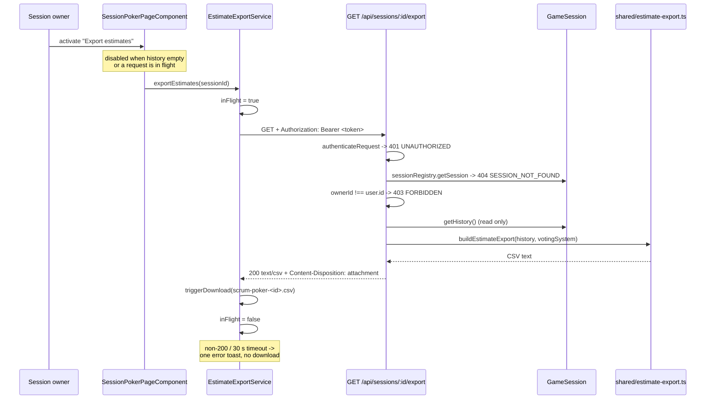
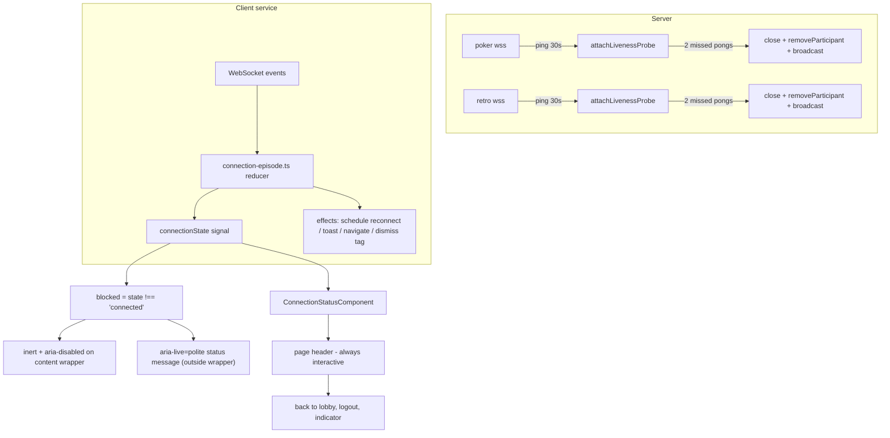
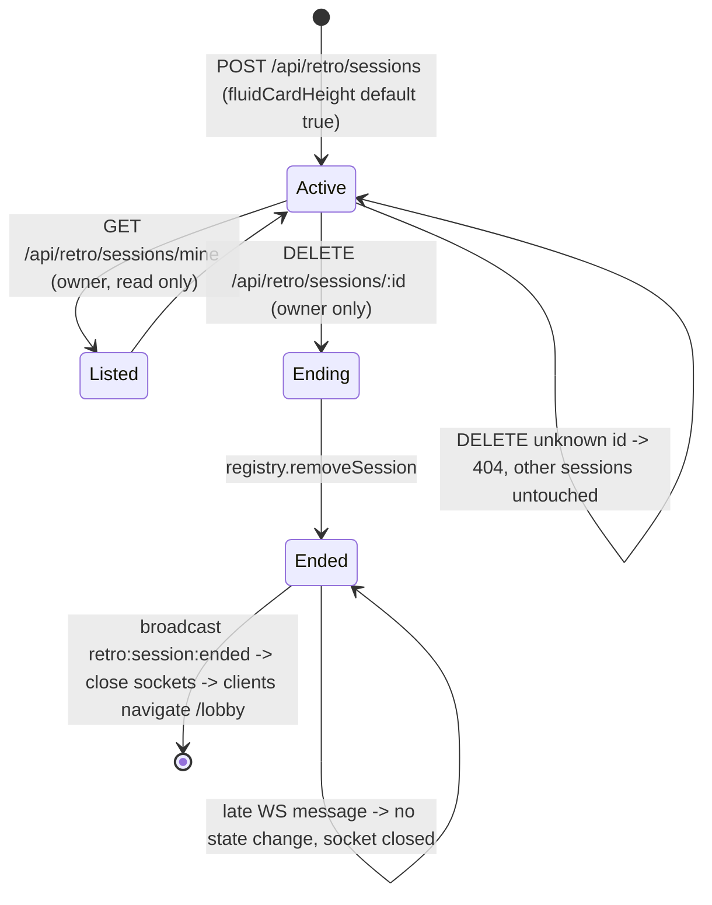

# Design Document — Poker & Retro UX Improvements

## Overview

This feature delivers fourteen requirements across three surfaces (Scrum Poker session page, Retrospective board, shared session behaviour). The work is organised into ten streams, each mapped to concrete modules in the existing codebase:

| # | Stream | Requirements | Primary new/changed units |
|---|--------|--------------|---------------------------|
| 1 | Poker estimate export | R1 | `shared/csv.ts`, `shared/estimate-export.ts`, `GET /api/sessions/:sessionId/export`, `EstimateExportService` |
| 2 | Issue list title layout | R2 | `IssueListPanelComponent` template + styles, `issue-title.ts` |
| 3 | Card deck selection containment | R3 | `CardDeckComponent` styles, `card-deck-geometry.ts` |
| 4 | Retro card sizing & text behaviour | R4, R5, R6 | `retro-card-height.ts`, `RetroCardComponent`, `RetroSession.config`, `RetroToolbarComponent` settings |
| 5 | Screenshot capture fidelity | R4 | `RetroScreenshotService`, `retro-capture-mode.ts` |
| 6 | Retro layout & toolbar | R7, R10 | `RetroBoardPageComponent`, `RetroColumnComponent`, `RetroToolbarComponent`, `FeelingsStripComponent` styles |
| 7 | Retro sessions on lobby + lobby user menu | R8, R12 | `GET /api/retro/sessions/mine`, `RetroResumeListComponent`, `UserMenuComponent` inputs, `LobbyComponent` header |
| 8 | End retro session | R9 | `DELETE /api/retro/sessions/:sessionId`, `endRetroSession()` in retro handler, confirm dialog |
| 9 | Connection status & interaction blocking | R11 | `ConnectionStatusComponent`, `connection-episode.ts`, `liveness.ts`, both WS services, both session pages |
| 10 | No-regression & verification | R13, R14 | test files listed in Testing Strategy, `docs/verification-coverage.md` |

### Research findings that shape the design

These were established by reading the current implementation, not assumed:

1. **`GameSession.history` is newest-first.** `clearBoard()` does `history.unshift(entry)`. R1.9 demands ascending `completedAt` with stable ordering for ties, so the export must apply a **stable sort by `completedAt` ascending over the stored array**, not a reverse.
2. **`formatDuration` in `shared/types.ts` already satisfies R1.10.** It computes `Math.floor(totalSeconds / 60)` without a modulo, so 3,600,000 ms renders as `60:00` — exactly the ">= 60 minutes carries total minutes" rule. Reuse it; do not re-implement.
3. **`VotingRound.selections` is a `Map`,** serialised by `handler.ts` via `Object.fromEntries`. The export path never touches `selections`: `HistoryEntry.participants` is already a plain `ParticipantVote[]`. No Map/JSON hazard on the export path.
4. **`VotingMetrics.outliers` is `string[]` of userIds**, `distribution` is `Record<string, number>`, `average` is `number | null`. R1.10 asks for the *count* of outliers, so the Summary_Row emits `outliers.length`.
5. **Card deck root cause (R3).** `.card-deck` has `padding: 0.5rem 0` (8 px top) while `.card-deck__card--selected` applies `transform: translateY(-20px) scale(1.05)` to a 72 px card. Required headroom is `20 + 72 × 0.05 / 2 = 21.8 px` against 8 px available — the card crosses the container's top edge by ~13.8 px. The fix is a smaller lift plus reserved padding, not `overflow: visible`.
6. **Issue title is currently single-line** (`white-space: nowrap` + `text-overflow: ellipsis`), the title span has `flex: 1` **without `min-width: 0`**, and the Estimate/Resume button is conditionally rendered with no reserved slot — so action buttons do not share a left edge (R2.13) and long unbroken titles can push the row wider than the panel (R2.3).
7. **`RetroSessionRegistry` has no `getSessionsByOwner`**, `RetroSession.board` is private with no card-count or completion accessor, and there is no `removeSession` caller outside tests. R8 and R9 need three small additive accessors.
8. **Retro WS `retro:config:update` is already moderator-gated** in `handleRetroEvent`'s `moderatorOnlyEvents` list, and `updateConfig` merges a `Partial<RetroConfiguration>` — so `fluidCardHeight` rides the existing event (R6.11, R6.17) with only a type guard added.
9. **`RetroColumnComponent.getDropIndex` already uses bounding-box midpoints**, which is inherently height-agnostic (R6.12). It only needs extracting to a pure function to become testable.
10. **The client test environment does no layout.** `theme.spec.ts` states it explicitly, and the runner is Vitest with a DOM shim; `getBoundingClientRect()` returns zeros and CSS custom properties are not computed. Every geometric or contrast criterion is therefore verified against **pure functions over declared values** plus **style-declaration assertions**, never against live layout. This single constraint drives most of the "extract a pure function" decisions below.
11. **Both WS services toast on every close and every reconnect attempt** (`'Connection lost. Attempting to reconnect...'`, `` `Reconnecting... (attempt ${n})` ``) and give up at `reconnectAttempt >= 10` with a redirect to `/login`. R11 keeps the threshold and the backoff but removes both toasts.
12. **Server has no WS liveness probe.** `ws` exposes `ping()`/`'pong'`; the probe must be attached per-server so poker and retro stay independent (R11.22).
13. **`SessionStateService` tracks `sessionConfig` but not `ownerId`**, while `GameSessionState` carries `ownerId`. R1.1/R1.2 are owner-scoped, not role-scoped, so an `ownerId` signal is added.

### Scope discipline

Every change is additive at the protocol level: new REST routes, one new optional config field, one new WS event name, new optional parameters on `ToastService.show`. No existing event name, payload field, route, status code, accessible name, or key binding is removed (R13).

---

## Architecture

### Module map (new files only)

```
shared/
  csv.ts                       # RFC 4180 quote/parse — pure, no imports
  estimate-export.ts           # HistoryEntry[] -> CSV rows — pure
  (types.ts)                   # + fluidCardHeight, RetroSessionSummary, RETRO_SESSION_ENDED

server/src/
  routes/sessions.ts           # + GET /:sessionId/export
  routes/retro-routes.ts       # + GET /sessions/mine, DELETE /sessions/:sessionId
  services/retro-session.ts    # + getCardCount, isBoardCompleted, fluidCardHeight default
  services/retro-session-registry.ts  # + getSessionsByOwner
  websocket/liveness.ts        # attachLivenessProbe(wss, onDead) — server-agnostic
  websocket/retro-handler.ts   # + endRetroSession(), close-on-unknown-session
  websocket/handler.ts         # + liveness wiring only

client/src/app/
  components/connection-status/connection-status.component.ts
  components/retro-resume-list/retro-resume-list.component.ts
  services/estimate-export.service.ts
  services/retro-card-height.ts        # pure
  services/retro-capture-mode.ts       # pure-ish DOM transform with undo log
  services/connection-episode.ts       # pure reducer
  components/card-deck/card-deck-geometry.ts   # pure
  components/issue-list-panel/issue-title.ts   # pure
  components/retro-board/drop-index.ts         # pure
```

### Data flow: estimate export (R1)



### Data flow: connection status and interaction blocking (R11)



### Lifecycle: retro session (R8, R9)



---

## Components and Interfaces

### Stream 1 — Poker estimate export (R1)

**`shared/csv.ts`** (pure, zero imports, reachable from server Jest via `roots: ['<rootDir>/../shared']` and from client Vitest via `@shared/*`):

```ts
/** RFC 4180 field quoting. Quotes when the value contains , " CR or LF; doubles embedded quotes. */
export function quoteCsvField(value: string): string;
/** Joins already-quoted fields with commas. */
export function serializeCsvRow(fields: string[]): string;
/** Joins rows with CRLF (RFC 4180 line terminator). */
export function serializeCsvDocument(rows: string[][]): string;
/** RFC 4180 parser: returns rows of raw field values. Inverse of serializeCsvDocument. */
export function parseCsv(text: string): string[][];
```

`quoteCsvField` is the isolated unit for the round-trip property (R14.8). `parseCsv` is a test-grade reference parser that also proves compliance of the writer; the existing `RetroSession.parseCSV` is left untouched.

**`shared/estimate-export.ts`** (pure):

```ts
export interface EstimateExportInput {
  history: readonly HistoryEntry[];      // as stored (newest-first)
  votingSystem: VotingSystemType;        // for distribution ordering
}
export function sortCompletedEstimates(history: readonly HistoryEntry[]): HistoryEntry[];
export function buildSummaryRow(entry: HistoryEntry, votingSystem: VotingSystemType): string[];
export function buildVoteRows(entry: HistoryEntry): string[][];
export function formatAverage(average: number | null, insufficientData: boolean): string;
export function formatDistribution(d: Record<string, number>, votingSystem: VotingSystemType): string;
export function formatVotingDuration(ms: number | undefined): string;
export function buildEstimateExportRows(input: EstimateExportInput): string[][];
export function buildEstimateExportCsv(input: EstimateExportInput): string;
export const SUMMARY_HEADER: readonly string[];
export const VOTE_HEADER: readonly string[];
```

Exact document shape (R1.9–R1.21):

```
Story,Participants,Numeric Votes,Average,Mode,Spread,Distribution,Outliers,Duration,Completed At   <- SUMMARY_HEADER, once, before the first Summary_Row
<Summary_Row for estimate 1>
Story,Participant,Vote                                                                             <- VOTE_HEADER, once per estimate
<Vote_Row ...>   (participants of estimate 1, displayName ascending)
<Summary_Row for estimate 2>
Story,Participant,Vote
<Vote_Row ...>
```

- `Summary_Row` fields in order (R1.10): story description; participant count (`entry.participants.length`); numeric vote count (`metrics.numericVoteCount`); average; mode; spread; distribution; outlier count (`metrics.outliers.length`); duration; `completedAt`.
- `formatAverage`: `'-'` when `insufficientData` (R1.15), otherwise half-up to one decimal with `.` separator (R1.13): `(Math.round((average + Number.EPSILON) * 10) / 10).toFixed(1)`.
- Mode and spread: `'-'` when `insufficientData`, otherwise `String(metrics.mode)` / `String(metrics.spread)` (R1.14, R1.15). Distribution and outlier count are always the real values — `insufficientData` does not blank them (R1.14 lists only average/mode/spread in R1.15).
- `formatDistribution`: one entry per distinct key present in `metrics.distribution`, rendered `value=count`, joined by `; `, ordered by `getCardsForVotingSystem(votingSystem)`; keys absent from that sequence (legacy rounds recorded under a different system) are appended afterwards in `Object.keys` order so no vote is silently dropped.
- `formatVotingDuration`: `'-'` when `votingDurationMs` is `undefined` (R1.10), otherwise `formatDuration(ms)` from `shared/types.ts`.
- `sortCompletedEstimates`: `history.map((e, i) => [e, i])` sorted by `(completedAt, i)` so ties keep stored order (R1.9).
- Every field passes through `quoteCsvField` (R1.16).
- Null `cardValue` renders as `No Vote` (R1.12).

**Server route** (added to `sessions.ts`, registered **before** `GET /:sessionId`):

```ts
sessionsRouter.get('/:sessionId/export', (req, res) => { /* 401 -> 404 -> 403 -> 200 */ });
```

Order of checks matters: auth first (R1.6), then existence (R1.8), then ownership (R1.7). Response headers: `Content-Type: text/csv`, `Content-Disposition: attachment; filename="scrum-poker-<sessionId>.csv"`. The handler only calls `getHistory()` and reads `config.votingSystem`, so it is a pure read (R1.19).

**`EstimateExportService`** (`providedIn: 'root'`, Signals, no new RxJS streams beyond the existing `HttpClient` + `firstValueFrom` pattern already used by `RetroExportService`):

```ts
readonly inFlight: Signal<boolean>;
async exportEstimates(sessionId: string): Promise<void>;
```

Behaviour: refuses to start while `inFlight()` (R1.4 "exactly one request"); `timeout(30_000)` on the request (R1.18); on 200 builds a `Blob([csvText], { type: 'text/csv' })` and downloads as `scrum-poker-<sessionId>.csv` with content byte-identical to the response (R1.17); on any failure shows exactly one `error` toast and triggers no download.

**Header control** in `SessionPokerPageComponent`:

```html
@if (isOwner()) {
  <button class="session-poker-page__export-btn"
          type="button" aria-label="Export estimates" title="Export estimates"
          [disabled]="exportDisabled()" (click)="onExportEstimates()">⬇</button>
}
```

`isOwner = computed(() => sessionState.ownerId() !== null && sessionState.ownerId() === sessionState.currentUser()?.id)` — a new `ownerId` signal on `SessionStateService` fed from the `session:state` payload (`GameSessionState.ownerId`, already sent). `exportDisabled = computed(() => sessionState.history().length === 0 || exportService.inFlight())` (R1.3, R1.22). Button sized `min-width: 32px; min-height: 32px` (R1.1).

### Stream 2 — Issue list title layout (R2)

Replaced declarations on `.issue-list-panel__item-title` (removing `white-space: nowrap`):

```css
.issue-list-panel__item { display: flex; align-items: flex-start; gap: 8px; }
.issue-list-panel__item-title {
  flex: 1 1 auto;
  min-width: 0;                        /* NEW — lets the flex item shrink below content width */
  display: -webkit-box;
  -webkit-line-clamp: 2;               /* R2.1, R2.8 */
  -webkit-box-orient: vertical;
  overflow: hidden;
  overflow-wrap: anywhere;             /* R2.5 — replaces word-break: break-word */
  font-size: 0.8125rem;                /* 13px >= 12px at every width (R2.6) */
  line-height: 1.35;
}
.issue-list-panel__item-action { flex: 0 0 5.5rem; display: flex; justify-content: flex-end; }  /* R2.13 */
.issue-list-panel__select-btn { width: 100%; white-space: nowrap; }
.issue-list-panel { overflow: hidden; }   /* kept — confines overflow (R2.3) */
```

The action button moves into an always-rendered fixed-width `span.issue-list-panel__item-action`, so the slot exists even for estimated issues; all action buttons therefore share one left edge (R2.13) and title width is the remainder (R2.11). The status marker keeps `min-width: 1rem; flex: 0 0 auto`.

Pure helpers in `issue-title.ts` (property-testable without layout, R14.14):

```ts
export const ISSUE_TITLE_PLACEHOLDER = '(untitled issue)';
/** Placeholder for empty/whitespace-only titles (R2.10). */
export function issueTitleText(title: string): string;
/** Full stored value, never truncated, used for title attr + aria-label (R2.2). */
export function issueTitleAccessibleName(title: string): string;
/** Layout model: does the row fit the panel content width? Mirrors the CSS box model. */
export function issueRowOverflows(model: IssueRowLayoutModel): boolean;
```

`IssueRowLayoutModel` carries `{ panelContentWidth, statusWidth, actionWidth, gap, titleMinWidth: 0, longestUnbreakableTokenWidth }`. Because the title declares `min-width: 0` and `overflow-wrap: anywhere`, `issueRowOverflows` returns `false` for every model where `statusWidth + actionWidth + 2 × gap <= panelContentWidth`; the property test asserts exactly that over generated title lengths, item counts and viewport widths, which is the testable form of R2.3. Drag handling, status markers and all four actions keep their current handlers and accessible names (R2.7).

### Stream 3 — Card deck selection containment (R3)

Replacement values (R3.1, R3.4):

```css
.card-deck {
  padding-top: 12px;      /* reserved headroom, multiple of 4 */
  padding-bottom: 8px;
}
.card-deck__card--selected {
  transform: translateY(-10px) scale(1.04);
}
.card-deck__card:hover:not(:disabled):not(.card-deck__card--selected) {
  transform: translateY(-4px);          /* unchanged; 4 + 0 <= 12 (R3.3) */
}
@media (prefers-reduced-motion: reduce) {
  .card-deck__card, .card-deck__card--selected { transition-duration: 0ms; }   /* same end state (R3.9) */
}
@media (max-width: 767px) {
  .card-deck { padding-top: 12px; overflow-y: hidden; }   /* scrollHeight <= clientHeight (R3.6) */
}
```

Reserved-space formula and its check live in `card-deck-geometry.ts`:

```ts
export const SELECTION_LIFT_PX = 10;        // within [8, 12] (R3.1)
export const SELECTION_SCALE = 1.04;        // within [1.00, 1.10] (R3.4)
export const DECK_PADDING_TOP_PX = 12;
export interface DeckGeometry { cardHeightPx: number; liftPx: number; scale: number; paddingTopPx: number; }
/** liftPx + cardHeightPx * (scale - 1) / 2 */
export function requiredHeadroomPx(g: DeckGeometry): number;
/** Top edge of the transformed border box relative to the container top edge; >= 0 means contained. */
export function selectedCardTopOffsetPx(g: DeckGeometry): number;
export function isSelectionContained(g: DeckGeometry): boolean;
```

Desktop: `10 + 72 × 0.04 / 2 = 11.44 <= 12`. Mobile: `10 + 76 × 0.04 / 2 = 11.52 <= 12`. The function is independent of card index and of card-set size, which is why R3.5 (first/middle/last card, 2–20 cards, 360–1920 px) reduces to a property over `(cardHeightPx, viewportWidth, cardIndex, cardCount)` with the same two declared constants.

`CardDeckComponent` changes: `selectedCard` becomes `signal<ExtendedCardValue | null>(null)` (currently a plain field, so the single-elevated-card invariant is not observable); `isSelected()` reads the signal. The existing `round:started` / `board:cleared` subscriptions already reset it (R3.8); `selectCard` overwrites it, so at most one card carries a non-zero lift (R3.7). Border width, gradient, shadow, focus ring, disabled state, `aria-pressed` and the live-region announcement are untouched (R3.10).

### Stream 4 — Retro card sizing and text behaviour (R4 sizing, R5, R6)

**One shared pure height module** `services/retro-card-height.ts`:

```ts
export const FLUID_MIN_LINES = 3;
export const FLUID_MAX_LINES = 12;
export const FIXED_LINES = 4;

export interface WrapMetrics { availableWidthPx: number; charWidthPx: number; }
export interface HeightMetrics { lineHeightPx: number; verticalPaddingPx: number; fluid: boolean; }

/** Left-to-right greedy wrap. Honours explicit \n, hard-breaks tokens wider than the line. */
export function measureLineCount(text: string, m: WrapMetrics): number;
/** clamp(lines, min, max) * lineHeight + padding, where min/max depend on `fluid`. */
export function computeTextAreaHeightPx(lineCount: number, m: HeightMetrics): number;
/** Composition used by the component and by the property tests. */
export function cardTextAreaHeightPx(text: string, w: WrapMetrics, h: HeightMetrics): number;
export function clampLines(lineCount: number, fluid: boolean): number;
```

`measureLineCount` is a single left-to-right scan whose state is `{ completedLines, usedWidth, pendingTokenWidth }` and which only ever **increments** `completedLines`. That construction is what makes the two required algebraic properties hold:

- **Idempotence / determinism (R6.8, R14.11):** the function is pure in `(text, availableWidthPx, charWidthPx)`, so repeated evaluation returns an identical number; the component therefore never oscillates between two heights for one text/width pair.
- **Prefix monotonicity (R6.9, R14.11):** appending characters can only push a pending token onto a new line or extend the current one; `completedLines` never decreases, and `clampLines` + `computeTextAreaHeightPx` are monotone non-decreasing, so `height(prefix) <= height(text)`.

In the browser the authoritative line count comes from the rendered element (`(el.scrollHeight - verticalPadding) / lineHeight`, read once per change inside an `afterRenderEffect`), and that count is fed into the **same** `computeTextAreaHeightPx`. The clamp decision therefore has a single implementation; `measureLineCount` is the DOM-free fallback and the unit the screenshot clone and the property tests use. Where the environment reports `scrollHeight === 0` (test DOM, pre-layout), the component falls back to `measureLineCount`.

**`fluidCardHeight` threading.** `RetroConfiguration.fluidCardHeight?: boolean` (optional, so existing records stay valid — R6.1). Defaulting is expressed once per side as a pure coercion:

```ts
// shared/types.ts
export function resolveFluidCardHeight(value: unknown): boolean {
  return typeof value === 'boolean' ? value : true;
}
```

- Server: `RetroSession` constructor sets `fluidCardHeight: resolveFluidCardHeight(config.fluidCardHeight)` (R6.2), and `getSessionState()` therefore always broadcasts a boolean (R13.10).
- Client: `RetroCardComponent.fluidCardHeight = computed(() => resolveFluidCardHeight(this.retroState.config()?.fluidCardHeight))` (R6.3, R13.11).
- `RetroSession.updateConfig` rejects a non-boolean `fluidCardHeight` by deleting it from the partial before the merge; the handler detects the rejection and replies `retro:error` with code `INVALID_CONFIG` and sends **no** broadcast (R6.17). Non-moderator senders are already rejected upstream by `moderatorOnlyEvents`.

**Moderator control** (R6.10, R6.15): one more `retro-settings__toggle` inside the existing settings dialog, rendered only when `isModerator()` (the whole dialog is already moderator-gated):

```html
<label class="retro-settings__toggle">
  <input type="checkbox" [checked]="fluidCardHeightSetting()"
         (change)="onSettingChange('fluidCardHeight', $event)" />
  <span>Fluid card height</span>
</label>
```

`onSettingChange` already routes to `sendConfigUpdate({ [key]: checked })` → `retro:config:update` → `updateConfig` → `retro:config:updated` broadcast to every connected participant including the sender (R6.11). `RetroStateService` already replaces `config` wholesale on that event, so every rendered card re-evaluates its height through its `computed` within one change-detection pass (R6.16).

**Card CSS.** The textarea's `min-height: 4.5em` and `rows="4"` are replaced by a bound inline height:

```html
<textarea #textArea class="retro-card__text"
          [style.height.px]="textAreaHeightPx()"
          [value]="card().text" ...></textarea>
```

```css
.retro-card__text {
  overflow-y: auto;          /* scrolling inside the box only (R5.11, R6.5, R6.6) */
  scrollbar-gutter: stable;
  box-sizing: border-box;
  white-space: pre-wrap;
  overflow-wrap: anywhere;
}
```

Fluid ⇒ `clamp(lines, 3, 12)`; fixed ⇒ exactly 4 lines for any text length (R6.4–R6.6). Both branches are layout-direction independent, so the horizontal column layout gets the same height rule (R6.14) — in horizontal mode the column already pins card width to 200 px, which only changes `availableWidthPx`.

**Scroll-offset reset (R5)** without fighting the user:

```ts
private readonly focused = signal(false);     // (focus)/(blur) on the textarea
// afterRenderEffect, reads card().text and focused()
if (!this.focused() && el.scrollTop !== 0) el.scrollTop = 0;
```

- Not focused ⇒ offset pinned to 0 on first render and after every text update, short or long (R5.1, R5.2, R5.3, R5.10).
- `(blur)` handler sets `focused=false` and `scrollTop=0` in the same turn, and does not alter the text (R5.4).
- While focused the effect's guard is false, so the only scroll changes are the browser's own responses to caret movement, typing and user scrolling (R5.8), and an inbound `retro:card:edited` leaves `scrollTop`, caret and uncommitted text alone because the effect does not run and the component does **not** write `el.value` while focused (R5.9). The existing `[value]` binding is replaced by a guarded write: `if (!focused()) el.value = card().text`.
- `onTextBlur` keeps its current "send edit when text differs" behaviour (R5.6); `onTextEnter` keeps Enter-without-Shift ⇒ commit + blur (R5.7).

**Drag and drop with variable heights (R6.12, R6.13).** `drop-index.ts`:

```ts
export interface CardRect { start: number; size: number; }   // start/size along the layout axis
/** Index of the first card whose midpoint is beyond `pointerPos`, else rects.length. */
export function computeDropIndex(rects: readonly CardRect[], pointerPos: number): number;
/** Same-column move correction: originalIndex < dropIndex ? dropIndex - 1 : dropIndex. */
export function adjustDropIndexForSameColumn(dropIndex: number, originalIndex: number): number;
```

This is the existing algorithm, extracted. It is height-agnostic by construction: it reads each card's measured `start` and `size` from `getBoundingClientRect()` at drag time and compares the pointer against `start + size / 2`. No card height, uniform or not, appears as a constant anywhere, so variable fluid heights cannot shift the result; an empty column yields index 0 because the loop over zero rects falls through to `rects.length === 0`. `RetroColumnComponent.getDropIndex`/`showDropIndicator` delegate to it, keeping drag start, drag over, drop indicator, move, merge and column reorder behaviour as-is.

### Stream 5 — Screenshot capture fidelity (R4)

**Why the current capture misrenders card text.** `html2canvas` rasterises replaced form controls by reading the element's `value` and drawing it with its own simplified text layout. For a `<textarea>` it does not reproduce the control's internal soft-wrapping, its `scrollTop` clipping, or its scrolled-out content: the value is drawn as laid out by html2canvas' own box, which overflows the card's bounding box, and content scrolled out of view is drawn from the top. Additionally the call passes `windowWidth/windowHeight = element.scrollWidth/scrollHeight` while the real `.retro-board__columns` and `.retro-column__cards` keep `overflow: auto`, so cards outside the visible scroll area are clipped by those ancestors rather than captured.

**Fix: a transient capture-mode DOM substitution with a guaranteed undo log.** `services/retro-capture-mode.ts`:

```ts
export interface Mutation { undo(): void; }
export interface CaptureModeHandle { restore(): void; }
/**
 * Swap every textarea for a styled static <div>, unclip scroll containers,
 * and record one undo closure per mutation.
 */
export function enterCaptureMode(root: HTMLElement): CaptureModeHandle;
/** Pure: the static clone's declarations copied from the live textarea. */
export function captureTextStyle(computed: CSSStyleDeclaration, heightPx: number): Record<string, string>;
```

`enterCaptureMode` performs, recording an undo closure for each step:

1. For each `textarea.retro-card__text`: read `getComputedStyle` (font-family, font-size, line-height, color, padding, width) and the current `scrollTop`; insert a sibling `<div class="retro-card__text retro-card__text--capture">` carrying the **full** `value` as `textContent`, `white-space: pre-wrap`, `overflow-wrap: anywhere`, `overflow: visible` and a height equal to its wrapped content (`measureLineCount` × line height + padding); hide the textarea with `display: none`. Undo: remove the div, restore `display`, restore `scrollTop`.
2. For each scroll container (`.retro-board__columns`, `.retro-column__cards`, `.retro-card__text`): record `overflow`, `maxHeight`, `height`, `scrollTop`, `scrollLeft`; set `overflow: visible` and auto heights. Undo restores all five.
3. Mark the root `data-retro-capture="true"` so capture-only CSS applies.

Because the static div is a normal block element, html2canvas lays it out with the browser's own text wrapping: every line is at most the card content width (R4.11), the typography matches the live board because the declarations were copied from it (R4.12), the clone's height contains its wrapped text (R4.13), text that the live textarea clipped or scrolled is present (R4.2), and glyphs stay inside the card box (R4.1).

`RetroScreenshotService.captureBoard` becomes:

```ts
readonly capturing = signal(false);
async captureBoard(element: HTMLElement): Promise<void> {
  if (this.capturing()) return;                       // R4.10
  this.capturing.set(true);
  const handle = enterCaptureMode(element);
  try {
    const blob = await withTimeout(this.render(element), CAPTURE_TIMEOUT_MS);   // 10 s, R4.8
    ... clipboard-then-download, exactly one toast          // R4.5, R4.6, R4.9
  } catch {
    this.toastService.show('error', 'Failed to capture screenshot');            // R4.4
  } finally {
    handle.restore();                                                           // R4.3
    this.capturing.set(false);
  }
}
```

`restore()` replays the undo log in reverse inside `finally`, so element count, attribute values, computed styles and the scroll offsets of the column container and every textarea are back to their pre-capture values whether the capture succeeded, failed or timed out (R4.3). The toolbar screenshot button binds `[disabled]="screenshotService.capturing()"` (R4.10). Exactly one notification fires per outcome: copied, downloaded, or failed — and the failure path writes nothing to the clipboard and triggers no download (R4.4). A board with zero cards enters and exits capture mode with an empty mutation log, and both column layouts take the same path (R4.7).

### Stream 6 — Retro board layout and toolbar (R7, R10)

All changed declarations use the 4-px spacing scale and existing tokens. The concrete edits:

`retro-board-page.component.ts` styles:

| Selector | Before | After | Criterion |
|---|---|---|---|
| `.retro-board` | `padding: 0.5rem` | `padding: 8px` | R7.1 |
| `.retro-board__header` | `padding: 0.375rem 0.75rem; margin-bottom: 0.375rem` | `padding: 8px 12px; margin-bottom: 8px` | R7.1 |
| `.retro-board__context` | `margin-bottom: 0.375rem` | `margin-bottom: 8px` | R7.1 |
| `.retro-board__context-input`, `.retro-board__context-display` | `#e0e0e0`, `#f9fafb`, `#555`, `#eee`, `min-height: 1.75rem` | `var(--color-primary-light)`, `var(--surface-board)`, `var(--text-primary)`, `var(--color-primary-light)`, `min-height: auto; padding: 8px 12px; line-height: 1.4` | R7.2, R7.4, R7.17 |
| `.retro-board__context-display` | `display: flex; align-items: center` | `display: block; white-space: pre-wrap` | R7.17 |
| `.retro-board__columns--vertical` | `gap: 0.5rem` | `gap: 8px; width: 100%; align-items: stretch` | R7.1, R7.15, R7.16 |
| `.retro-board__columns--horizontal` | `gap: 0.5rem` | `gap: 8px; width: 100%` | R7.1, R7.15 |
| `.retro-board` (new) | — | `overflow-x: hidden` on the page, horizontal overflow confined to `.retro-board__columns` | R7.12 |
| new media query | — | `@media (max-width: 767px) { .retro-board__header { flex-wrap: wrap; row-gap: 4px } }` | R7.13 |
| new | — | `*:focus-visible { outline: 2px solid var(--color-primary-dark); outline-offset: 2px }` | R7.14 |
| reduced motion | partial | one block zeroing `transition-duration` and `animation-duration` for all descendants | R7.11 |

`retro-column.component.ts`: in the vertical layout `:host { align-self: stretch; min-height: 0 }` and `.retro-column { height: 100%; min-height: 0 }` make the column fill the board height, and `.retro-column__cards { flex: 1 1 auto; min-height: 0; overflow-y: auto }` makes the card list the single scrolling element, so the header stays pinned and every card stays reachable (R7.16). The horizontal layout keeps content sizing through the `:host.is-horizontal` counterparts (`align-self: flex-start`, `height: auto`, `flex: 0 0 auto`), where the container scrolls instead. Header row gets `flex-wrap: nowrap`, the name keeps single-line ellipsis plus `[title]` and `[attr.aria-label]` carrying the full name (R7.7), and the count/add/delete controls stay on one row at `min-width/min-height: 32px` (R7.5, R7.6). Hard-coded `#f8f9fa`, `#e0e0e0`, `#fff`, `#333`, `#888` become `var(--surface-board)`, `var(--color-primary-light)`, `var(--surface-card-deck)`, `var(--text-primary)`, `var(--text-secondary)` (R7.2).

`retro-card.component.ts`: `#e8ecf0`/`#d0d5dd`/`#1a1a2e`/`#666`/`#555` → `var(--surface-board)`, `var(--color-primary-light)`, `var(--text-primary)`, `var(--text-secondary)`; `font-size` floors raised to `0.75rem` (12 px) for the author line, vote count and comment text (R7.3); action buttons to `min-width/min-height: 32px` (R7.5); `padding: 6px 0` → `8px 0` and inner padding `0.375rem` → `8px` (R7.1); `.retro-card { display: flex; flex-direction: column }` so text, author line, action row and comments stack without overlap for any text length (R7.18).

`retro-toolbar.component.ts` (R10):

```css
.retro-toolbar {
  display: flex; align-items: center; gap: 4px;
  padding: 4px 8px;                 /* 32px control + 2x4px = 40px max row height (R10.1) */
  margin-bottom: 8px;
  background: var(--surface-card-deck);
  border: 1px solid var(--color-primary-light);
  border-radius: 6px;
  max-height: 40px;                 /* R10.1 */
  overflow-x: auto; overflow-y: hidden;   /* R10.8 */
  flex-wrap: nowrap;
}
@media (max-width: 767px) {
  .retro-toolbar { max-height: 120px; flex-wrap: wrap; row-gap: 0; }  /* <= 3 rows x 40px (R10.2) */
}
.retro-toolbar__btn { width: 32px; height: 32px; }                     /* R10.3 */
```

`FeelingsStripComponent` is pulled inside that row (it already is a sibling) and shrinks to fit: `.feelings-strip { height: 32px; padding: 0 4px; gap: 4px; }`, `.feelings-strip__emoji-btn, .feelings-strip__summary-btn { width: 32px; height: 32px; }` (R10.3, R10.4, R10.10), and the `retro-toolbar__spacer` keeps `flex: 1` but the strip gets `flex: 0 0 auto` so no empty bordered region wider than its controls can appear (R10.10). The label keeps `font-size: 0.75rem` and `color: var(--text-primary)` on `--surface-card-deck` for ≥ 4.5:1 (R10.6). Every control keeps its icon, `title`, `aria-label`, visibility condition and disabled condition; the toolbar stays a `role="toolbar"` with natural tab order (R10.5, R10.7, R10.9).

Combined block sizes: header 48 px + toolbar 40 px + context row 40 px = 128 px ≤ 160 px (R7.8); toolbar 40 px + context 40 px = 80 px — the context row is therefore reduced to `padding: 4px 12px; line-height: 1.4; font-size: 0.75rem` giving 32 px, for a combined 72 px (R10.11). Mobile wrapped layout: 48 + 120 + 40 = 208 px ≤ 240 px (R7.13).

Verification approach for this stream: these are declared-value criteria, not computed-layout criteria. Tests assert the **declaration text** of the component's `styles` (padding/gap/max-height values on the 4-px scale, token references instead of literals, `font-size` floors, `min-width`/`min-height` on controls) plus the rendered DOM structure and accessible names. A pure contrast helper (`wcagContrastRatio`, the function already written inline in `card-deck.component.property.spec.ts`, promoted to `client/src/app/testing/contrast.ts`) checks R7.4, R7.14, R10.6 and R11.8 against the token hex values.

### Stream 7 — Retro sessions on the lobby, lobby user menu (R8, R12)

**Server.** `RetroSessionRegistry.getSessionsByOwner(ownerId): RetroSession[]` plus `RetroSession.getCardCount(): number` and `RetroSession.isBoardCompleted(): boolean` (the board field is private). New route registered **before** `GET /sessions/:sessionId` so `mine` is not captured as an id:

```ts
retroRouter.get('/sessions/mine', (req, res) => { /* 401 -> 200 { sessions } */ });
```

Ordering: `lastActivityAt` descending, ties broken by `createdAt` descending (R8.4). The handler only reads, so two consecutive calls return identical entries (R8.8), and because it draws from `retroSessionRegistry` alone it can never include a `GameSession` (R8.7, R13.9). No limit is applied (R8.2).

**Client.** `RetroResumeListComponent` (standalone, `imports: [CommonModule]`, Signals only), modelled on `SessionResumeListComponent` but with distinct labels (R8.12):

```ts
readonly sessions = signal<RetroSessionSummary[]>([]);
readonly loading = signal(false);
readonly loadFailed = signal(false);
```

- Fires one `GET /api/retro/sessions/mine` with the stored token on init (R8.9) with `timeout(10_000)` (R8.20).
- While pending: `<div role="status">Loading retrospective boards…</div>` in place of the list; the poker list renders independently because it is a sibling component with its own request (R8.11).
- 200 with entries: one entry per summary in response order (R8.10), each a `<button>` in document order showing board name, session id, created and last-activity timestamps (R8.13, R8.15), navigating to `/retro/:sessionId` on activation (R8.16).
- Section heading `Your Retrospective Boards` with `aria-labelledby` pointing at it, distinct from the poker list's `Your Previous Sessions` / `Your previous sessions` (R8.12).
- Board name element: single-line ellipsis plus `[title]` and `[attr.aria-label]` carrying the full name (R8.14).
- 200 with zero entries → component renders nothing (R8.17). 401 → renders nothing, no message (R8.18). Other status or timeout → `<div role="alert">Failed to load retrospective boards</div>` (R8.19, R8.20). In every failure case the poker list and all lobby actions stay rendered and enabled because they are independent siblings (R8.21, R8.22).

**Lobby header and user menu (R12).** `UserMenuComponent` gains two inputs, both defaulted so the poker page is unaffected (R13.7):

```ts
readonly user = input<User | null>(null);          // null => fall back to SessionStateService.currentUser
readonly showRoleSwitch = input<boolean>(true);
readonly effectiveUser = computed(() => this.user() ?? this.sessionState.currentUser());
```

The role-switch `<button>` is wrapped in `@if (showRoleSwitch())`, and `MENU_ITEM_COUNT` becomes a `computed` (`showRoleSwitch() ? 2 : 1`) so arrow-key clamping stays correct. `getAvatarLetter` is hardened to the first **non-whitespace** character, uppercased (R12.3), returning `''` when none exists (R12.10) — the avatar button keeps its 44 px target and the dropdown stays reachable. The dropdown name gets `overflow: hidden; text-overflow: ellipsis; white-space: nowrap` to stay inside the dropdown box (R12.4).

`LobbyComponent` gains a header row:

```html
<header class="lobby-header">
  <span class="lobby-header__spacer"></span>
  @if (authUser(); as user) {
    <app-user-menu [user]="user" [showRoleSwitch]="false" />
  }
</header>
```

with `.lobby-header { display: flex; justify-content: flex-end; }` so the control is the last element of the row with its right edge inside the content area at every width (R12.1). `authUser = computed(() => auth.getToken() !== null ? auth.getCurrentUser()() : null)` — both token and user record must be present (R12.6). Open/close, Escape, outside-click and avatar-toggle behaviour, `aria-haspopup`, `aria-expanded`, `role="menu"`, the `User menu` and `Logout` accessible names and the focus move to the logout item all come from the reused component (R12.2, R12.7, R12.8, R12.9). `AuthService.logout()` already clears both keys before the caller navigates; the component keeps `logout(); router.navigate(['/login'])` so storage is cleared before navigation (R12.5).

### Stream 8 — End retro session (R9)

**Server.**

```ts
// retro-routes.ts — registered before GET /sessions/:sessionId
retroRouter.delete('/sessions/:sessionId', (req, res) => {
  // 401 (no state change, regardless of whether the id exists) -> 404 -> 403 -> 200
  retroSessionRegistry.removeSession(sessionId);
  endRetroSession(sessionId);          // broadcast then close
  res.status(200).json({ success: true });
});
```

```ts
// retro-handler.ts
export const RETRO_SESSION_ENDED = 'retro:session:ended';   // re-exported from shared/types.ts
export function endRetroSession(sessionId: string): void {
  broadcastToSession(sessionId, RETRO_SESSION_ENDED, { sessionId });
  const userMap = retroSessionClients.get(sessionId);
  userMap?.forEach(sockets => sockets.forEach(ws => ws.close(1000, 'Session ended by moderator')));
  retroSessionClients.delete(sessionId);
}
```

Broadcast strictly precedes the closes so every connected participant, the moderator included, receives the event before its socket goes away (R9.8). `handleRetroEvent` additionally closes the socket when the registry no longer holds the session: `sendError(...); ws.close(4004, 'Session not found'); return;` — no `RetroSession` is mutated on that path (R9.14). Poker state is untouched because this route imports only retro modules (R9.15, R13.9).

**Client.** `RetroBoardPageComponent` header gains, for moderators only (R9.1, R9.2):

```html
@if (isModerator()) {
  <button class="retro-board__end-btn" type="button"
          aria-label="End session" title="End session"
          [disabled]="endInFlight()" (click)="openEndDialog()">⏹</button>
}
@if (showEndDialog()) {
  <div class="retro-board__dialog-backdrop">
    <div role="alertdialog" aria-label="End session confirmation" aria-modal="true">
      <p>End this retrospective for all participants?</p>
      <button #cancelBtn (click)="closeEndDialog()">Cancel</button>
      <button [disabled]="endInFlight()" (click)="confirmEndSession()">End session</button>
    </div>
  </div>
}
```

`openEndDialog()` sets the signal and focuses the cancel button in an `afterNextRender`-style callback, leaving session state untouched (R9.3). `closeEndDialog()` dismisses and returns focus to the end-session control (R9.4). `confirmEndSession()` guards on `endInFlight()`, sets it, and issues exactly one `DELETE` with the stored token (R9.5, R9.6); on error or 10 s timeout it dismisses the dialog, clears `endInFlight`, stays on the board with cards and votes untouched and shows exactly one error toast (R9.13).

The event path: `RetroWebSocketService` subscribes internally to `retro:session:ended` and sets `manualDisconnect = true`, state `disconnected`, and suppresses its 4004/close toasts for that socket — otherwise the subsequent close would emit a second, wrong notification. The page subscribes to the same event and performs the user-visible part: one toast "The moderator ended the session" with `durationMs: 6000` (≥ 5 s, R9.12) and `router.navigate(['/lobby'])`. Back to lobby, copy link, votes remaining, session id and the user control keep their accessible names (R9.16).

### Stream 9 — Connection status and interaction blocking (R11)

**`ConnectionStatusComponent`** (standalone, input-driven so it couples to neither WS service, preserving poker/retro isolation):

```ts
@Component({ selector: 'app-connection-status', standalone: true, imports: [CommonModule], ... })
export class ConnectionStatusComponent {
  readonly state = input.required<ConnectionState>();
  readonly label = computed(() => CONNECTION_LABEL[this.state()]);   // Connected | Trying to restore connection | Disconnected
  readonly healthy = computed(() => this.state() === 'connected');
}
```

```html
<span class="connection-status" [class.connection-status--healthy]="healthy()"
      [title]="label()" [attr.aria-label]="label()" role="status">
  <span class="connection-status__dot" aria-hidden="true"></span>
  <span class="connection-status__label">{{ label() }}</span>
</span>
```

Labels are exactly the required strings (R11.4–R11.6) and the visible label text equals the `title` text, so state is conveyed by text as well as colour (R11.7). Height 24 px with an inline label makes width ≥ 1.5 × height trivially true (R11.3).

**Colour tokens and the contrast problem.** New tokens in `styles.scss`:

```css
--status-chip-bg: #ffffff;
--status-connected: #1b7f3b;
--status-fault: #b3261e;
--text-on-status: #ffffff;
```

Both session headers paint `--gradient-primary` (`#667eea` → `#764ba2`, relative luminance 0.237 → 0.115). A saturated green or red cannot reach 3:1 against that range — satisfying it would require luminance ≤ 0.005 (near black) or ≥ 0.81 (near white). The indicator therefore sits on its own neutral chip surface inside the header (`background: var(--status-chip-bg)`, 4 px padding, 6 px radius), and the fill colours are measured against that adjacent background: `#1b7f3b` vs `#ffffff` = 5.07:1 and `#b3261e` vs `#ffffff` = 6.54:1, both ≥ 3:1 (R11.8 first clause); `--text-on-status` on each fill = 5.07:1 and 6.54:1, both ≥ 4.5:1 (R11.8 second clause). This is a deliberate design decision recorded here because it changes the header's visual composition slightly.

**Pre-connect state (R11.1, R11.2).** Neither service's initial signal value changes (existing tests assert `'disconnected'` before `connect()`). Instead each page derives the displayed state:

```ts
readonly displayedConnectionState = computed<ConnectionState>(() =>
  this.connectAttempted() ? this.ws.connectionState() : 'reconnecting');
```

`connectAttempted` flips in `ngOnInit` for the retro page and after the `/exists` check resolves for the poker page — so from the very first render, including the async window before the socket is opened, the indicator reads `reconnecting`. `openConnection()` also sets `reconnecting` at the start so the CONNECTING phase is covered.

**Interaction blocking: mechanism and justification.** The blocker is `inert` plus `aria-disabled` applied to a **content wrapper that sits inside each page's scroll container**, not a CSS overlay and not per-control disabled bindings:

```html
<!-- header is a sibling of the wrapper: indicator, back-to-lobby and the user menu stay interactive -->
<main class="session-poker-page__main">
  <section class="session-poker-page__board-area">            <!-- scroll container, NOT inert -->
    <div class="interaction-blocker" [attr.inert]="blocked() ? '' : null"
         [attr.aria-disabled]="blocked()">
      ... all session controls ...
    </div>
  </section>
</main>
@if (blocked()) {
  <p class="interaction-blocker__status" role="status" aria-live="polite">
    Interaction is paused until the connection is restored.
  </p>
}
```

Why `inert` rather than the alternatives:

- A **CSS overlay** (`pointer-events: none` or a transparent shield) blocks pointer activation only; keyboard activation of focusable descendants still works, failing R11.9.
- **Per-control disabled bindings** would require touching every control in both pages, would change the `disabled` state that other criteria pin (R7.9, R10.5), and `disabled` on a container is not inherited by arbitrary elements.
- `inert` blocks pointer *and* keyboard activation in one declarative binding, removes descendants from the tab order and marks them unavailable to assistive technology (R11.9, R11.10), **keeps the content visible** (no opacity or display change) and **does not touch DOM values**, so text already typed into inputs is retained verbatim (R11.12). Placing the wrapper *inside* the scroll container keeps page scrolling available because the scrollable element itself is never inert (R11.12). Removing the attribute restores pointer and keyboard activation for every previously blocked control in one pass, and the `@if` drops the status message (R11.13).

`blocked = computed(() => displayedConnectionState() !== 'connected')`, so the transition in either direction completes within one change-detection cycle, well inside 500 ms (R11.10, R11.13).

**Notification suppression as a state machine.** `services/connection-episode.ts` — pure, no sockets, no Angular:

```ts
export const GIVE_UP_THRESHOLD = 10;
export type ConnectionEvent =
  | { kind: 'open' } | { kind: 'close'; code?: number }
  | { kind: 'attempt' } | { kind: 'manual-disconnect' };
export interface EpisodeState {
  connection: ConnectionState;
  attempt: number;
  episodeActive: boolean;
  gaveUp: boolean;
}
export type EpisodeEffect =
  | { kind: 'schedule-reconnect'; delayMs: number }
  | { kind: 'dismiss-connection-toasts' }
  | { kind: 'toast-give-up' }
  | { kind: 'navigate-login' }
  | { kind: 'toast-close-code'; code: number };
export const initialEpisodeState: EpisodeState;
export function reduceEpisode(s: EpisodeState, e: ConnectionEvent): { state: EpisodeState; effects: EpisodeEffect[] };
export function calculateBackoff(attempt: number): number;   // min(2^attempt * 1000, 30000) — unchanged (R11.19)
```

Transition rules:

| Event | Guard | Next state | Effects |
|---|---|---|---|
| `close` | code ∈ {4009, 4010, 4004} | `disconnected`, episode closed, no reconnect | `toast-close-code` (exactly one) |
| `close` | otherwise, not manual | `reconnecting`, `episodeActive = true` | `dismiss-connection-toasts`, `schedule-reconnect(calculateBackoff(attempt))` — **no toast** |
| `attempt` | `attempt + 1 < 10` | `attempt + 1`, still `reconnecting` | `schedule-reconnect` on the next close — **no toast** |
| `attempt` | `attempt + 1 === 10` | `disconnected`, `gaveUp = true`, no further attempts | `toast-give-up` (exactly one), `navigate-login` |
| `open` | — | `connected`, `attempt = 0`, episode closed | `dismiss-connection-toasts` |
| `manual-disconnect` | — | `disconnected`, episode closed | — |

The reducer emits `toast-give-up` on exactly the transition that reaches the threshold and never emits a toast for a drop or an attempt, which is the testable form of R11.14, R11.15, R11.16, R11.23, R11.25 and R11.26: any event sequence that returns to `open` before the tenth attempt produces zero notification effects. Both `WebSocketService` and `RetroWebSocketService` keep their own socket plumbing but delegate every decision to this reducer and then execute the effects, so poker and retro remain separate classes with one shared pure rule set. `ToastService.show` gains an options parameter (`{ durationMs?, tag? }`) and `ToastService.dismissByTag(tag)`; connection toasts carry `tag: 'connection'`, which is what `dismiss-connection-toasts` acts on (R11.27).

**Server-side liveness probe.** `server/src/websocket/liveness.ts` — imports only `ws`, so it is neutral ground for both servers (R11.22):

```ts
export const LIVENESS_INTERVAL_MS = 30_000;
export const MAX_MISSED_PONGS = 2;
export interface LivenessOptions { intervalMs?: number; maxMissed?: number; onDead(ws: WebSocket): void; }
export function attachLivenessProbe(wss: WebSocketServer, options: LivenessOptions): { stop(): void };
export function nextMissedCount(missed: number, pongSeen: boolean): number;   // pure, testable
```

Per connection the probe tracks a missed counter: on each 30 s tick it increments when no pong arrived since the previous tick and resets to 0 when one did; when the counter reaches 2 it calls `onDead(ws)` and closes the socket. `server.ts` attaches one probe per server:

```ts
attachLivenessProbe(wss,      { onDead: ws => removePokerConnection(ws) });
attachLivenessProbe(retroWss, { onDead: ws => removeRetroConnection(ws) });
```

Each handler exposes a small `remove<X>Connection(ws)` that removes the participant from its own registry and broadcasts the updated state to the remaining sockets of that session, reusing the logic already present in the `'close'` handler (R11.21). The two probes share no state, so a closure on one server leaves the other's sockets open (R11.22). Close codes 4009/4010/4004 keep their current meanings and handling (R11.17, R11.18).

### Stream 10 — No-regression strategy (R13)

- **WS events:** every existing event name and payload field is kept; the only new event is `retro:session:ended`, a name absent from both handlers today (R13.1, R13.2, R13.3).
- **New payload field defaults:** `fluidCardHeight` is read through `resolveFluidCardHeight`, so an event or config record omitting it behaves exactly as before plus the documented default (R13.4, R13.10, R13.11).
- **REST:** new routes are additional paths; the two new ones are registered before their sibling `/:sessionId` routes to avoid shadowing. No existing path, method, request shape, status code or response field changes (R13.5, R13.6). `/api/health` and the base-path mounting logic in `server.ts` are untouched (R13.12, R13.13), as is the `server.on('upgrade')` retro/poker split (R13.14).
- **Accessibility and keyboard:** changes are additive controls plus style edits. `UserMenuComponent`'s new inputs default to today's behaviour. Token keys `scrum-poker-token` / `scrum-poker-user` are unchanged (R13.15).
- **Isolation:** `retro-routes.ts`, `retro-handler.ts`, `retro-session*.ts` and the new retro endpoints import no poker module; `liveness.ts` imports neither side (R13.9). A test asserts this by scanning the import statements of the retro modules.
- **One documented conflict (R13.18).** `client/src/app/services/websocket.service.spec.ts` and `retro-websocket.service.spec.ts` currently assert that a connection drop shows `'Connection lost. Attempting to reconnect...'` and that a retry shows `` `Reconnecting... (attempt 1)` ``. R11.14 and R11.26 forbid exactly those notifications. R13.18 ("existing assertions remain present and unchanged") cannot hold simultaneously. Resolution: R11 is the specific, intentional change and wins; those two test cases are replaced by their R11 counterparts (zero toasts before the threshold, one at it), and the substitution is recorded in `docs/verification-coverage.md`. Every other existing assertion in the suite stays untouched.

---

## Data Models

### New and changed shared types

```ts
// shared/types.ts

/** CHANGED: one optional field added. Records that omit it remain valid (R6.1). */
export interface RetroConfiguration {
  boardName: string;
  maxVotesPerUser: number;
  templateId: string;
  hideCardsInitially: boolean;
  disableVotingInitially: boolean;
  hideVoteCount: boolean;
  oneVotePerCard: boolean;
  showCardAuthor: boolean;
  password: string | null;
  enableGifEmoji: boolean;
  columnLayout: ColumnLayout;
  allowedFeelings: FeelingCategory[];
  /** NEW. Sizes the card text area to its content. Absent or non-boolean is treated as true. */
  fluidCardHeight?: boolean;
}

/** NEW: single coercion point for the default, used by server and client (R6.2, R6.3, R13.10). */
export function resolveFluidCardHeight(value: unknown): boolean {
  return typeof value === 'boolean' ? value : true;
}

/** NEW: response entry of GET /api/retro/sessions/mine (R8.6). */
export interface RetroSessionSummary {
  sessionId: string;
  boardName: string;
  createdAt: string;        // ISO 8601
  lastActivityAt: string;   // ISO 8601
  participantCount: number; // non-negative integer
  cardCount: number;        // non-negative integer
  isCompleted: boolean;
}

/** NEW: response body of GET /api/retro/sessions/mine. */
export interface RetroSessionsResponse {
  sessions: RetroSessionSummary[];
}

/** NEW: WS event name constant, additive (R9.8, R13.3). */
export const RETRO_SESSION_ENDED = 'retro:session:ended';

/** NEW: payload of retro:session:ended. */
export interface RetroSessionEndedPayload {
  sessionId: string;
}

/** NEW: shared connection lifecycle type, previously duplicated as a local alias
 *  in both WS services. Same three values, so no behavioural change. */
export type ConnectionState = 'connected' | 'disconnected' | 'reconnecting';

/** NEW: the exact indicator labels required by R11.4-R11.6. */
export const CONNECTION_LABEL: Record<ConnectionState, string> = {
  connected: 'Connected',
  reconnecting: 'Trying to restore connection',
  disconnected: 'Disconnected',
};
```

### Export document model (server-internal, pure)

```ts
// shared/estimate-export.ts
export const SUMMARY_HEADER = [
  'Story', 'Participants', 'Numeric Votes', 'Average', 'Mode',
  'Spread', 'Distribution', 'Outliers', 'Duration', 'Completed At',
] as const;

export const VOTE_HEADER = ['Story', 'Participant', 'Vote'] as const;

export const NO_VOTE_LABEL = 'No Vote';
export const NOT_AVAILABLE = '-';
```

### Client-side state additions

```ts
// SessionStateService — NEW signal, fed from the existing session:state payload
private readonly _ownerId = signal<string | null>(null);
readonly ownerId: Signal<string | null> = this._ownerId.asReadonly();

// EstimateExportService
private readonly _inFlight = signal(false);
readonly inFlight: Signal<boolean> = this._inFlight.asReadonly();

// RetroScreenshotService
private readonly _capturing = signal(false);
readonly capturing: Signal<boolean> = this._capturing.asReadonly();

// RetroBoardPageComponent
readonly showEndDialog = signal(false);
readonly endInFlight = signal(false);
readonly connectAttempted = signal(false);
```

### Service API additions

```ts
// ToastService — both parameters optional, existing two-argument calls unchanged
export interface ToastOptions { durationMs?: number; tag?: string; }
show(type: ToastType, message: string, options?: ToastOptions): void;
dismissByTag(tag: string): void;

// RetroSession
getCardCount(): number;
isBoardCompleted(): boolean;

// RetroSessionRegistry
getSessionsByOwner(ownerId: string): RetroSession[];
```

### Units extracted as pure functions specifically to be testable without a DOM or a socket

| Pure unit | File | Why it must be pure | Property family |
|---|---|---|---|
| `quoteCsvField`, `parseCsv` | `shared/csv.ts` | round-trip provable without HTTP | P1 |
| `buildSummaryRow`, `formatAverage`, `formatDistribution`, `formatVotingDuration` | `shared/estimate-export.ts` | statistics comparable against `metrics-engine.calculate` output directly | P2, P3 |
| `sortCompletedEstimates` | `shared/estimate-export.ts` | stable ordering provable over generated histories | P4 |
| `measureLineCount`, `clampLines`, `computeTextAreaHeightPx` | `retro-card-height.ts` | the test DOM performs no layout, so wrapping must be computable in TS | P5, P6 |
| `issueRowOverflows`, `issueTitleText` | `issue-title.ts` | `scrollWidth`/`clientWidth` are always 0 in the test DOM | P7 |
| `requiredHeadroomPx`, `isSelectionContained` | `card-deck-geometry.ts` | `getBoundingClientRect()` is always zeroed in the test DOM | P8 |
| `computeDropIndex`, `adjustDropIndexForSameColumn` | `drop-index.ts` | drag events and rects are not reproducible in the test DOM | P9 |
| `reduceEpisode`, `calculateBackoff` | `connection-episode.ts` | toast/navigation decisions provable without a socket or timers | P10, P11 |
| `resolveFluidCardHeight` | `shared/types.ts` | one default for both runtimes | P6 |
| `nextMissedCount` | `server/src/websocket/liveness.ts` | probe arithmetic provable without timers | — (unit test) |
| `summariseRetroSessions` | `retro-routes.ts` helper | registry-separation provable without HTTP | P12 |
| `wcagContrastRatio` | `client/src/app/testing/contrast.ts` | contrast criteria provable without computed styles | P13 |

---

## Correctness Properties

*A property is a characteristic or behavior that should hold true across all valid executions of a system — essentially, a formal statement about what the system should do. Properties serve as the bridge between human-readable specifications and machine-verifiable correctness guarantees.*

Each property below is executable: it names its inputs, its generators, the invariant, and the acceptance criteria it validates. Properties were consolidated per the prework reflection, so no property is implied by another.

### Property 1: CSV field quoting round trip

*For any* list of field values, parsing the serialized row produced by `quoteCsvField` with an RFC 4180 parser recovers every original field value unchanged.

- Inputs: `fields: string[]`
- Generators: `fc.array(fc.stringMatching(/^[\s\S]*$/), { minLength: 1, maxLength: 10 })` where each string is drawn from a character set including `,`, `"`, `\r`, `\n`, spaces and unicode, length 0–1,000
- Invariant: `parseCsv(serializeCsvRow(fields.map(quoteCsvField)))[0]` deep-equals `fields`
- Exercises: `shared/csv.ts`

**Validates: Requirements 1.16, 14.8**

### Property 2: Summary_Row statistics equal the computed metrics

*For any* selection set over the card values of any voting system, the exported average, mode, spread, distribution and outlier count of the resulting Completed_Estimate equal the `VotingMetrics` values computed by the metrics engine for the same selections.

- Inputs: `selections: Map<string, CardValue>`, `votingSystem: VotingSystemType`
- Generators: 1–50 distinct participant ids; card values from `getCardsForVotingSystem(votingSystem)`; `votingSystem` from the four system keys
- Invariant: for `metrics = calculate(selections)` and `row = buildSummaryRow(entry, votingSystem)`: `Number(row[3])` is within 0.05 of `metrics.average`, `row[4] === String(metrics.mode)`, `row[5] === String(metrics.spread)`, `row[6]` parses back to `metrics.distribution`, `Number(row[7]) === metrics.outliers.length`, `Number(row[2]) === metrics.numericVoteCount`
- Exercises: `shared/estimate-export.ts` against `server/src/services/metrics-engine.ts`

**Validates: Requirements 1.13, 1.14, 14.9**

### Property 3: Insufficient data renders as a dash

*For any* Completed_Estimate whose metrics hold `insufficientData === true`, the exported average, mode and spread fields each equal the single character `-`, while the distribution and outlier-count fields still carry their computed values.

- Inputs: `selections` with fewer than two numeric votes
- Generators: 0–1 numeric card values plus 0–10 special card values over 0–50 participants
- Invariant: `row[3] === row[4] === row[5] === '-'` and `row[6]`/`row[7]` match the metrics
- Exercises: `formatAverage`, `buildSummaryRow`

**Validates: Requirements 1.15, 14.10**

### Property 4: Export document shape and ordering

*For any* session history, the export document starts with exactly one Summary header row, contains exactly one Summary_Row per Completed_Estimate in non-decreasing `completedAt` order with equal timestamps keeping their stored relative order, and places after each Summary_Row exactly one Vote header row followed by that estimate's Vote_Rows in ascending participant display-name order, each Vote_Row carrying that estimate's story description and rendering a null card value as `No Vote`.

- Inputs: `history: HistoryEntry[]`
- Generators: 0–30 entries; `completedAt` drawn from a small timestamp pool so ties are frequent; 0–50 participants per entry with generated display names (including duplicates and unicode) and `cardValue` nullable; `votingDurationMs` sometimes `undefined`
- Invariant: a single walk over `buildEstimateExportRows` asserts header counts and positions, summary ordering with tie stability, vote-block adjacency and ownership, name ordering, and the `No Vote` rendering
- Exercises: `sortCompletedEstimates`, `buildVoteRows`, `buildEstimateExportRows`

**Validates: Requirements 1.9, 1.11, 1.12, 1.20, 1.21**

### Property 5: Issue row never overflows its panel

*For any* issue-list state — title lengths 0–500 including titles with no whitespace character, 0–200 entries, viewport widths 360–1920 px — the row layout model reports no overflow, and the rendered title element exposes the complete stored title (or the placeholder for a blank title) as both its `title` attribute and its accessible name with no truncation marker added.

- Inputs: `titles: string[]`, `panelContentWidth: number`
- Generators: titles from `fc.string({ maxLength: 500 })` plus a no-whitespace variant and whitespace-only strings; counts 0–200; widths 360–1920
- Invariant: `issueRowOverflows(model) === false` for every row, the action slot offset is identical across rows, and `issueTitleAccessibleName` equals the stored title exactly (or `ISSUE_TITLE_PLACEHOLDER` when blank)
- Exercises: `issue-title.ts` plus a rendered-DOM assertion of the attributes

**Validates: Requirements 2.2, 2.3, 2.5, 2.9, 2.10, 2.13, 14.14**

### Property 6: Selected card stays inside the deck container

*For any* card index of any voting-system card set (2–20 cards), any card height in 56–96 px, and any viewport width 360–1920 px, the top edge of the transformed border box of the selected card lies at or below the container's top edge, and the reserved headroom is at least the lift plus half the scale growth.

- Inputs: `cardHeightPx`, `cardIndex`, `cardCount`, `viewportWidth`
- Generators: card sets from `VOTING_SYSTEMS` extended with specials; `cardIndex` in `[0, cardCount)`; heights 56–96; widths 360–1920
- Invariant: `selectedCardTopOffsetPx(g) >= 0` and `requiredHeadroomPx(g) <= DECK_PADDING_TOP_PX`, with the same assertion for the hover lift plus focus-ring allowance
- Exercises: `card-deck-geometry.ts`

**Validates: Requirements 3.2, 3.3, 3.4, 3.5, 14.15**

### Property 7: Card text area height is idempotent

*For any* card text and any text-area width, evaluating the height function repeatedly returns an identical value.

- Inputs: `text: string`, `widthPx: number`
- Generators: texts 0–5,000 characters including explicit `\n`, consecutive line breaks, and single tokens wider than the element; widths 200–1,200 px; both `fluid` values
- Invariant: `cardTextAreaHeightPx(text, w, h)` equals itself across three successive evaluations
- Exercises: `retro-card-height.ts`

**Validates: Requirements 6.8, 14.11**

### Property 8: Card text area height is monotone in text prefixes

*For any* pair of texts where the first is a prefix of the second, the computed height of the first is less than or equal to the height of the second at the same width.

- Inputs: `text: string`, `splitPoint: number`, `widthPx: number`
- Generators: as Property 7, with `splitPoint` in `[0, text.length]`
- Invariant: `cardTextAreaHeightPx(text.slice(0, splitPoint), …) <= cardTextAreaHeightPx(text, …)`
- Exercises: `measureLineCount`, `clampLines`, `computeTextAreaHeightPx`

**Validates: Requirements 6.9, 14.11**

### Property 9: Height clamp follows the configured mode

*For any* card text, width and `fluidCardHeight` value, the height equals `clamp(lineCount, min, max) × lineHeight + padding` where `(min, max)` is `(3, 12)` when fluid and `(4, 4)` when not, independent of the column layout.

- Inputs: `text`, `widthPx`, `fluid`, `columnLayout`
- Generators: as Property 7 plus `columnLayout` from `'vertical' | 'horizontal'`
- Invariant: the height equals the clamp formula; it never falls below the 3-line (or 4-line) height and never exceeds the 12-line (or 4-line) height
- Exercises: `retro-card-height.ts`

**Validates: Requirements 6.4, 6.5, 6.6, 6.14**

### Property 10: fluidCardHeight default resolution

*For any* value supplied for `fluidCardHeight` — absent, `true`, `false`, or any non-boolean — the resolved value is the supplied boolean when it is a boolean and `true` otherwise, identically on the server at session creation, on the server when broadcasting state, and on the client when rendering a card.

- Inputs: `value: unknown`
- Generators: `fc.oneof(fc.boolean(), fc.constant(undefined), fc.string(), fc.integer(), fc.constant(null), fc.object())`
- Invariant: `resolveFluidCardHeight(value) === (typeof value === 'boolean' ? value : true)`, and a `RetroSession` constructed with that config reports the same value from `getSessionState()`
- Exercises: `resolveFluidCardHeight`, `RetroSession`, `RetroCardComponent`

**Validates: Requirements 6.1, 6.2, 6.3, 13.4, 13.10, 13.11**

### Property 11: Drop index from bounding-box midpoints

*For any* list of card rectangles with arbitrary, non-uniform sizes and any pointer position, the computed drop index equals the number of rectangles whose midpoint lies at or before the pointer, which is 0 for an empty list.

- Inputs: `rects: CardRect[]`, `pointerPos: number`
- Generators: 0–50 rects with `size` 10–400 laid end to end with gaps 0–16; pointer positions spanning before, inside and after the strip
- Invariant: `computeDropIndex(rects, pos) === rects.filter(r => r.start + r.size / 2 <= pos).length`; adding a constant to every `size` leaves the relative ordering decision unchanged for a proportionally scaled pointer
- Exercises: `drop-index.ts`

**Validates: Requirements 6.12**

### Property 12: Capture mode is restored exactly

*For any* board — 0–10 columns holding 0–100 cards each, either column layout, either `fluidCardHeight` value, texts 0–2,000 characters — entering capture mode and then restoring returns the element count, every element's attribute set, every inline style and the scroll offsets of the column container and of every card text area to their pre-capture values, whether the capture succeeded, threw, or timed out.

- Inputs: board shape, texts, layout, fluid flag, outcome (`success | throw | timeout`)
- Generators: as stated; `scrollTop` seeded to random non-zero values before capture
- Invariant: a structural snapshot taken before equals the snapshot taken after `restore()`
- Exercises: `retro-capture-mode.ts`, `RetroScreenshotService`

**Validates: Requirements 4.3, 4.7**

### Property 13: Capture clone carries the complete text with the live typography

*For any* board as in Property 12, the capture clones together contain the full text of every card, including text the live text area clipped or scrolled and cards outside the visible scroll area, each clone carries the live element's font family, font size, line height and text colour unchanged, and each clone's height is at least the height its wrapped line count requires at the card content width.

- Inputs: board shape, texts, widths, layout, fluid flag
- Generators: as Property 12; card content widths 160–400 px
- Invariant: for every card, the clone's `textContent === card.text`; `captureTextStyle` reproduces the four declarations; `cloneHeight >= measureLineCount(text, width) × lineHeight + padding`
- Exercises: `retro-capture-mode.ts`, `retro-card-height.ts`

**Validates: Requirements 4.2, 4.11, 4.12, 4.13**

### Property 14: Unfocused card text area is pinned to its first line

*For any* card text (0–2,000 characters, including consecutive line breaks and a token wider than the element) and either `fluidCardHeight` value, a card text area that does not hold keyboard focus reports a vertical scroll offset of 0 on first render, after any inbound text update, and after focus loss, with the text unchanged by the reset.

- Inputs: `text`, `updates: string[]`, `fluid`
- Generators: as stated; `updates` 0–5 successive generated texts
- Invariant: after each render pass with `focused === false`, `scrollTop === 0` and the element value equals the latest received text
- Exercises: `RetroCardComponent`

**Validates: Requirements 5.1, 5.2, 5.3, 5.4, 5.5, 5.10**

### Property 15: A focused card text area is never written by the component

*For any* sequence of inbound card-text updates delivered while a card text area holds keyboard focus, the component writes neither the scroll offset, nor the caret position, nor the element value, and the edit it later sends on blur carries exactly the text then present in the element.

- Inputs: `inbound: string[]`, `typed: string`, `caret: number`
- Generators: 1–10 inbound texts; typed text 0–200 characters; caret within range
- Invariant: `scrollTop`, `selectionStart` and `value` are unchanged across every inbound update; on blur an edit is sent exactly when `value !== lastReceivedText`, carrying `value`
- Exercises: `RetroCardComponent`

**Validates: Requirements 5.6, 5.8, 5.9**

### Property 16: Connection indicator maps state to colour and label totally

*For any* sequence of connection states, the indicator renders the healthy fill exactly when the state is `connected`, and its `title`, its accessible name and its visible label text are all equal to the label defined for the current state.

- Inputs: `states: ConnectionState[]`
- Generators: sequences of length 1–50 over the three values
- Invariant: after each state, `healthy === (state === 'connected')`, and `title === ariaLabel === labelText === CONNECTION_LABEL[state]`
- Exercises: `ConnectionStatusComponent`

**Validates: Requirements 11.4, 11.5, 11.6, 11.7, 14.12**

### Property 17: Interaction is permitted exactly when connected

*For any* sequence of connection states, the blockable content wrapper carries `inert` and `aria-disabled` exactly when the state is not `connected`, the paused-interaction status message is present exactly then, the connection indicator, the back-to-lobby action and the logout action remain outside the wrapper and activatable throughout, the content remains visible, the scroll container is never the inert element, and any text already entered in a session input is unchanged.

- Inputs: `states: ConnectionState[]`, `typedText: string`
- Generators: sequences of length 1–50; typed text 0–200 characters
- Invariant: as stated, asserted after every transition
- Exercises: `SessionPokerPageComponent`, `RetroBoardPageComponent`

**Validates: Requirements 11.9, 11.10, 11.11, 11.12, 11.13, 14.12**

### Property 18: Zero notifications before the give-up threshold, exactly one at it

*For any* Connection_Loss_Episode — any interleaving of drop and reconnection-attempt events — the reducer emits no notification effect while the attempt count stays below ten, emits exactly one `error` notification on the transition that reaches ten, emits no further reconnection effect afterwards, resets the attempt count to zero on every return to `connected`, emits a dismissal effect on every transition out of `connected`, and never emits a notification whose text reports a connection loss or an attempt number.

- Inputs: `events: ConnectionEvent[]`
- Generators: 100+ sequences of length 1–60 mixing `close` (no code), `attempt`, `open` and `manual-disconnect`; a dedicated generator for episodes holding 1–9 attempts that end with `open`
- Invariant: counted over the whole run — `toast` effects equal the number of threshold crossings; for every episode ending in `open` before the threshold the count is 0; after a crossing no `schedule-reconnect` is emitted; `attempt === 0` in every state following `open`; `dismiss-connection-toasts` accompanies every exit from `connected`; no emitted message matches `/lost|attempt \d/i`
- Exercises: `connection-episode.ts`

**Validates: Requirements 11.14, 11.15, 11.16, 11.23, 11.25, 11.26, 11.27, 14.13**

### Property 19: Reserved close codes end the episode without reconnection

*For any* close event carrying code 4009, 4010 or 4004, the reducer yields state `disconnected`, exactly one notification effect for that cause, and no reconnection effect; and *for any* attempt number 0–20 the backoff delay equals `min(2^attempt × 1000, 30000)`.

- Inputs: `code: 4009 | 4010 | 4004`, `attempt: number`
- Generators: the three codes; attempts 0–20
- Invariant: as stated
- Exercises: `connection-episode.ts`

**Validates: Requirements 11.18, 11.19**

### Property 20: Retro session list holds exactly the caller's retro sessions

*For any* registry state holding 0–50 retro sessions and 0–50 game sessions with arbitrary owners, the response of the retro sessions endpoint contains exactly the session ids of the retro sessions owned by the authenticated user, contains no game session id, is ordered by `lastActivityAt` descending with ties broken by `createdAt` descending, carries a well-formed summary for each entry, and leaves the registry and every session state unchanged so that a second identical request returns identical entries.

- Inputs: registry contents, authenticated owner
- Generators: 0–50 retro sessions and 0–50 game sessions across 1–5 owners, with colliding timestamps, 0–20 cards and 0–10 participants per board, some boards completed
- Invariant: the returned id set equals the owned retro id set; no poker id appears; the sequence is non-increasing under the composite comparator; every summary has ISO timestamps, non-negative integer counts and the matching completion flag; two consecutive calls are deep-equal and the registry snapshot is unchanged
- Exercises: `summariseRetroSessions`, `RetroSessionRegistry.getSessionsByOwner`, the route

**Validates: Requirements 8.2, 8.4, 8.6, 8.7, 8.8, 14.16**

### Property 21: Ending a retro session touches nothing else

*For any* registry state, a `DELETE` for a session the caller does not own leaves that session, its cards and its votes unchanged and returns 403; a `DELETE` for an id the registry does not hold leaves every other retro session unchanged and returns 404; a `DELETE` without a valid token leaves the registry unchanged and returns 401; and in every case every game session is unchanged.

- Inputs: registry contents, caller identity, target id
- Generators: as Property 20, plus a target drawn from owned ids, foreign ids and fresh ids; token present/absent/invalid
- Invariant: status code matches the case, and a deep snapshot of the non-target sessions and of the entire poker registry is unchanged
- Exercises: the retro `DELETE` route, `RetroSessionRegistry`

**Validates: Requirements 9.9, 9.10, 9.11, 9.15**

### Property 22: Late retro WebSocket messages change nothing

*For any* retro event name and payload arriving for a session id the registry no longer holds, no `RetroSession` is created or mutated and the socket is closed.

- Inputs: `event: string`, `data: unknown`
- Generators: event names drawn from the handler's routed names plus random strings; arbitrary payload objects
- Invariant: the registry snapshot is unchanged and `ws.close` was called
- Exercises: `retro-handler.ts`

**Validates: Requirements 9.14**

### Property 23: Export endpoint is a pure read

*For any* session history, two consecutive export requests return byte-identical documents and the session's history, current round, participants and config are unchanged by the request.

- Inputs: `history: HistoryEntry[]`
- Generators: as Property 4
- Invariant: `csv1 === csv2` and a deep snapshot of the session state is unchanged
- Exercises: the export route, `GameSession`

**Validates: Requirements 1.19**

### Property 24: Voting duration formatting

*For any* voting duration in 0–10^8 ms, or an absent duration, the exported duration field is `-` when absent and otherwise matches `MM:SS` with two zero-padded digits per part, a minute part equal to `floor(ms / 60000)` (so durations of 60 minutes or more carry the total minutes) and a second part equal to `floor(ms / 1000) % 60`.

- Inputs: `ms: number | undefined`
- Generators: `fc.oneof(fc.nat(100_000_000), fc.constant(undefined))`
- Invariant: as stated
- Exercises: `formatVotingDuration`, `formatDuration`

**Validates: Requirements 1.10**

### Property 25: Lobby user control structure and avatar initial

*For any* authenticated display name holding at least one non-whitespace character, the lobby user control exposes the avatar accessible name `User menu for <display name>`, `aria-haspopup="true"`, an `aria-expanded` value tracking the open state, a dropdown with role `menu` named `User menu`, a single action item named `Logout`, no role-switch item, and an avatar initial equal to the uppercase form of the first non-whitespace character; *for any* whitespace-only display name the avatar renders no initial text while the dropdown and the logout action stay reachable.

- Inputs: `displayName: string`
- Generators: names 1–200 characters including leading/trailing whitespace, unicode, emoji and combining marks; a whitespace-only generator
- Invariant: as stated
- Exercises: `UserMenuComponent` on the lobby

**Validates: Requirements 12.2, 12.3, 12.10**

### Property 26: Retro session list entries render and navigate

*For any* array of retro session summaries, the lobby renders one focusable control per summary in response order, each displaying the board name, session id, creation timestamp and last-activity timestamp, exposing the complete board name as both `title` and accessible name, and activating a navigation to `/retro/<sessionId>`.

- Inputs: `summaries: RetroSessionSummary[]`
- Generators: 1–30 summaries with board names 1–300 characters and generated ids
- Invariant: entry count and order match; all four values appear in each entry's text; `title === ariaLabel === boardName`; activation dispatches `['/retro', sessionId]`
- Exercises: `RetroResumeListComponent`

**Validates: Requirements 8.10, 8.13, 8.14, 8.16**

### Property 27: Declared style invariants of the retro surfaces

*For any* margin, padding, row-gap or column-gap declaration in the retro board page, column, card and toolbar styles, the value resolves to 0 or a multiple of 4 px; *for any* background, border, text-colour or shadow declaration on those surfaces, the value is a design-token reference with no literal colour; *for any* font-size declaration on a visible text element, the value resolves to at least 12 px; *for any* interactive control selector, the declared box is at least 32 × 32 px; and *for any* (text token, surface token) pair used by those components the contrast ratio is at least 4.5:1, with at least 3:1 for every (focus-outline token, adjacent surface token) pair and for every (status fill, chip surface) pair.

- Inputs: the parsed declaration list of the four components plus the token table
- Generators: `fc.constantFrom(...declarations)` and `fc.constantFrom(...tokenPairs)` — exhaustive enumeration driven through the property runner
- Invariant: as stated, using `wcagContrastRatio`
- Exercises: component `styles` text, `client/src/app/testing/contrast.ts`

**Validates: Requirements 7.1, 7.2, 7.3, 7.4, 7.5, 7.14, 10.3, 10.6, 11.8**

### Property 28: Pre-existing names and routes survive

*For any* WebSocket event name accepted before this feature, both handlers still route it without an `UNKNOWN_EVENT` error; *for any* REST route served before this feature, the route still resolves at its path and method; *for any* accessible name present before this feature on the eight listed components, that name is still present; and *for any* retro module file, its import specifiers reference no poker module.

- Inputs: the enumerated pre-change event list, route table, accessible-name sets and the retro module file list
- Generators: `fc.constantFrom(...)` over each enumeration
- Invariant: as stated
- Exercises: both WS handlers, the route tables, the rendered components, static import scanning

**Validates: Requirements 13.1, 13.2, 13.5, 13.7, 13.9**

---

## Error Handling

Every `IF/THEN` criterion in the requirements, with its handling point.

### Export (R1)

| Condition | Handling | Criterion |
|---|---|---|
| Missing, malformed or invalid `Authorization` header | Route returns `401 { error: 'UNAUTHORIZED' }` before any registry lookup | 1.6 |
| Authenticated user is not the session owner | Route returns `403 { error: 'FORBIDDEN' }` after the existence check | 1.7 |
| Session id not in the registry | Route returns `404 { error: 'SESSION_NOT_FOUND' }` | 1.8 |
| Response status other than 200 | `EstimateExportService` shows exactly one `error` toast, triggers no download, mutates no page state | 1.18 |
| No response within 30 s | `timeout(30_000)` rejects into the same branch as above | 1.18 |
| Zero completed estimates | Control is disabled, so no request is made; a direct request still returns the header-only document | 1.3 |
| Field containing `,`, `"`, `CR` or `LF` | `quoteCsvField` quotes and doubles embedded quotes | 1.16 |
| `insufficientData` metrics | Average, mode and spread render as `-` | 1.15 |
| Absent `votingDurationMs` | Duration renders as `-` | 1.10 |
| Participant with a null card value | Vote renders as `No Vote` | 1.12 |

### Issue list (R2)

| Condition | Handling | Criterion |
|---|---|---|
| Title with no whitespace wider than its element | `overflow-wrap: anywhere` breaks within the word; the panel keeps `overflow: hidden` | 2.5 |
| Title needing more than two lines | Two-line clamp with a trailing ellipsis | 2.8 |
| Title fitting two lines | No ellipsis; rendered text equals the stored value | 2.9 |
| Empty or whitespace-only title | `issueTitleText` returns `ISSUE_TITLE_PLACEHOLDER`; it becomes the accessible name; the entry stays selectable | 2.10 |

### Screenshot (R4)

| Condition | Handling | Criterion |
|---|---|---|
| Renderer rejects or throws | One `error` toast; nothing written to the clipboard; no download; DOM restored in `finally` | 4.4, 4.3 |
| No image within 10 s | `withTimeout` rejects; treated as the failure path above | 4.8 |
| Clipboard API absent or `write` rejects | Exactly one PNG download plus one "downloaded" toast | 4.6, 4.9 |
| Capture already running | `captureBoard` returns immediately; the toolbar button is disabled | 4.10 |
| Board with zero cards | Empty mutation log; enter/restore are no-ops; capture still produces an image | 4.7 |

### Retro card text and configuration (R5, R6)

| Condition | Handling | Criterion |
|---|---|---|
| Inbound text update while the text area holds focus | Component writes nothing: no value write, no scroll write, caret untouched | 5.9 |
| Text longer than the clamp maximum | Render the clamp maximum, scroll from the first line, all lines reachable | 6.5 |
| `fluidCardHeight` absent or non-boolean in a received config | `resolveFluidCardHeight` yields `true` | 6.3, 13.11 |
| `fluidCardHeight` update from a non-moderator | Already rejected by `moderatorOnlyEvents`: `retro:error` with `UNAUTHORIZED`, no state change, no broadcast | 6.17 |
| `fluidCardHeight` update carrying a non-boolean | Stripped before the merge; `retro:error` with `INVALID_CONFIG`; stored value unchanged; no broadcast | 6.17 |

### Retro sessions on the lobby (R8)

| Condition | Handling | Criterion |
|---|---|---|
| Missing, invalid or expired token at the endpoint | `401 { error: 'UNAUTHORIZED' }` | 8.5 |
| Zero owned sessions | `200 { sessions: [] }`; the lobby renders no list | 8.3, 8.17 |
| Lobby receives 401 | No list, no failure message; poker list and actions untouched | 8.18, 8.21 |
| Lobby receives any other non-200 | `role="alert"` failure message in place of the list; poker list and actions stay enabled | 8.19, 8.21 |
| No response within 10 s, or a transport failure | Loading indicator stops; the same failure message is shown | 8.20 |

### End retro session (R9)

| Condition | Handling | Criterion |
|---|---|---|
| No valid token | `401`; session stays in the registry whether or not the id exists | 9.9 |
| Valid token, existing id, non-owner | `403`; session, cards and votes unchanged | 9.10 |
| Valid token, unknown id | `404`; every other session unchanged | 9.11 |
| DELETE error response or no response within 10 s | Dialog dismissed, control re-enabled, board unchanged, exactly one error toast | 9.13 |
| WS message for a session the registry no longer holds | No session mutated; `retro:error` with `NOT_FOUND`; socket closed with 4004 | 9.14 |
| Confirm activated while a DELETE is in flight | Both confirm and the end-session control are disabled; no additional request | 9.6 |

### Connection handling (R11)

| Condition | Handling | Criterion |
|---|---|---|
| Unexpected close below the threshold | State `reconnecting`; zero notifications; dismiss tagged connection toasts; schedule a reconnect with the existing backoff | 11.14, 11.15, 11.19, 11.27 |
| Tenth consecutive failed attempt | State `disconnected`; exactly one `error` notification; no further attempt; navigate to login within 2 s | 11.16, 11.23, 11.24 |
| Close code 4009 / 4010 / 4004 | Existing per-code notification, state `disconnected`, no reconnection attempt | 11.17, 11.18 |
| Two consecutive missed liveness probes | Server closes the socket, removes the participant, broadcasts updated state to that session's remaining sockets | 11.21 |
| Connection restored | Attempt count reset to zero; blocking removed; status message removed | 11.13, 11.25 |

### Toolbar and layout (R7, R10)

| Condition | Handling | Criterion |
|---|---|---|
| Column name wider than its element | Single line with ellipsis; full name as `title` and accessible name | 7.7 |
| Visible controls wider than the toolbar | Toolbar scrolls horizontally inside its own box; the page keeps `overflow-x: hidden` | 10.8 |
| Reduced-motion preference | Transition and animation durations are 0 s; final visual state applied immediately | 7.11, 3.9 |

### Lobby user control (R12)

| Condition | Handling | Criterion |
|---|---|---|
| No stored token or no stored user record | No user control; every other lobby element still rendered | 12.6 |
| Display name with no non-whitespace character | Avatar renders no initial, keeps its 32 px target, dropdown and logout stay reachable | 12.10 |

---

## Testing Strategy

### Dual approach

Unit and integration tests pin concrete examples, header/status/attribute contracts and DOM structure. Property-based tests cover the universal rules listed above. The division follows one hard environmental fact: **the client test runner performs no layout**, so every geometric, overflow, spacing and contrast criterion is verified through a pure function over declared values plus a declaration assertion, never through `getBoundingClientRect` or `getComputedStyle`.

### Runners and placement

| Runner | Location | Content |
|---|---|---|
| Jest (`cd server && npm test`) | `server/src/**/__tests__`, `shared/__tests__` | routes (supertest), sessions, registries, WS handlers, liveness, and all `shared/` pure modules — `jest.config.ts` already lists `<rootDir>/../shared` in `roots`, and `@shared/*` resolves through the inline `tsconfig`, so no `moduleNameMapper` is added |
| Vitest (`cd client && npm test`) | `client/src/app/**` | components via `@testing-library/angular`, services, and the client-side pure modules; `fast-check` is already a devDependency |

### New test files

**Server / shared (Jest)**

| File | Content | Criteria |
|---|---|---|
| `shared/__tests__/csv.property.spec.ts` | Property 1 (quoting round trip) | 1.16, 14.8 |
| `shared/__tests__/csv.spec.ts` | quoting/parsing examples, CRLF terminators | 1.16 |
| `shared/__tests__/estimate-export.property.spec.ts` | Properties 2, 3, 4, 24 | 1.9–1.15, 1.20, 1.21, 14.9, 14.10 |
| `shared/__tests__/estimate-export.spec.ts` | exact column order, header text, `No Vote`, `-` branches | 1.10, 1.12, 1.15, 1.21 |
| `shared/__tests__/fluid-card-height.property.spec.ts` | Property 10 (default resolution) | 6.1–6.3, 13.4, 13.10 |
| `server/src/routes/__tests__/sessions-export.spec.ts` | 401/403/404/200, headers, 200-estimate timing, Property 23 | 1.5–1.8, 1.19 |
| `server/src/routes/__tests__/retro-sessions-mine.spec.ts` | Property 20 plus 401 and empty cases | 8.1–8.8, 14.16 |
| `server/src/routes/__tests__/retro-end-session.spec.ts` | Property 21 plus the 200 path | 9.7, 9.9–9.11, 9.15 |
| `server/src/websocket/__tests__/retro-session-ended.spec.ts` | broadcast-then-close ordering, Property 22 | 9.8, 9.14 |
| `server/src/websocket/__tests__/liveness.spec.ts` | `nextMissedCount` unit, 30 s ticks, removal, per-server independence | 11.20–11.22 |
| `server/src/services/__tests__/retro-session-fluid-height.spec.ts` | creation default, update acceptance and rejection | 6.2, 6.11, 6.17, 13.10 |
| `server/src/__tests__/isolation.spec.ts` | Property 28 import scan, event-name and route-table enumerations | 13.1, 13.2, 13.5, 13.9 |

**Client (Vitest)**

| File | Content | Criteria |
|---|---|---|
| `services/estimate-export.service.spec.ts` | single request, header, filename, blob content, error and timeout paths | 1.4, 1.17, 1.18 |
| `components/session-poker-page/export-control.spec.ts` | owner/non-owner rendering, disabled/enabled states, 32 px target | 1.1–1.3, 1.22 |
| `components/issue-list-panel/issue-title.property.spec.ts` | Property 5 | 2.2, 2.3, 2.5, 2.9, 2.10, 2.13, 14.14 |
| `components/issue-list-panel/issue-list-panel.layout.spec.ts` | clamp/`min-width`/action-slot/font-size declarations, preserved actions | 2.1, 2.4, 2.6, 2.7, 2.8, 2.11, 2.12 |
| `components/card-deck/card-deck-geometry.property.spec.ts` | Property 6 | 3.2–3.5, 14.15 |
| `components/card-deck/card-deck.containment.spec.ts` | declared lift/scale/padding, reduced motion, single-elevated-card, reset on round change, preserved visuals | 3.1, 3.6–3.10 |
| `services/retro-card-height.property.spec.ts` | Properties 7, 8, 9 | 6.4–6.6, 6.8, 6.9, 6.14, 14.11 |
| `components/retro-board/retro-card.scroll.property.spec.ts` | Properties 14, 15 | 5.1–5.6, 5.8–5.10 |
| `components/retro-board/retro-card.sizing.spec.ts` | height binding, recompute on text/width change, scrollbar containment | 5.11, 6.7 |
| `components/retro-board/fluid-height-settings.spec.ts` | moderator control present/absent, reflects stored value, applies on broadcast | 6.10, 6.15, 6.16 |
| `components/retro-board/drop-index.property.spec.ts` | Property 11 | 6.12 |
| `components/retro-board/retro-column.dnd.spec.ts` | preserved drag/drop/merge/reorder behaviour | 6.13, 7.10 |
| `services/retro-capture-mode.property.spec.ts` | Properties 12, 13 | 4.2, 4.3, 4.7, 4.11–4.13 |
| `services/retro-screenshot.service.spec.ts` | clipboard success, clipboard fallback, failure, timeout, disabled-while-capturing | 4.1, 4.4–4.6, 4.8–4.10 |
| `components/retro-board/retro-layout.property.spec.ts` | Property 27 | 7.1–7.5, 7.14, 10.3, 10.6, 11.8 |
| `components/retro-board/retro-layout.spec.ts` | column header row, name ellipsis, height sums, preserved controls, reduced motion, overflow confinement, context row, card composition | 7.6–7.13, 7.15–7.18 |
| `components/retro-board/retro-toolbar.compact.spec.ts` | 40 px row, mobile wrap, strip inside the row, preserved control matrix, keyboard reach, combined 72 px | 10.1, 10.2, 10.4, 10.5, 10.7–10.11 |
| `components/retro-resume-list/retro-resume-list.property.spec.ts` | Property 26 | 8.10, 8.13, 8.14, 8.16 |
| `components/retro-resume-list/retro-resume-list.spec.ts` | request/loading/empty/401/error/timeout states, heading association, focus order | 8.9, 8.11, 8.12, 8.15, 8.17–8.21 |
| `components/lobby/lobby-user-menu.property.spec.ts` | Property 25 | 12.2, 12.3, 12.10 |
| `components/lobby/lobby-user-menu.spec.ts` | placement, dropdown content without role switch, logout ordering, open/close/Escape, missing-credential cases, preserved lobby actions | 8.22, 12.1, 12.4–12.9 |
| `components/connection-status/connection-status.property.spec.ts` | Property 16 | 11.4–11.7, 14.12 |
| `components/connection-status/interaction-blocking.property.spec.ts` | Property 17 | 11.9–11.13, 14.12 |
| `services/connection-episode.property.spec.ts` | Properties 18, 19 | 11.14–11.16, 11.18, 11.19, 11.23, 11.25–11.27, 14.13 |
| `services/websocket.service.connection.spec.ts` | reserved close codes, give-up navigation, zero toasts below the threshold | 11.17, 11.24 |
| `services/retro-websocket.service.connection.spec.ts` | same for the retro service, plus session-ended suppression | 9.12, 11.17, 11.24 |
| `components/retro-board/end-session.spec.ts` | control visibility, alertdialog, focus handling, single DELETE, in-flight disabled, failure path, event handling | 9.1–9.6, 9.12, 9.13, 9.16 |
| `testing/contrast.ts` | shared `wcagContrastRatio` helper (promoted from the existing inline implementation) | support |

### Mapping of the eight required property families (R14.8–R14.16)

| R14 criterion | Property | File | Pure unit exercised |
|---|---|---|---|
| 14.8 | P1 | `shared/__tests__/csv.property.spec.ts` | `quoteCsvField` / `parseCsv` |
| 14.9 | P2 | `shared/__tests__/estimate-export.property.spec.ts` | `buildSummaryRow` vs `calculate` |
| 14.10 | P3 | `shared/__tests__/estimate-export.property.spec.ts` | `formatAverage`, `buildSummaryRow` |
| 14.11 | P7, P8 | `services/retro-card-height.property.spec.ts` | `measureLineCount`, `computeTextAreaHeightPx` |
| 14.12 | P16, P17 | `components/connection-status/*.property.spec.ts` | `CONNECTION_LABEL` mapping, `blocked` computed |
| 14.13 | P18 | `services/connection-episode.property.spec.ts` | `reduceEpisode` |
| 14.14 | P5 | `components/issue-list-panel/issue-title.property.spec.ts` | `issueRowOverflows`, `issueTitleText` |
| 14.15 | P6 | `components/card-deck/card-deck-geometry.property.spec.ts` | `selectedCardTopOffsetPx`, `requiredHeadroomPx` |
| 14.16 | P20 | `server/src/routes/__tests__/retro-sessions-mine.spec.ts` | `summariseRetroSessions` |

### Property test configuration

- Library: `fast-check` (already a client devDependency; added to `server/devDependencies` for the `shared/` properties, matching the existing `*.property.test.ts` files that already use it under Jest).
- Every property runs with `numRuns: 100` minimum; Properties 2–4 and 20 use `numRuns: 200` because their generators span wider spaces.
- Each property test carries a tag comment in the form:
  `// Feature: poker-retro-ux-improvements, Property 6: For any card index of any voting-system card set, the top edge of the transformed border box of the selected card lies at or below the container top edge`
- Each property is implemented by a **single** property-based test; counterexample and seed reporting come from `fast-check`'s default reporter, which satisfies R14.17.
- Every added test title embeds its criterion markers, e.g. `it('R1.9/R1.21: emits one summary row per estimate in ascending completedAt order', ...)`, so the covered-criterion count is derivable from test names alone (R14.2).

### Coverage ledger

`docs/verification-coverage.md` records, for every acceptance criterion of R1–R13: the test name that asserts it, or the reason it is not observable (R14.1, R14.3). Entries expected in the "not observable" column:

- R4.1 — per-glyph rasterised position is not assertable in the test environment; the capture-mode substitution that guarantees it is asserted instead (P12, P13), with a one-off manual visual check recorded.
- R7.8, R7.13, R10.1, R10.2, R10.11 — rendered row heights require layout; the declared maxima are summed and asserted instead.
- R11.20 timing tolerance (±5 s) — asserted as tick counts under fake timers rather than wall-clock drift.
- R13.18 — documented conflict with R11.14/R11.26; the two superseded WS-service test cases and the rationale are listed.

---

## Migration and Compatibility

### `fluidCardHeight` on sessions created before this change

Sessions live only in memory (`RetroSessionRegistry` holds a `Map`, there is no persistence layer), so "sessions created before this change" means sessions already in a running process when a new build replaces it, and, more practically, **client payloads and stored config records that omit the field**. Three guarantees cover both:

1. **The field is optional.** `RetroConfiguration.fluidCardHeight?: boolean`, so every existing config literal — including the ones in the existing test suites and in `RetroCreatePageComponent` — still type-checks and still validates (`validateConfig` is unchanged and never inspects the field).
2. **One coercion point, applied at three boundaries.** `resolveFluidCardHeight(value)` returns the value when it is a boolean and `true` otherwise. It is applied in the `RetroSession` constructor (so the stored config is always normalised), in `updateConfig` (so a malformed update cannot poison the stored value), and in `RetroCardComponent` (so a client that receives a legacy config from an older server still renders the new default). A session whose stored config omitted the field therefore **broadcasts `fluidCardHeight: true`** and **renders with the fluid behaviour** (R13.10, R13.11).
3. **No forced re-render or reconnect.** The field rides the existing `retro:config:updated` payload, which `RetroStateService` already replaces wholesale; cards re-evaluate their height through a `computed`, so applying a change needs no page reload (R6.16) and an old client that ignores the field keeps its previous fixed-height rendering without error (R13.4).

### Other compatibility notes

- **New REST routes** are registered before their `/:sessionId` siblings (`/:sessionId/export` before `GET /:sessionId`; `/sessions/mine` and `DELETE /sessions/:sessionId` in the retro router) so no existing path is shadowed and `mine` is never captured as a session id.
- **`ToastService.show`** gains a third optional parameter; all existing two-argument call sites and their tests are unaffected.
- **`UserMenuComponent`** gains two inputs with defaults that reproduce today's behaviour on the poker page.
- **`WebSocketService` / `RetroWebSocketService`** keep their public surface (`connect`, `disconnect`, `send`, `on`, `connectionState`), their initial `'disconnected'` value, their close-code branches and the `calculateBackoff` / `calculateRetroBackoff` exports. Only the notification decisions move into the shared reducer.
- **`ConnectionState`** moves to `shared/types.ts` as a named type; both services replace their identical local aliases with the import, which is a type-level change with no runtime effect.
- **Storage keys** `scrum-poker-token` and `scrum-poker-user` are untouched, so a user authenticated before the upgrade stays authenticated (R13.15).
