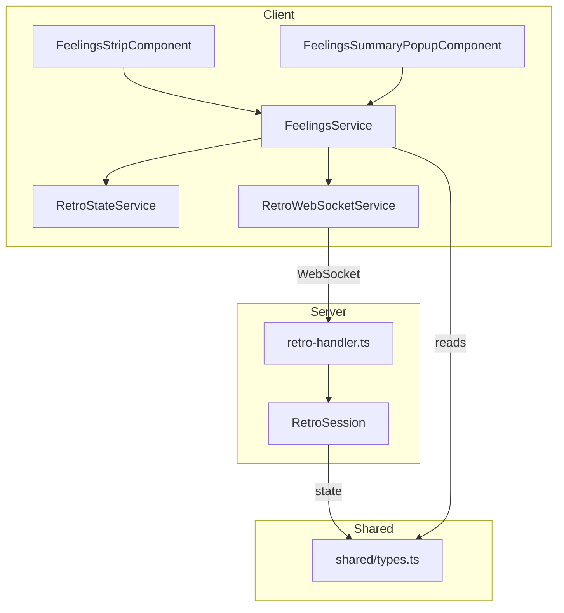

# Design Document: Retro Participant Feelings

## Overview

This feature adds a "Participant Feelings" capability to the existing retrospective board. Participants can express their current mood by selecting an emoji from a configurable strip displayed in the board toolbar. The moderator controls which emoji categories are available and can view a summary popup of all participants' feelings with screenshot functionality.

The design extends the existing retro architecture:
- **Shared types** (`shared/types.ts`) — new `FeelingCategory` type and `allowedFeelings` field on `RetroConfiguration`
- **Server** (`RetroSession` + `retro-handler.ts`) — feelings state management and new WebSocket events
- **Client** — new standalone components (`FeelingsStripComponent`, `FeelingsSummaryPopupComponent`) and a `FeelingsService` using Angular Signals

The feelings feature is isolated from existing card/column/voting logic, uses the same WebSocket connection and broadcasting patterns, and integrates into the toolbar without modifying existing retro functionality.

## Architecture



**Data flow:**
1. Participant clicks emoji → `FeelingsStripComponent` calls `FeelingsService.selectFeeling(category)`
2. `FeelingsService` sends `retro:feeling:select` via `RetroWebSocketService`
3. Server `retro-handler` validates (allowed feeling, board not completed, valid user) and updates `RetroSession.feelings` map
4. Server broadcasts `retro:feeling:updated` to all session clients
5. Client `RetroStateService` (or `FeelingsService`) updates local signal state
6. `FeelingsStripComponent` reactively re-renders highlight; `FeelingsSummaryPopupComponent` updates if open

## Components and Interfaces

### New Shared Types (`shared/types.ts`)

```typescript
// Feeling categories available for selection
export type FeelingCategory =
  | 'Satisfaction'
  | 'Frustration'
  | 'Confidence'
  | 'Confusion'
  | 'Boredom'
  | 'Happy'
  | 'No_Feeling'
  | 'Glad'
  | 'Sad'
  | 'Mad';

export const ALL_FEELING_CATEGORIES: FeelingCategory[] = [
  'Satisfaction', 'Frustration', 'Confidence', 'Confusion',
  'Boredom', 'Happy', 'No_Feeling', 'Glad', 'Sad', 'Mad',
];

// Emoji mapping for each feeling category
export const FEELING_EMOJI_MAP: Record<FeelingCategory, string> = {
  Satisfaction: '😌',
  Frustration: '😤',
  Confidence: '💪',
  Confusion: '😕',
  Boredom: '😴',
  Happy: '😊',
  No_Feeling: '😶',
  Glad: '😄',
  Sad: '😢',
  Mad: '😠',
};

export const DEFAULT_ALLOWED_FEELINGS: FeelingCategory[] = ['Happy', 'Sad', 'No_Feeling'];
```

### Extended `RetroConfiguration`

```typescript
export interface RetroConfiguration {
  // ... existing fields ...
  allowedFeelings: FeelingCategory[];  // ordered list, min 1, max 10
}
```

### Extended `RetroSessionState`

```typescript
export interface RetroSessionState {
  // ... existing fields ...
  feelings: Record<string, FeelingCategory | null>;  // userId -> selected feeling or null
}
```

### New WebSocket Events

| Event | Direction | Payload | Description |
|-------|-----------|---------|-------------|
| `retro:feeling:select` | Client → Server | `{ category: FeelingCategory \| null }` | Participant selects/deselects a feeling |
| `retro:feeling:updated` | Server → All Clients | `{ userId: string, category: FeelingCategory \| null }` | Broadcast feeling change |

Configuration updates use the existing `retro:config:update` / `retro:config:updated` events with the `allowedFeelings` field included.

### Client Components

#### `FeelingsStripComponent`
- **Selector:** `app-feelings-strip`
- **Location:** `client/src/app/components/feelings-strip/feelings-strip.component.ts`
- **Inputs:** None (reads from `RetroStateService` and `FeelingsService`)
- **Responsibilities:**
  - Render the golden/yellow bordered container with "Your feeling" label
  - Display emoji buttons for each category in `allowedFeelings`
  - Highlight the currently selected emoji
  - Show tooltip on hover with category name
  - Disable interactions when board is completed
  - Show summary icon for moderators only

#### `FeelingsSummaryPopupComponent`
- **Selector:** `app-feelings-summary-popup`
- **Location:** `client/src/app/components/feelings-summary-popup/feelings-summary-popup.component.ts`
- **Inputs:** `open: InputSignal<boolean>`
- **Outputs:** `closed: OutputEmitterRef<void>`
- **Responsibilities:**
  - Modal dialog listing all participants + their feeling emoji
  - Sort participants alphabetically (case-insensitive)
  - Display "No feeling" for participants without a selection
  - Live-update from WebSocket events while open
  - Screenshot button with loading state and error handling

#### `FeelingsService`
- **Location:** `client/src/app/services/feelings.service.ts`
- **Pattern:** `providedIn: 'root'`, uses `inject()` + Signals
- **Responsibilities:**
  - Maintain `feelings` signal: `Signal<Record<string, FeelingCategory | null>>`
  - Maintain `myFeeling` computed signal based on current user
  - Subscribe to `retro:feeling:updated` events
  - Provide `selectFeeling(category: FeelingCategory | null)` method
  - Handle connection state (don't update local state if send fails)

### Server Changes

#### `RetroSession` additions
- New private field: `feelings: Map<string, FeelingCategory | null>`
- `setFeeling(userId: string, category: FeelingCategory | null): void` — validates category is in `allowedFeelings`, stores in map
- `getFeeling(userId: string): FeelingCategory | null`
- `getFeelingsMap(): Record<string, FeelingCategory | null>`
- `clearFeelingForCategory(category: FeelingCategory): string[]` — returns userIds whose feelings were cleared
- Override `removeParticipant` to also remove feeling
- Override `getSessionState` to include `feelings` in the returned state
- Override `updateConfig` to clear feelings for removed categories

#### `retro-handler.ts` additions
- Handle `retro:feeling:select` event
- Validate: board not completed, category in `allowedFeelings` (or null for deselect)
- On config update that removes feelings: clear affected participants and broadcast individual `retro:feeling:updated` events
- On participant disconnect: broadcast `retro:feeling:updated` with null

### Settings Panel Integration

The existing settings dialog (`retro-toolbar.component.ts`) will be extended with a "Feelings" section containing:
- 10 checkboxes for each `FeelingCategory`
- Checked state derived from current `allowedFeelings`
- Minimum-one enforcement (disable last checked checkbox)
- Changes sent via existing `sendConfigUpdate()` method

## Data Models

### Feelings State (Server-side, in-memory)

```typescript
// Within RetroSession class
private feelings: Map<string, FeelingCategory | null> = new Map();
```

The feelings map is:
- Keyed by participant `userId`
- Values are either a valid `FeelingCategory` or `null` (no feeling selected)
- Populated when participants select feelings
- Entries removed when participants disconnect
- Entries cleared (set to null then removed) when their selected category is removed from `allowedFeelings`
- Included in the `RetroSessionState` sent on join/reconnect as a plain `Record<string, FeelingCategory | null>`

### Configuration Extension

```typescript
// Default added to RetroConfiguration
allowedFeelings: FeelingCategory[]  // default: ['Happy', 'Sad', 'No_Feeling']
```

The `allowedFeelings` field is:
- Persisted as part of `RetroConfiguration` for the session lifetime (in-memory)
- Ordered — the UI renders emojis in this order
- Constrained to 1-10 entries from the `ALL_FEELING_CATEGORIES` set
- Updated via the existing `retro:config:update` mechanism

### Screenshot Filename Format

```
feelings-summary-YYYY-MM-DD.png
```

Generated using the current date at the time of capture.

## Correctness Properties

*A property is a characteristic or behavior that should hold true across all valid executions of a system — essentially, a formal statement about what the system should do. Properties serve as the bridge between human-readable specifications and machine-verifiable correctness guarantees.*

### Property 1: allowedFeelings bounds enforcement

*For any* `allowedFeelings` update attempt, the system SHALL ensure the resulting list contains at least 1 and at most 10 entries. If a removal would result in an empty list, the removal SHALL be rejected and the list remains unchanged.

**Validates: Requirements 1.1, 1.4**

### Property 2: Non-moderator configuration rejection

*For any* user who is not a moderator, any attempt to modify the `allowedFeelings` configuration SHALL be rejected and the configuration SHALL remain unchanged.

**Validates: Requirements 1.8**

### Property 3: Feelings strip displays exactly allowedFeelings in order

*For any* `allowedFeelings` configuration, the Feelings Strip SHALL render exactly those emoji icons corresponding to the categories in `allowedFeelings`, in the same order as the array.

**Validates: Requirements 2.2, 2.5**

### Property 4: Selected feeling is highlighted

*For any* participant with a non-null feeling selection that is in the current `allowedFeelings`, the corresponding emoji in the Feelings Strip SHALL have the highlight indicator applied, and all other emojis SHALL NOT have it.

**Validates: Requirements 2.6**

### Property 5: Valid feeling selection updates state and broadcasts

*For any* participant (including moderators) selecting a valid `FeelingCategory` that is present in `allowedFeelings` on a non-completed board, the system SHALL store that category as the participant's feeling and broadcast a `retro:feeling:updated` event with the participant's userId and the selected category.

**Validates: Requirements 3.1, 3.2, 3.6, 4.1, 4.2**

### Property 6: Toggle deselection

*For any* participant whose current feeling matches the category they click, the system SHALL set their feeling to null and broadcast a `retro:feeling:updated` event with null.

**Validates: Requirements 3.3**

### Property 7: Disallowed feeling rejection

*For any* `FeelingCategory` that is NOT in the current `allowedFeelings`, if a participant submits that category as their selection, the system SHALL reject the request, retain the participant's previous feeling unchanged, and NOT broadcast any update.

**Validates: Requirements 3.7**

### Property 8: Board completion prevents feeling changes

*For any* board that is marked as completed, all feeling selection requests SHALL be rejected and the feelings map SHALL remain unchanged.

**Validates: Requirements 3.5**

### Property 9: Removing a feeling from allowed clears affected participants

*For any* `FeelingCategory` removed from `allowedFeelings`, all participants whose current feeling matches that category SHALL have their feeling cleared to null, and a `retro:feeling:updated` event with null SHALL be broadcast for each affected participant.

**Validates: Requirements 1.6, 2.7**

### Property 10: Disconnect removes participant feeling

*For any* participant who disconnects from the session, their entry SHALL be removed from the feelings map and a `retro:feeling:updated` event with null SHALL be broadcast to all remaining clients.

**Validates: Requirements 4.4**

### Property 11: New joiner receives full feelings map

*For any* new participant joining (or reconnecting to) a session, the session state sent to them SHALL include the complete current feelings map containing all connected participants' feeling selections.

**Validates: Requirements 4.3, 4.5**

### Property 12: Summary icon visibility matches moderator status

*For any* user, the summary icon in the Feelings Strip SHALL be visible if and only if that user is a moderator.

**Validates: Requirements 5.1**

### Property 13: Popup displays participants in case-insensitive alphabetical order

*For any* set of participants in a session, the Feelings Summary Popup SHALL display them sorted in case-insensitive alphabetical order by display name, with the correct feeling emoji (or "No feeling" for null) next to each name.

**Validates: Requirements 5.4, 5.5**

## Error Handling

| Scenario | Client Behavior | Server Behavior |
|----------|----------------|-----------------|
| Feeling selection on completed board | Emoji buttons disabled; no request sent | Returns error: `BOARD_COMPLETED` |
| Feeling not in allowedFeelings | Should not occur (UI only shows allowed); if forced, ignore | Returns error: `INVALID_FEELING` |
| Non-moderator config update | Settings panel not shown to non-moderators | Returns error: `UNAUTHORIZED` |
| WebSocket disconnected during selection | Don't update local highlight; show toast "Selection not saved" | N/A (message never received) |
| Screenshot capture failure | Re-enable button; show error toast | N/A (client-only) |
| Invalid message format | Ignore silently | Returns error: `INVALID_MESSAGE` |
| Session not found | Redirect to lobby | Returns error: `NOT_FOUND` and close connection |

### Graceful Degradation
- If `allowedFeelings` is missing from an older session state (migration), default to `['Happy', 'Sad', 'No_Feeling']`
- If `feelings` map is missing from session state, treat as empty `{}`
- If a feeling category in the map doesn't match any known category, ignore it on the client

## Testing Strategy

### Property-Based Tests (Client — Vitest + fast-check)

PBT is appropriate for this feature because:
- Feeling selection/deselection involves pure logic with clear input/output behavior
- The `allowedFeelings` constraint, feeling validation, and sorting are universal properties over large input spaces
- The emoji-to-category mapping, ordering, and highlight logic are pure functions testable across all valid inputs

**Configuration:**
- Library: `fast-check` (already used in the project)
- Minimum 100 iterations per property test
- Tag format: `Feature: retro-participant-feelings, Property {number}: {property_text}`

**Property tests to implement:**
1. `allowedFeelings` bounds (Property 1)
2. Strip renders correct emojis in order (Property 3)
3. Highlight on selected emoji only (Property 4)
4. Valid selection updates state (Property 5)
5. Toggle deselection (Property 6)
6. Disallowed feeling rejected (Property 7)
7. Completed board rejects changes (Property 8)
8. Removing allowed feeling clears affected (Property 9)
9. Popup alphabetical ordering (Property 13)

### Unit Tests (Client — Vitest)

- `FeelingsStripComponent`: renders label, shows/hides summary icon, disables on completion
- `FeelingsSummaryPopupComponent`: opens/closes, displays "No feeling", screenshot button states
- `FeelingsService`: connection state handling, event subscription, local state management
- Settings panel: checkbox rendering, minimum-one enforcement

### Unit Tests (Server — Jest)

- `RetroSession.setFeeling()`: stores valid feeling, rejects invalid/completed
- `RetroSession.updateConfig()`: clears feelings when categories removed
- `RetroSession.removeParticipant()`: clears feeling entry
- `RetroSession.getSessionState()`: includes feelings map
- `retro-handler`: routes `retro:feeling:select`, validates permissions, broadcasts correctly

### Integration Tests

- Full WebSocket flow: connect → select feeling → verify broadcast received by other clients
- Config update flow: moderator removes category → verify affected participants cleared
- Reconnection: disconnect → reconnect → verify feelings map received in state

### Non-Regression

- All existing retro tests pass unchanged
- No modifications to poker components or services
- Feelings WebSocket events handled in a new case branch, not modifying existing event routing
