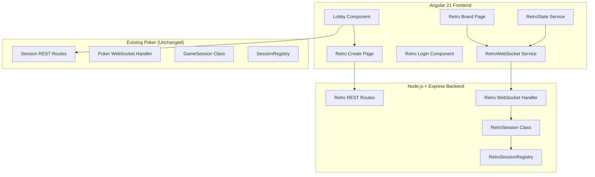
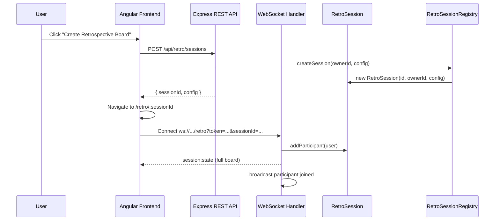

# Design Document: Retrospective Board

## Overview

The Retrospective Board feature adds a collaborative sprint retrospective tool alongside the existing Scrum Poker application. It follows the same architectural patterns: Angular 21 standalone components with signals on the frontend, Node.js/Express with WebSocket on the backend, and in-memory session storage with automatic cleanup.

The feature introduces a parallel session type (`RetroSession`) managed by its own registry (`RetroSessionRegistry`), completely independent from the poker `SessionRegistry`. Both share the same authentication flow (JWT tokens), WebSocket infrastructure patterns, and lobby entry point.

Key capabilities:
- Template-based board creation with 25 predefined retrospective formats
- Real-time collaboration via WebSocket (cards, votes, comments, columns)
- Moderator-controlled workflow (hide cards → reveal → enable voting → complete)
- Advanced configuration (password protection, card visibility, voting rules, layout)
- CSV import/export for data portability
- Board screenshot capture

## Architecture

### High-Level System Architecture



### Integration Points

1. **Lobby**: Updated to show both "Start New Game" (poker) and "Create Retrospective Board" tiles
2. **Authentication**: Reuses existing `auth-service.ts` (JWT token generation/validation)
3. **WebSocket**: Separate handler function (`handleRetroWebSocket`) mounted on a distinct path (`/retro`)
4. **Routes**: New `/api/retro` route prefix, completely separate from `/api/sessions`
5. **Shared Types**: New retro types added to `shared/types.ts`

### Request Flow



## Components and Interfaces

### Frontend Components

| Component | Responsibility |
|-----------|---------------|
| `LobbyComponent` (updated) | Adds retro tile alongside poker tile |
| `RetroCreatePageComponent` | Board creation form (name, votes, template, config) |
| `RetroBoardPageComponent` | Main board view with columns, cards, toolbar |
| `RetroColumnComponent` | Single column with header, card list, add card button |
| `RetroCardComponent` | Card with text, votes, comments, emoji |
| `RetroToolbarComponent` | Moderator controls (reveal, enable voting, complete, export, import, screenshot) |
| `RetroLoginComponent` | Display name + optional password entry for joining |
| `TemplatePreviewComponent` | Shows column names for selected template |

### Frontend Services

| Service | Responsibility |
|---------|---------------|
| `RetroWebSocketService` | WebSocket connection management for retro sessions |
| `RetroStateService` | Reactive state management using signals |
| `RetroExportService` | CSV export/import logic |
| `RetroScreenshotService` | Board screenshot capture using html2canvas |

### Backend Modules

| Module | Responsibility |
|--------|---------------|
| `retro-session.ts` | `RetroSession` class — board state management |
| `retro-session-registry.ts` | `RetroSessionRegistry` — session lifecycle |
| `retro-routes.ts` | REST API endpoints for retro sessions |
| `retro-handler.ts` | WebSocket event handler for retro sessions |
| `retro-templates.ts` | Template definitions (25 templates) |

### Angular Route Structure

```typescript
// New routes added to app.routes.ts
{ path: 'retro/create', loadComponent: () => import('./components/retro-create/...') },
{ path: 'retro/:sessionId', loadComponent: () => import('./components/retro-board/...') },
{ path: 'retro/:sessionId/login', loadComponent: () => import('./components/retro-login/...') },
```

## Data Models

### RetroConfiguration

```typescript
interface RetroConfiguration {
  boardName: string;
  maxVotesPerUser: number;          // default: 6, positive integer
  templateId: string;                // references a template
  hideCardsInitially: boolean;       // default: false
  disableVotingInitially: boolean;   // default: false
  hideVoteCount: boolean;            // default: false
  oneVotePerCard: boolean;           // default: false
  showCardAuthor: boolean;           // default: false
  password: string | null;           // null = no password
  enableGifEmoji: boolean;           // default: true
  columnLayout: 'vertical' | 'horizontal'; // default: 'vertical'
}
```

### RetroTemplate

```typescript
interface RetroTemplate {
  id: string;           // kebab-case identifier
  name: string;         // display name
  columns: string[];    // ordered column names
}
```

### RetroBoard (Session State)

```typescript
interface RetroBoard {
  columns: RetroColumn[];
  context: string;                   // sprint context description
  cardsRevealed: boolean;            // moderator has revealed cards
  votingEnabled: boolean;            // moderator has enabled voting
  isCompleted: boolean;              // board is locked
}
```

### RetroColumn

```typescript
interface RetroColumn {
  id: string;           // UUID
  name: string;
  cards: RetroCard[];
  order: number;        // position index
}
```

### RetroCard

```typescript
interface RetroCard {
  id: string;           // UUID
  text: string;
  authorId: string;     // userId of creator
  authorName: string;   // display name of creator
  votes: number;        // total vote count
  votedBy: string[];    // userIds who voted on this card
  comments: RetroComment[];
  columnId: string;     // parent column reference
  order: number;        // position within column
  createdAt: string;    // ISO 8601
}
```

### RetroComment

```typescript
interface RetroComment {
  id: string;           // UUID
  text: string;
  authorId: string;
  authorName: string;
  createdAt: string;    // ISO 8601
}
```

### RetroSessionState (Full state for sync)

```typescript
interface RetroSessionState {
  sessionId: string;
  config: RetroConfiguration;
  board: RetroBoard;
  participants: User[];  // reuses existing User type
  ownerId: string;
  createdAt: string;
  votesRemaining: Record<string, number>; // userId -> remaining votes
}
```

### WebSocket Event Protocol

#### Client → Server Events

| Event | Data | Description |
|-------|------|-------------|
| `retro:card:add` | `{ columnId, text }` | Add a card to a column |
| `retro:card:edit` | `{ cardId, text }` | Edit card text |
| `retro:card:remove` | `{ cardId }` | Remove a card |
| `retro:card:move` | `{ cardId, targetColumnId, targetIndex }` | Move card between/within columns |
| `retro:card:vote` | `{ cardId }` | Vote on a card |
| `retro:card:unvote` | `{ cardId }` | Remove vote from a card |
| `retro:comment:add` | `{ cardId, text }` | Add comment to a card |
| `retro:comment:remove` | `{ cardId, commentId }` | Remove a comment |
| `retro:column:add` | `{ name }` | Add a new column |
| `retro:column:remove` | `{ columnId }` | Remove a column |
| `retro:column:reorder` | `{ orderedIds }` | Reorder columns |
| `retro:column:rename` | `{ columnId, name }` | Rename a column |
| `retro:context:update` | `{ text }` | Update board context |
| `retro:cards:reveal` | `{}` | Reveal all hidden cards |
| `retro:voting:enable` | `{}` | Enable voting |
| `retro:board:complete` | `{}` | Mark board as completed |
| `retro:config:update` | `{ config: Partial<RetroConfiguration> }` | Update board config |

#### Server → Client Events

| Event | Data | Description |
|-------|------|-------------|
| `retro:session:state` | `{ state: RetroSessionState }` | Full state sync on connect/reconnect |
| `retro:card:added` | `{ card, columnId }` | Card was added |
| `retro:card:edited` | `{ cardId, text }` | Card text was updated |
| `retro:card:removed` | `{ cardId, columnId }` | Card was removed |
| `retro:card:moved` | `{ cardId, fromColumnId, toColumnId, targetIndex }` | Card was moved |
| `retro:card:voted` | `{ cardId, votes, votedBy, votesRemaining }` | Vote count updated |
| `retro:comment:added` | `{ cardId, comment }` | Comment was added |
| `retro:comment:removed` | `{ cardId, commentId }` | Comment was removed |
| `retro:column:added` | `{ column }` | Column was added |
| `retro:column:removed` | `{ columnId }` | Column was removed |
| `retro:column:reordered` | `{ orderedIds }` | Columns were reordered |
| `retro:column:renamed` | `{ columnId, name }` | Column was renamed |
| `retro:context:updated` | `{ text }` | Context was updated |
| `retro:cards:revealed` | `{}` | Cards are now visible |
| `retro:voting:enabled` | `{}` | Voting is now active |
| `retro:board:completed` | `{}` | Board is now locked |
| `retro:config:updated` | `{ config }` | Configuration changed |
| `retro:participant:joined` | `{ participants }` | Participant list updated |
| `retro:participant:left` | `{ participants }` | Participant list updated |
| `retro:error` | `{ message, code }` | Error notification |

### REST API Endpoints

| Method | Path | Description |
|--------|------|-------------|
| `POST` | `/api/retro/sessions` | Create a new retro session |
| `GET` | `/api/retro/sessions/:sessionId` | Get session info |
| `GET` | `/api/retro/sessions/:sessionId/exists` | Check if session exists (no auth) |
| `POST` | `/api/retro/sessions/:sessionId/verify-password` | Verify board password |
| `GET` | `/api/retro/sessions/:sessionId/export` | Export board as CSV |
| `POST` | `/api/retro/sessions/:sessionId/import` | Import cards from CSV |

### RetroSession Class Design

```typescript
class RetroSession {
  readonly sessionId: string;
  readonly ownerId: string;
  readonly createdAt: string;
  config: RetroConfiguration;
  lastActivityAt: string;

  private board: RetroBoard;
  private participants: Map<string, User>;
  private votesUsed: Map<string, number>; // userId -> votes used

  // Participant management
  addParticipant(user: User): void;
  removeParticipant(userId: string): void;
  getParticipants(): User[];
  getParticipantCount(): number;
  hasDisplayName(displayName: string): boolean;

  // Column operations
  addColumn(name: string): RetroColumn;
  removeColumn(columnId: string): void;
  reorderColumns(orderedIds: string[]): void;
  renameColumn(columnId: string, name: string): void;

  // Card operations
  addCard(columnId: string, text: string, authorId: string, authorName: string): RetroCard;
  editCard(cardId: string, text: string, userId: string): void;
  removeCard(cardId: string, userId: string): void;
  moveCard(cardId: string, targetColumnId: string, targetIndex: number): void;

  // Voting
  voteCard(cardId: string, userId: string): void;
  unvoteCard(cardId: string, userId: string): void;
  getVotesRemaining(userId: string): number;

  // Comments
  addComment(cardId: string, text: string, authorId: string, authorName: string): RetroComment;
  removeComment(cardId: string, commentId: string, userId: string): void;

  // Moderator controls
  revealCards(): void;
  enableVoting(): void;
  completeBoard(): void;
  updateContext(text: string): void;
  updateConfig(partial: Partial<RetroConfiguration>): RetroConfiguration;

  // State
  getSessionState(): RetroSessionState;
  getVisibleState(userId: string): RetroSessionState; // filtered by card visibility

  // Export/Import
  exportCSV(): string;
  importCSV(csvData: string): void;
}
```

### Template System Design

Templates are defined as a static registry in `retro-templates.ts`:

```typescript
// server/src/services/retro-templates.ts
export const RETRO_TEMPLATES: RetroTemplate[] = [
  { id: 'went-well-improve-actions', name: 'Went well, To improve, Action items', columns: ['Went Well', 'To Improve', 'Action Items'] },
  { id: 'four-questions', name: 'What went well?, What didn\'t go so well?, What have I learned?, What still puzzles me?', columns: ['Went Well', 'Didn\'t Go Well', 'Learned', 'Still Puzzles Me'] },
  { id: 'start-stop-continue', name: 'Start, Stop, Continue', columns: ['Start', 'Stop', 'Continue'] },
  // ... 22 more templates
];

export function getTemplateById(id: string): RetroTemplate | undefined;
export function getDefaultTemplate(): RetroTemplate;
```

The template registry is shared between frontend and backend via `shared/types.ts` so both can reference template definitions without duplication.

## Correctness Properties

*A property is a characteristic or behavior that should hold true across all valid executions of a system — essentially, a formal statement about what the system should do. Properties serve as the bridge between human-readable specifications and machine-verifiable correctness guarantees.*

### Property 1: Board name validation

*For any* string input, the board creation should succeed if and only if the trimmed string is non-empty (contains at least one non-whitespace character).

**Validates: Requirements 2.1, 2.5**

### Property 2: Max votes validation

*For any* numeric input, the max votes field should accept the value if and only if it is a positive integer (> 0, no decimals).

**Validates: Requirements 2.2**

### Property 3: Template-to-columns mapping

*For any* template selected from the template registry, creating a board with that template should produce columns whose names exactly match the template's column definitions in order.

**Validates: Requirements 3.2, 7.1**

### Property 4: Configuration toggle isolation

*For any* valid RetroConfiguration and any single configuration toggle change, updating that toggle should modify only the targeted setting while preserving all other configuration values unchanged.

**Validates: Requirements 4.1–4.8**

### Property 5: Session ID uniqueness

*For any* sequence of session creations, all generated session IDs should be unique (no two sessions share the same ID).

**Validates: Requirements 5.1**

### Property 6: Password authentication

*For any* password-protected board with password P and any password attempt A, access should be granted if and only if A equals P.

**Validates: Requirements 5.4, 16.1, 16.2**

### Property 7: Display name case-insensitive uniqueness

*For any* retrospective session with an existing participant named N, attempting to join with a display name that is a case-insensitive match of N should be rejected.

**Validates: Requirements 6.2**

### Property 8: Column addition

*For any* board with N columns and any valid (non-empty) column name, adding a column should result in exactly N+1 columns with the new column appended at the end.

**Validates: Requirements 7.3, 19.1**

### Property 9: Column removal cascades to cards

*For any* board and any column containing cards, removing that column should result in both the column and all its cards being absent from the board state.

**Validates: Requirements 7.4, 19.2**

### Property 10: Column reorder preserves cards

*For any* board with columns and any valid permutation of column IDs, reordering should produce exactly that column order with all cards within each column unchanged.

**Validates: Requirements 7.5, 19.3**

### Property 11: Card addition

*For any* column in any board state and any valid (non-empty) card text, adding a card should increase that column's card count by exactly 1 and the new card should contain the provided text and author.

**Validates: Requirements 8.1**

### Property 12: Card edit updates text

*For any* existing card and any valid new text string, editing the card (by the author or moderator) should result in the card containing the new text with all other card properties unchanged.

**Validates: Requirements 8.2**

### Property 13: Card removal permissions

*For any* card on the board and any user, removal should succeed if and only if the user is the card's author or a moderator. Successful removal should result in the card being absent from the board.

**Validates: Requirements 8.3, 8.4**

### Property 14: Card move between columns

*For any* card in column A and any target column B (where A ≠ B), moving the card should remove it from column A and add it to column B at the specified index, preserving all card data.

**Validates: Requirements 8.8, 8.9**

### Property 15: Voting mechanics

*For any* participant with remaining votes > 0 and any card (respecting one-vote-per-card rules), voting should increment the card's vote count by 1 and decrement the participant's remaining votes by 1. When remaining votes equals 0, all further vote attempts should be rejected.

**Validates: Requirements 9.1, 9.2, 9.3**

### Property 16: Disabled voting prevents all votes

*For any* board where voting is disabled and any participant attempting to vote on any card, the vote should be rejected and no vote counts should change.

**Validates: Requirements 9.4**

### Property 17: Card visibility when hidden

*For any* board with "hide cards initially" active and cards not yet revealed, and for any participant, the visible cards should be exactly those authored by that participant. The card count per column should equal the total number of cards in that column regardless of authorship.

**Validates: Requirements 10.1, 10.3**

### Property 18: Card reveal makes all visible

*For any* board state, after the moderator triggers card reveal, all cards in all columns should be visible to all participants.

**Validates: Requirements 10.2**

### Property 19: Completed board rejects modifications

*For any* completed board and any modification action (add/edit/remove card, vote, add/remove/reorder column, update context), the action should be rejected and the board state should remain unchanged.

**Validates: Requirements 11.4, 19.4**

### Property 20: Reconnect restores full board state

*For any* board state at time T, when a participant disconnects and reconnects, the state received should be equivalent to the current board state (including all columns, cards, votes, comments, and configuration).

**Validates: Requirements 12.6**

### Property 21: CSV export completeness

*For any* board state with columns, cards, votes, and comments, the exported CSV should contain every column name, every card text, every vote count, and every comment text present in the board.

**Validates: Requirements 13.2, 13.3**

### Property 22: CSV import/export round trip

*For any* board state, exporting to CSV and then importing that CSV into an empty board with matching columns should produce cards with equivalent text content and column placement.

**Validates: Requirements 14.2**

### Property 23: Invalid CSV rejection

*For any* malformed CSV input (missing required columns, invalid structure), the import should be rejected with an error and the board state should remain unchanged.

**Validates: Requirements 14.3**

### Property 24: Session isolation

*For any* two concurrent retro sessions, any modification to one session's state (adding cards, voting, column changes) should not affect the other session's state.

**Validates: Requirements 15.2**

### Property 25: Inactive session cleanup

*For any* session with zero participants and lastActivityAt older than 30 minutes, running the cleanup process should remove that session from the registry.

**Validates: Requirements 15.3**

### Property 26: Context editable only by moderator

*For any* non-moderator participant attempting to update the board context, the update should be rejected and the context should remain unchanged.

**Validates: Requirements 18.3**

### Property 27: Icon buttons have accessibility attributes

*For any* icon-only button rendered on the board, it should have both a non-empty `title` attribute and a non-empty `aria-label` attribute with matching text.

**Validates: Requirements 21.2, 21.3**

## Error Handling

### Client-Side Errors

| Scenario | Handling |
|----------|----------|
| WebSocket disconnection | Auto-reconnect with exponential backoff (same as poker) |
| Invalid form input | Inline validation errors, prevent submission |
| Password incorrect | Display error message, allow retry |
| Session not found | Redirect to lobby with toast notification |
| Clipboard API unavailable | Fallback to file download for screenshots |
| CSV parse failure | Display error toast with description of the issue |

### Server-Side Errors

| Scenario | Response |
|----------|----------|
| Unauthorized action | WebSocket error event with code `UNAUTHORIZED` |
| Session not found | WebSocket close code 4004 or REST 404 |
| Board completed (locked) | WebSocket error with code `BOARD_COMPLETED` |
| Invalid card/column ID | WebSocket error with code `NOT_FOUND` |
| No remaining votes | WebSocket error with code `NO_VOTES_REMAINING` |
| Duplicate display name | WebSocket close code 4009 |
| Invalid password | REST 403 with error code `INVALID_PASSWORD` |
| Empty text input | WebSocket error with code `EMPTY_INPUT` |
| Invalid CSV format | REST 400 with error code `INVALID_CSV` |

### Error Event Format

```typescript
// Same pattern as existing poker error events
{ event: 'retro:error', data: { message: string, code: string } }
```

## Testing Strategy

### Property-Based Tests (using fast-check)

Property-based tests will validate the correctness properties defined above. Each property test runs a minimum of 100 iterations with randomly generated inputs.

**Target modules for PBT:**
- `RetroSession` class (properties 1–26): Core business logic for board state management
- Frontend components (property 27): Accessibility attribute verification

**Configuration:**
- Library: `fast-check` (already available in the project ecosystem)
- Minimum iterations: 100 per property
- Tag format: `Feature: retrospective-board, Property {N}: {title}`

### Unit Tests (example-based)

- Template registry completeness (all 25 templates present with correct columns)
- REST API endpoint responses (create, get, exists, verify-password, export, import)
- WebSocket event routing (correct handler called for each event type)
- UI component rendering (lobby tile, board layout, card display)
- CSV format generation and parsing
- Screenshot capture trigger and clipboard/download fallback

### Integration Tests

- WebSocket broadcast latency (< 500ms requirement)
- Full session lifecycle (create → join → add cards → vote → reveal → complete)
- Multi-participant collaboration (concurrent card additions, votes)
- Reconnection state restoration
- Password-protected session join flow

### Test Organization

```
server/src/services/__tests__/retro-session.spec.ts          # Unit tests
server/src/services/__tests__/retro-session.property.spec.ts # Property tests
server/src/services/__tests__/retro-session-registry.spec.ts # Registry tests
server/src/websocket/__tests__/retro-handler.spec.ts         # WebSocket handler tests
server/src/routes/__tests__/retro-routes.spec.ts             # REST API tests
client/src/app/components/retro-board/__tests__/             # Frontend tests
```
