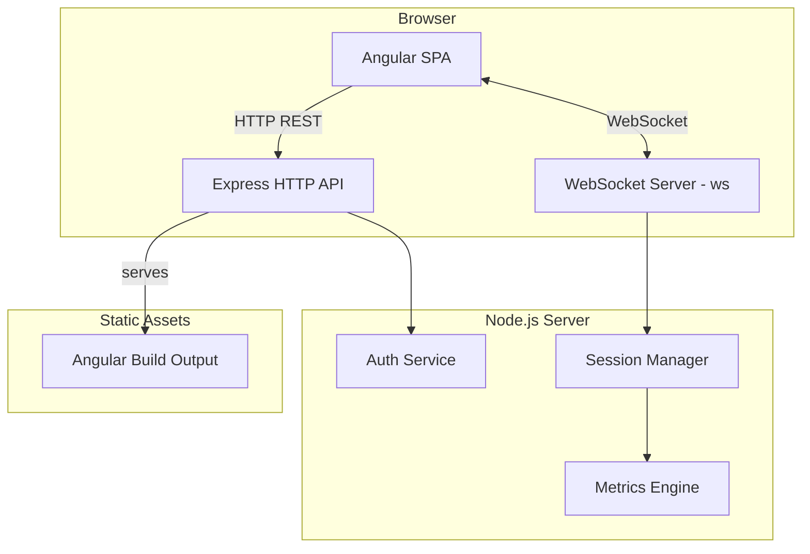
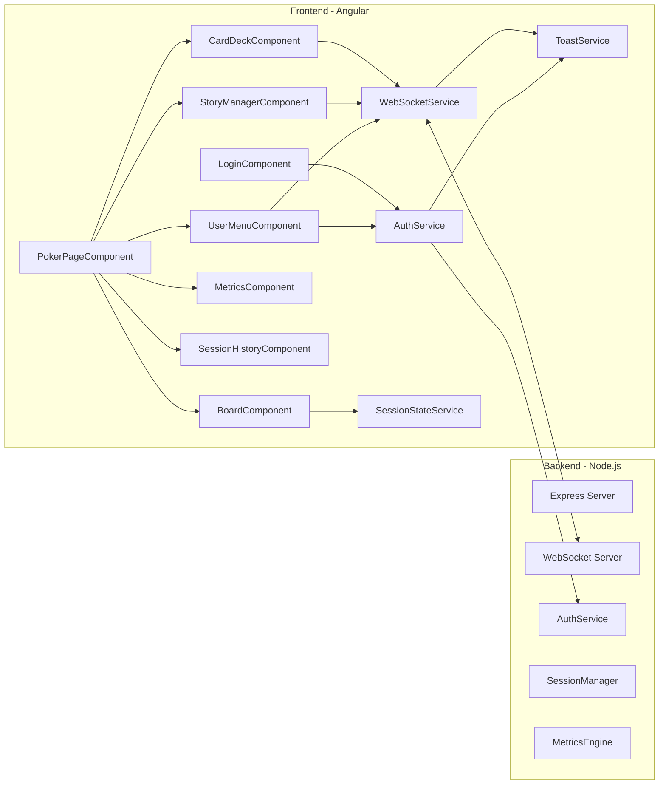

# Design Document: Scrum Poker

## Overview

This document describes the technical design for a web-based Scrum Poker application that enables Agile teams to conduct real-time estimation sessions. The system follows a client-server architecture with an Angular single-page application (SPA) frontend communicating with a Node.js backend over HTTP and WebSocket protocols.

The application supports two user roles (Moderator and Participant), real-time card selection and reveal workflows, voting metrics calculation, and session history tracking. It is packaged as a single Docker container and deployed to Kubernetes.

### Key Design Decisions

1. **Single container deployment**: Both the Angular frontend (served as static files) and the Node.js backend run in one container. The Node.js server serves the Angular build artifacts and handles WebSocket connections on the same port.

2. **In-memory session state**: Session state (active voting rounds, participants, card selections) is stored in-memory on the server. This keeps the architecture simple and avoids database dependencies. Session history persists for the lifetime of the server process.

3. **WebSocket for real-time communication**: All real-time events (card selections, reveals, board resets, participant joins/leaves) flow through WebSocket. HTTP REST endpoints handle authentication and initial session state retrieval.

4. **Token-based sessions**: Authentication uses a simple JWT-like token stored in `localStorage` for cross-tab persistence. No password is required — users authenticate with a username or anonymous display name.

5. **Angular standalone components**: The frontend uses Angular standalone components (no NgModules) for a simpler, more modern component architecture.

6. **CSS custom properties for theming**: The visual design system uses CSS custom properties (variables) defined on `:root` to establish a cohesive color palette. This enables consistent theming across all components and simplifies future theme changes.

7. **Toast notification service**: Error and status notifications use a centralized `ToastService` that manages a queue of toast messages with auto-dismiss timers. This decouples error presentation from business logic and provides a single point of control for notification behavior.

8. **User menu replaces inline profile**: The `ProfileComponent` is replaced by a `UserMenuComponent` that consolidates role switching, user info display, and logout behind a compact avatar dropdown. This reduces header clutter and follows common UI patterns.

## Architecture

### High-Level Architecture



### Component Architecture



### Request Flow

**Authentication Flow:**
1. User submits username or display name via login form
2. Frontend `AuthService` sends POST to `/api/auth/login`
3. Backend `AuthService` validates input, generates session token, returns token + user info
4. Frontend stores token in `localStorage`, redirects to poker page
5. On new tab open, frontend checks `localStorage` for existing token, validates via `/api/auth/validate`

**Voting Round Flow:**
1. Moderator submits story description
2. Frontend sends `story:submit` WebSocket event
3. Backend `SessionManager` creates new voting round, broadcasts `round:started` to all clients
4. Participants select cards, frontend sends `card:select` events
5. Backend records selections, broadcasts `card:voted` (without value) to all clients
6. Moderator clicks "Reveal Cards", frontend sends `cards:reveal`
7. Backend broadcasts `cards:revealed` with all selections to all clients
8. Frontend plays flip animation, displays metrics
9. Moderator clicks "Clear Board", frontend sends `board:clear`
10. Backend saves round to history, resets state, broadcasts `board:cleared`

## Components and Interfaces

### Backend Components

#### Express HTTP Server (`server.ts`)

The main entry point. Configures Express, serves static Angular files, mounts API routes, and upgrades HTTP connections to WebSocket.

```typescript
// server.ts
import express from 'express';
import http from 'http';
import path from 'path';
import { WebSocketServer } from 'ws';
import { authRouter } from './routes/auth';
import { handleWebSocket } from './websocket/handler';

const app = express();
const server = http.createServer(app);
const wss = new WebSocketServer({ server });

app.use(express.json());
app.use('/api/auth', authRouter);
app.use(express.static(path.join(__dirname, '../client/dist')));
app.get('*', (req, res) => {
  res.sendFile(path.join(__dirname, '../client/dist/index.html'));
});

wss.on('connection', handleWebSocket);

const PORT = process.env.PORT || 3000;
server.listen(PORT);
```

#### Auth Service (`services/auth-service.ts`)

Handles user authentication, token generation, and session validation.

**Interface:**
```typescript
interface AuthService {
  login(username: string, isAnonymous: boolean): AuthResult;
  validateToken(token: string): User | null;
  logout(token: string): void;
  getActiveTokens(userId: string): string[];
}

interface AuthResult {
  token: string;
  user: User;
}
```

#### Session Manager (`services/session-manager.ts`)

Manages the poker session lifecycle: participants, voting rounds, card selections, and history.

**Interface:**
```typescript
interface SessionManager {
  addParticipant(user: User): void;
  removeParticipant(userId: string): void;
  getParticipants(): User[];

  startRound(storyDescription: string): VotingRound;
  getCurrentRound(): VotingRound | null;

  selectCard(userId: string, cardValue: CardValue): void;
  getSelections(): Map<string, CardValue>;

  revealCards(): RevealResult;
  clearBoard(): HistoryEntry;

  getHistory(): HistoryEntry[];
  clearHistory(): void;

  getSessionState(): SessionState;
}
```

#### Metrics Engine (`services/metrics-engine.ts`)

Pure function module that calculates voting statistics from revealed card selections.

**Interface:**
```typescript
interface MetricsEngine {
  calculate(selections: Map<string, CardValue>): VotingMetrics;
}

interface VotingMetrics {
  average: number | null;
  mode: CardValue | null;
  spread: number | null;
  distribution: Map<CardValue, number>;
  outliers: string[];          // userIds of outlier voters
  numericVoteCount: number;
  insufficientData: boolean;   // true when < 2 numeric votes
}
```

**Outlier Detection Algorithm:**
The Fibonacci sequence used is `[0, 1, 2, 3, 5, 8, 13, 21, 34, 55, 89]`. Each value has an index (0-10). The mode's index is found, and any vote whose index differs from the mode's index by more than 2 is flagged as an outlier.

#### WebSocket Handler (`websocket/handler.ts`)

Manages WebSocket connections, authenticates incoming connections via token, routes events to the SessionManager, and broadcasts state changes.

**Interface:**
```typescript
interface WebSocketHandler {
  handleConnection(ws: WebSocket, request: http.IncomingMessage): void;
  broadcast(event: string, data: any): void;
  sendTo(userId: string, event: string, data: any): void;
}
```

### Frontend Components

#### LoginComponent

- Displays login form with username field and anonymous login option
- Validates non-empty input
- Calls `AuthService.login()` and navigates to poker page on success
- Styled with the application Theme: gradient background, branded header, styled input fields, and prominent submit button
- Uses Theme CSS custom properties for consistent color application

#### PokerPageComponent

- Main layout container for the poker session
- Composes: `CardDeckComponent`, `BoardComponent`, `StoryManagerComponent`, `MetricsComponent`, `SessionHistoryComponent`, `UserMenuComponent`
- Subscribes to `SessionStateService` for reactive state updates
- Renders a visually rich gradient/pattern background replacing the default white
- Wraps each section (Card_Deck, Board, Metrics, Story input) in styled containers with distinct background colors, rounded corners (`border-radius: 12px`), and subtle box shadows for visual separation

#### CardDeckComponent

- Renders the 14 estimation cards (11 numeric + 3 special)
- Highlights the currently selected card with Card_Selection_Animation
- Disables cards when no voting round is active
- Emits card selection events to `WebSocketService`
- **Card styling**: Each unselected card has a colored border, gradient or solid background fill, rounded corners, and subtle shadow for a 3D appearance
- **Value-based color coding**: Numeric cards use a color scale — lower values (0–3) use cooler tones (blues, greens), higher values (34–89) use warmer tones (oranges, reds), mid-range values (5–21) use transitional tones
- **Special card accent colors**: Coffee, No Clue, and Break cards each have a unique accent color distinct from numeric cards
- **Special card labels**: Each special card displays a text label below the icon — "Coffee" for ☕, "Unknown" for ?, "Break" for ⏸ — in a smaller font size than the icon
- **Hover effect**: Unselected cards show a slight elevation change and border color shift within 100ms on hover
- **Selection animation**: Selected card translates upward by 20px and scales to 105% over 300ms with ease-out timing
- **Reduced motion**: When `prefers-reduced-motion` is enabled, animations are skipped but visual state changes (color, border) are applied immediately

#### BoardComponent

- Displays participant card placeholders in a responsive grid
- Shows face-down cards during voting, face-up after reveal
- Indicates which participants have voted (without showing values)
- Triggers `CardFlipAnimation` on reveal
- **Board clear animation**: When the board is cleared, plays a fade-out + downward slide animation (400ms per card) with 50ms stagger between cards for a sequential sweep effect
- **Reduced motion**: When `prefers-reduced-motion` is enabled, board clear animation is skipped and the board resets immediately

#### StoryManagerComponent (Moderator only)

- Text input for story description with validation
- "Reveal Cards" button (enabled during active round)
- "Clear Board" button (enabled after reveal)

#### MetricsComponent

- Displays voting metrics after card reveal
- Shows average, mode, spread, distribution chart, and outlier highlights
- Shows "insufficient data" message when fewer than 2 numeric votes

#### SessionHistoryComponent

- Sidebar listing completed voting rounds
- Each entry shows story description, average, and mode
- Expandable detail view with individual votes and full metrics
- "Clear History" button with confirmation dialog

#### UserMenuComponent (replaces ProfileComponent)

- Displays a circular avatar icon in the header showing the first letter of the user's display name inside a colored circle
- On click, opens a dropdown menu containing:
  - User display name
  - Current role label (Moderator or Participant)
  - Role switch option (toggles between Moderator and Participant)
  - Logout option
- Closes when clicking outside the menu or pressing the Escape key
- Role switch sends `role:change` event via WebSocketService
- Logout calls `AuthService.logout()` and redirects to login page
- **Keyboard accessible**: Open with Enter/Space, navigate with arrow keys, select with Enter
- **ARIA support**: Avatar button and all menu options have ARIA labels; menu uses `role="menu"` and `role="menuitem"` patterns

#### ProfileComponent (deprecated — replaced by UserMenuComponent)

- Retained for backward compatibility but no longer rendered in PokerPageComponent
- Functionality moved to UserMenuComponent

### Frontend Services

#### AuthService (`services/auth.service.ts`)

```typescript
@Injectable({ providedIn: 'root' })
export class AuthService {
  login(username: string, isAnonymous: boolean): Observable<AuthResult>;
  validateSession(): Observable<User | null>;
  logout(): void;
  getToken(): string | null;
  getCurrentUser(): Signal<User | null>;
}
```

#### WebSocketService (`services/websocket.service.ts`)

```typescript
@Injectable({ providedIn: 'root' })
export class WebSocketService {
  connect(token: string): void;
  disconnect(): void;
  send(event: string, data: any): void;
  on<T>(event: string): Observable<T>;
  connectionState: Signal<'connected' | 'disconnected' | 'reconnecting'>;
}
```

Implements auto-reconnect with exponential backoff (1s initial, 30s cap).

#### SessionStateService (`services/session-state.service.ts`)

```typescript
@Injectable({ providedIn: 'root' })
export class SessionStateService {
  currentRound: Signal<VotingRound | null>;
  participants: Signal<User[]>;
  selections: Signal<Map<string, CardValue>>;
  isRevealed: Signal<boolean>;
  metrics: Signal<VotingMetrics | null>;
  history: Signal<HistoryEntry[]>;
  currentUser: Signal<User | null>;
}
```

Reactive state store that subscribes to WebSocket events and maintains the current session state.

#### ToastService (`services/toast.service.ts`)

```typescript
type ToastType = 'error' | 'warning' | 'info';

interface ToastMessage {
  id: string;
  type: ToastType;
  message: string;
  createdAt: number;
}

@Injectable({ providedIn: 'root' })
export class ToastService {
  readonly toasts: Signal<ToastMessage[]>;

  show(type: ToastType, message: string): void;
  dismiss(id: string): void;
}
```

Centralized notification service that manages a queue of toast messages. Key behaviors:
- Each toast auto-dismisses after 5 seconds
- Maximum 3 visible toasts at any time; oldest toast is removed when a 4th is added
- Toasts are positioned in the top-right corner of the viewport and stack vertically
- Color-coded by type: red accent for errors, amber for warnings, blue for informational
- Each toast includes an ARIA live region announcement for screen reader support
- Users can manually dismiss a toast before the auto-dismiss timeout

**Integration points:**
- `WebSocketService` calls `ToastService.show('error', ...)` on connection failure, reconnection status, and card selection transmission failure
- `AuthService` calls `ToastService.show('error', ...)` on authentication failures
- `SessionStateService` calls `ToastService.show('error', ...)` when receiving `error` events from the server (unauthorized actions, etc.)

## Data Models

### Theme and Color Palette

The application uses CSS custom properties defined on `:root` for a cohesive color system. All components reference these variables rather than hardcoded color values.

```css
:root {
  /* Primary palette */
  --color-primary: #667eea;
  --color-primary-dark: #5a67d8;
  --color-primary-light: #a3bffa;

  /* Secondary palette */
  --color-secondary: #764ba2;
  --color-secondary-dark: #6b46a0;
  --color-secondary-light: #b794f4;

  /* Accent palette */
  --color-accent: #f6ad55;
  --color-accent-dark: #ed8936;
  --color-accent-light: #fbd38d;

  /* Background gradients */
  --gradient-primary: linear-gradient(135deg, #667eea 0%, #764ba2 100%);
  --gradient-page-bg: linear-gradient(135deg, #1a1a2e 0%, #16213e 50%, #0f3460 100%);

  /* Surface colors (containers) */
  --surface-card-deck: rgba(255, 255, 255, 0.95);
  --surface-board: rgba(255, 255, 255, 0.9);
  --surface-metrics: rgba(255, 255, 255, 0.92);
  --surface-story: rgba(255, 255, 255, 0.95);
  --surface-sidebar: rgba(255, 255, 255, 0.88);

  /* Text colors */
  --text-primary: #1a1a2e;
  --text-secondary: #4a5568;
  --text-on-primary: #ffffff;

  /* Toast colors */
  --toast-error: #e53e3e;
  --toast-warning: #dd6b20;
  --toast-info: #3182ce;

  /* Card value color scale (cool → warm) */
  --card-color-0: #3182ce;    /* blue */
  --card-color-1: #2b6cb0;    /* blue-dark */
  --card-color-2: #2f855a;    /* green */
  --card-color-3: #38a169;    /* green-light */
  --card-color-5: #d69e2e;    /* yellow */
  --card-color-8: #dd6b20;    /* orange */
  --card-color-13: #e53e3e;   /* red-light */
  --card-color-21: #c53030;   /* red */
  --card-color-34: #b83280;   /* pink */
  --card-color-55: #9b2c2c;   /* red-dark */
  --card-color-89: #742a2a;   /* red-darkest */

  /* Special card accent colors */
  --card-color-coffee: #b7791f;  /* warm brown */
  --card-color-no-clue: #6b46c1; /* purple */
  --card-color-break: #2c7a7b;   /* teal */

  /* Shadows */
  --shadow-sm: 0 1px 3px rgba(0, 0, 0, 0.12);
  --shadow-md: 0 4px 12px rgba(0, 0, 0, 0.15);
  --shadow-lg: 0 10px 40px rgba(0, 0, 0, 0.2);
  --shadow-card: 0 2px 8px rgba(0, 0, 0, 0.1);
  --shadow-card-hover: 0 4px 16px rgba(0, 0, 0, 0.15);
  --shadow-card-selected: 0 8px 24px rgba(0, 0, 0, 0.2);
}
```

**Design rationale**: The primary (#667eea) and secondary (#764ba2) colors are carried over from the existing login page gradient, ensuring visual continuity. The accent color (#f6ad55) provides warm contrast for highlights and call-to-action elements. The card value color scale progresses from cool blues/greens (low estimates) through yellows/oranges (mid-range) to reds (high estimates), giving participants an instant visual sense of estimate magnitude.

### Card Color Mapping Function

A pure function maps each numeric card value to its color from the palette:

```typescript
const CARD_COLOR_MAP: Record<NumericCardValue, string> = {
  0: 'var(--card-color-0)',
  1: 'var(--card-color-1)',
  2: 'var(--card-color-2)',
  3: 'var(--card-color-3)',
  5: 'var(--card-color-5)',
  8: 'var(--card-color-8)',
  13: 'var(--card-color-13)',
  21: 'var(--card-color-21)',
  34: 'var(--card-color-34)',
  55: 'var(--card-color-55)',
  89: 'var(--card-color-89)',
};

const SPECIAL_CARD_COLOR_MAP: Record<SpecialCardValue, string> = {
  'coffee': 'var(--card-color-coffee)',
  'no-clue': 'var(--card-color-no-clue)',
  'break': 'var(--card-color-break)',
};

function getCardColor(value: CardValue): string {
  if (typeof value === 'number') {
    return CARD_COLOR_MAP[value];
  }
  return SPECIAL_CARD_COLOR_MAP[value];
}
```

The color mapping preserves the monotonic cool-to-warm ordering: for any two numeric card values `a < b`, the hue of `getCardColor(a)` is cooler (higher on the blue-green spectrum) than `getCardColor(b)`.

### Card Selection Animation Specification

```css
.card-deck__card--selected {
  transform: translateY(-20px) scale(1.05);
  transition: transform 300ms ease-out, box-shadow 300ms ease-out, border-color 300ms ease-out;
  box-shadow: var(--shadow-card-selected);
}

.card-deck__card:not(.card-deck__card--selected) {
  transform: translateY(0) scale(1);
  transition: transform 300ms ease-out, box-shadow 300ms ease-out, border-color 300ms ease-out;
}

@media (prefers-reduced-motion: reduce) {
  .card-deck__card,
  .card-deck__card--selected {
    transition: none;
  }
}
```

### Board Clear Animation Specification

```css
.board__card--clearing {
  animation: boardCardClear 400ms ease-in forwards;
}

@keyframes boardCardClear {
  0% {
    opacity: 1;
    transform: translateY(0);
  }
  100% {
    opacity: 0;
    transform: translateY(30px);
  }
}

/* Stagger: each card's animation-delay = index * 50ms */
/* Applied dynamically via [style.animation-delay]="i * 50 + 'ms'" */

@media (prefers-reduced-motion: reduce) {
  .board__card--clearing {
    animation: none;
    opacity: 0;
  }
}
```

The stagger delay is computed as `cardIndex * 50` milliseconds. For a board with `n` cards, the total animation duration is `400 + (n - 1) * 50` milliseconds. After the last card's animation completes, the board resets to its initial empty state.

### Avatar Rendering

The avatar displays the first character of the user's display name inside a colored circle:

```typescript
function getAvatarLetter(displayName: string): string {
  return displayName.charAt(0).toUpperCase();
}
```

### Toast Notification Data Model

```typescript
type ToastType = 'error' | 'warning' | 'info';

interface ToastMessage {
  id: string;           // UUID for tracking
  type: ToastType;
  message: string;
  createdAt: number;    // timestamp in ms
}
```

### Special Card Label Mapping

```typescript
const SPECIAL_CARD_LABELS: Record<SpecialCardValue, { icon: string; label: string }> = {
  'coffee': { icon: '☕', label: 'Coffee' },
  'no-clue': { icon: '?', label: 'Unknown' },
  'break': { icon: '⏸', label: 'Break' },
};
```

### Shared Types (used by both frontend and backend)

```typescript
// Card values
type NumericCardValue = 0 | 1 | 2 | 3 | 5 | 8 | 13 | 21 | 34 | 55 | 89;
type SpecialCardValue = 'coffee' | 'no-clue' | 'break';
type CardValue = NumericCardValue | SpecialCardValue;

const FIBONACCI_SEQUENCE: NumericCardValue[] = [0, 1, 2, 3, 5, 8, 13, 21, 34, 55, 89];
const SPECIAL_CARDS: SpecialCardValue[] = ['coffee', 'no-clue', 'break'];
const ALL_CARDS: CardValue[] = [...FIBONACCI_SEQUENCE, ...SPECIAL_CARDS];

// User
interface User {
  id: string;           // UUID
  displayName: string;
  role: 'moderator' | 'participant';
  isAnonymous: boolean;
}

// Voting Round
interface VotingRound {
  id: string;           // UUID
  storyDescription: string;
  status: 'voting' | 'revealed' | 'completed';
  selections: Map<string, CardValue>;  // userId -> cardValue
  startedAt: string;    // ISO 8601
  revealedAt?: string;  // ISO 8601
}

// History Entry
interface HistoryEntry {
  roundId: string;
  storyDescription: string;
  participants: ParticipantVote[];
  metrics: VotingMetrics;
  completedAt: string;  // ISO 8601
}

interface ParticipantVote {
  userId: string;
  displayName: string;
  cardValue: CardValue | null;  // null = no vote
}

// Voting Metrics
interface VotingMetrics {
  average: number | null;
  mode: CardValue | null;
  spread: number | null;
  distribution: Record<string, number>;  // cardValue -> count
  outliers: string[];                     // userIds
  numericVoteCount: number;
  insufficientData: boolean;
}

// Session State (full state for sync on reconnect)
interface SessionState {
  currentRound: VotingRound | null;
  participants: User[];
  history: HistoryEntry[];
  isRevealed: boolean;
}
```

### WebSocket Event Protocol

All WebSocket messages use a JSON envelope:

```typescript
interface WebSocketMessage {
  event: string;
  data: any;
  timestamp: string;  // ISO 8601
}
```

**Client → Server Events:**

| Event | Data | Description |
|-------|------|-------------|
| `story:submit` | `{ storyDescription: string }` | Moderator submits a new story |
| `card:select` | `{ cardValue: CardValue }` | Participant selects a card |
| `cards:reveal` | `{}` | Moderator reveals all cards |
| `board:clear` | `{}` | Moderator clears the board |
| `role:change` | `{ role: 'moderator' \| 'participant' }` | User changes their role |
| `history:clear` | `{}` | Moderator clears session history |

**Server → Client Events:**

| Event | Data | Description |
|-------|------|-------------|
| `round:started` | `{ round: VotingRound }` | New voting round has begun |
| `card:voted` | `{ userId: string }` | A participant has voted (no value) |
| `cards:revealed` | `{ selections: Record<string, CardValue>, metrics: VotingMetrics }` | All cards revealed with metrics |
| `board:cleared` | `{ historyEntry: HistoryEntry }` | Board reset, round saved to history |
| `participant:joined` | `{ participants: User[] }` | Updated participant list |
| `participant:left` | `{ participants: User[] }` | Updated participant list |
| `role:changed` | `{ user: User }` | A user changed their role |
| `history:cleared` | `{}` | Session history was cleared |
| `session:state` | `{ state: SessionState }` | Full state sync (on reconnect) |
| `error` | `{ message: string, code: string }` | Error notification |

### REST API Endpoints

| Method | Path | Request Body | Response | Description |
|--------|------|-------------|----------|-------------|
| POST | `/api/auth/login` | `{ username: string, isAnonymous: boolean }` | `{ token: string, user: User }` | Authenticate user |
| GET | `/api/auth/validate` | — (Authorization header) | `{ user: User }` | Validate existing session |
| POST | `/api/auth/logout` | — (Authorization header) | `{ success: boolean }` | Invalidate session |


## Correctness Properties

*A property is a characteristic or behavior that should hold true across all valid executions of a system — essentially, a formal statement about what the system should do. Properties serve as the bridge between human-readable specifications and machine-verifiable correctness guarantees.*

### Property 1: Default role assignment

*For any* user who authenticates (whether with a username or as an anonymous user with a display name), the assigned role SHALL be `'participant'`.

**Validates: Requirements 1.4, 2.4**

### Property 2: Role change round-trip

*For any* user, changing their role from `'participant'` to `'moderator'` and then back to `'participant'` SHALL restore the original role state with participant-level privileges.

**Validates: Requirements 4.3, 4.4**

### Property 3: Board participant count invariant

*For any* set of connected participants during an active voting round, the number of card placeholders displayed on the board SHALL equal the number of connected participants.

**Validates: Requirements 6.1**

### Property 4: Pre-reveal card value secrecy

*For any* active voting round where cards have not been revealed, and *for any* participant who has made a card selection, the board state visible to other users SHALL NOT contain the selected card value — only a "voted" indicator and the participant's display name.

**Validates: Requirements 6.2, 6.3, 8.3**

### Property 5: Card selection last-write-wins

*For any* participant and *for any* sequence of card selections during an active voting round, the recorded selection SHALL always be the most recently selected card value, replacing all previous selections.

**Validates: Requirements 8.1, 8.2**

### Property 6: Story submission starts round

*For any* non-empty story description submitted by a moderator, the Session_Manager SHALL create a new VotingRound with status `'voting'` and the submitted story description.

**Validates: Requirements 7.2**

### Property 7: Post-reveal card display completeness

*For any* set of participants after a reveal event, every participant's card SHALL display either their selected card value (if they voted) or `"No Vote"` (if they did not vote). No card shall remain in a face-down state.

**Validates: Requirements 9.3, 9.4**

### Property 8: Metrics calculation correctness

*For any* set of card selections containing at least two numeric votes, the Metrics_Engine SHALL produce:
- An `average` equal to the arithmetic mean of all numeric card values (excluding special cards)
- A `mode` equal to the most frequently occurring numeric card value
- A `spread` equal to the difference between the maximum and minimum numeric card values
- A `distribution` where each card value's count equals its actual number of occurrences in the selections

**Validates: Requirements 11.1, 11.2, 11.3, 11.4**

### Property 9: Outlier detection correctness

*For any* set of revealed numeric card selections and the computed mode, a vote SHALL be identified as an outlier if and only if the absolute difference between its Fibonacci sequence index and the mode's Fibonacci sequence index is greater than 2.

**Validates: Requirements 11.5**

### Property 10: Insufficient data detection

*For any* set of card selections, the Metrics_Engine SHALL set `insufficientData` to `true` if and only if fewer than 2 participants have made numeric card selections (excluding special cards).

**Validates: Requirements 11.6**

### Property 11: Clear board saves and resets

*For any* completed voting round (cards revealed), when the board is cleared, the Session_Manager SHALL: (a) add the round's results to the session history, and (b) reset the current round to `null`, clear all card selections, and clear the story description.

**Validates: Requirements 12.2, 12.3**

### Property 12: History entry data completeness

*For any* history entry, the stored data SHALL include the story description, all individual participant votes (with display names and card values or null for no-vote), and the complete voting metrics (average, mode, spread, distribution, outliers).

**Validates: Requirements 13.4**

### Property 13: History ordering newest-first

*For any* sequence of completed voting rounds added to the session history, the history list SHALL be ordered with the most recently completed round at index 0 (prepended to the top).

**Validates: Requirements 13.3**

### Property 14: Clear history empties all entries

*For any* session history state containing one or more entries, clearing the history SHALL result in an empty history list with zero entries.

**Validates: Requirements 14.3**

### Property 15: Exponential backoff calculation

*For any* sequence of consecutive failed WebSocket reconnection attempts (indexed 0, 1, 2, ...), the backoff delay for attempt `n` SHALL equal `min(2^n * 1000, 30000)` milliseconds.

**Validates: Requirements 15.4**

### Property 16: Card value-to-color monotonicity

*For any* two numeric card values `a` and `b` where `a < b`, the color assigned to card `a` by the color-coding function SHALL have a cooler hue (blue/green range) than the color assigned to card `b` (orange/red range). Specifically, the Fibonacci index of `a` SHALL map to a lower index in the warm color scale than the Fibonacci index of `b`.

**Validates: Requirements 21.3**

### Property 17: Card text-background contrast ratio

*For any* card value and *for any* card visual state (unselected, selected, hovered, disabled), the contrast ratio between the card text color and the card background color SHALL be at least 4.5:1 as defined by WCAG 2.1 Level AA.

**Validates: Requirements 21.6**

### Property 18: Avatar first-letter extraction

*For any* non-empty user display name, the avatar SHALL display the uppercase form of the first character of the display name.

**Validates: Requirements 23.1**

### Property 19: Board clear animation stagger delay

*For any* number of cards on the board (1 to N), the animation delay for card at index `i` (0-based) SHALL equal `i * 50` milliseconds, producing a sequential sweep effect across the board.

**Validates: Requirements 24.3**

### Property 20: Toast maximum visible count

*For any* sequence of toast notifications added to the toast queue, the number of visible toasts SHALL never exceed 3 at any point in time. When a 4th toast is added, the oldest visible toast SHALL be removed.

**Validates: Requirements 25.6**

## Error Handling

### Authentication Errors

| Error Condition | Handling Strategy |
|----------------|-------------------|
| Empty username or display name | Frontend validation prevents submission; backend returns 400 with `{ error: 'USERNAME_REQUIRED' }` or `{ error: 'DISPLAY_NAME_REQUIRED' }` |
| Invalid or expired session token | Backend returns 401; frontend clears `localStorage` token, displays error Toast_Notification, and redirects to login page |
| Token validation failure on new tab | Frontend redirects to login page silently (no error toast) |
| Authentication request failure (network) | Frontend displays error Toast_Notification with descriptive message indicating the authentication failure reason |

### WebSocket Errors

| Error Condition | Handling Strategy |
|----------------|-------------------|
| Connection failure on initial connect | Display error Toast_Notification indicating connection issue and reconnection status; retry with exponential backoff (1s initial, 30s cap) |
| Connection lost during session | Display warning Toast_Notification with "Reconnecting..." message; auto-reconnect with exponential backoff; sync full state on reconnect |
| Reconnection cap reached (30s interval) | Continue retrying at 30s intervals; display persistent error Toast_Notification with connection lost message |
| Invalid WebSocket message format | Log warning server-side; send `error` event to client with `{ code: 'INVALID_MESSAGE', message: '...' }` |
| Unauthorized WebSocket action (e.g., participant tries to reveal) | Send `error` event to client with `{ code: 'UNAUTHORIZED', message: '...' }`; frontend displays error Toast_Notification informing user the action is not permitted for current role |
| Card selection transmission failure | Display error Toast_Notification informing participant that the vote was not recorded and suggesting a retry |

### Session State Errors

| Error Condition | Handling Strategy |
|----------------|-------------------|
| Card selection outside active round | Backend ignores the selection; sends `error` event with `{ code: 'NO_ACTIVE_ROUND' }` |
| Story submission with empty description | Frontend validation prevents submission; backend returns `error` event with `{ code: 'EMPTY_STORY' }` |
| Reveal when no votes cast | Allow reveal; Metrics_Engine returns `insufficientData: true`; UI displays "No votes to analyze" |
| Clear board before reveal | Backend ignores; "Clear Board" button is disabled in UI until reveal |
| Role change during active vote | Allow role change; if user had a card selection as participant, selection is preserved |
| Concurrent moderator actions | Last-write-wins semantics; no locking required for in-memory state |

### Infrastructure Errors

| Error Condition | Handling Strategy |
|----------------|-------------------|
| Container health check failure | Kubernetes liveness probe restarts the container; readiness probe removes from service until healthy |
| Port conflict | Application reads port from `PORT` environment variable; Kubernetes manages port mapping |
| Out of memory | Kubernetes resource limits trigger OOMKill; deployment restarts the pod |

## Testing Strategy

### Unit Tests

Unit tests verify specific examples, edge cases, and error conditions using concrete inputs.

**Backend unit tests (Jest):**
- `AuthService`: login with valid username, login with empty username, token generation and validation, logout invalidation
- `SessionManager`: add/remove participants, start round, select card, reveal cards, clear board, state transitions
- `MetricsEngine`: specific calculation examples (e.g., selections `[1, 2, 3]` → average 2, mode varies), edge cases (all special cards, single vote, no votes)
- `WebSocket handler`: message routing, authentication on connect, error responses for unauthorized actions

**Frontend unit tests (Karma/Jasmine or Jest with Angular Testing Library):**
- `LoginComponent`: form rendering, validation errors, successful login flow, theme styling applied
- `CardDeckComponent`: card rendering, selection highlighting, disabled state, value-based color coding, special card labels ("Coffee", "Unknown", "Break"), hover effects, selection animation (translateY -20px, scale 1.05, 300ms ease-out), reduced-motion behavior
- `BoardComponent`: participant placeholders, face-down/face-up states, "No Vote" display, board clear animation (fade-out + slide down, 400ms, 50ms stagger), reduced-motion behavior
- `MetricsComponent`: metric display, insufficient data message, outlier highlighting
- `SessionHistoryComponent`: entry listing, detail expansion, clear with confirmation
- `UserMenuComponent`: avatar rendering (first letter of display name), dropdown open/close on click, close on outside click and Escape key, role switch sends WebSocket event, logout calls AuthService and redirects, keyboard navigation (Enter/Space to open, arrow keys, Enter to select), ARIA labels on avatar button and menu options
- `ToastService`: toast creation with correct type and message, auto-dismiss after 5 seconds, manual dismiss before timeout, max 3 visible toasts (oldest removed when 4th added), ARIA live region on each toast, color coding (red for error, amber for warning, blue for info)
- `AuthService`: token storage in localStorage, cross-tab logout via storage events
- `WebSocketService`: connection lifecycle, reconnection backoff, message serialization, toast notification on connection failure

### Property-Based Tests

Property-based tests verify universal properties across randomly generated inputs using **fast-check** (TypeScript PBT library). Each property test runs a minimum of 100 iterations.

**Configuration:**
- Library: `fast-check` (npm package)
- Minimum iterations: 100 per property
- Each test is tagged with a comment referencing the design property

**Property test implementations:**

| Property | Test Description | Generator Strategy |
|----------|-----------------|-------------------|
| Property 1: Default role assignment | Generate random usernames and anonymous flags, verify role is always `'participant'` | `fc.record({ username: fc.string({ minLength: 1 }), isAnonymous: fc.boolean() })` |
| Property 2: Role change round-trip | Generate random users, change role to moderator then back, verify original state | `fc.record({ displayName: fc.string({ minLength: 1 }), startRole: fc.constant('participant') })` |
| Property 3: Board participant count | Generate random participant lists (1-50), verify placeholder count matches | `fc.array(fc.record({ id: fc.uuid(), displayName: fc.string({ minLength: 1 }) }), { minLength: 1, maxLength: 50 })` |
| Property 4: Pre-reveal secrecy | Generate random selections, verify no values leak in pre-reveal board state | `fc.array(fc.record({ userId: fc.uuid(), cardValue: fc.oneof(fc.constantFrom(...ALL_CARDS)) }))` |
| Property 5: Card selection last-write-wins | Generate random card value sequences per user, verify only last is recorded | `fc.array(fc.constantFrom(...ALL_CARDS), { minLength: 2, maxLength: 10 })` |
| Property 6: Story submission starts round | Generate random non-empty strings, verify round creation | `fc.string({ minLength: 1, maxLength: 500 })` |
| Property 7: Post-reveal completeness | Generate participants with optional selections, verify all show value or "No Vote" | `fc.array(fc.record({ userId: fc.uuid(), cardValue: fc.option(fc.constantFrom(...ALL_CARDS)) }))` |
| Property 8: Metrics calculation | Generate numeric + special card selections, verify average/mode/spread/distribution | `fc.array(fc.constantFrom(...ALL_CARDS), { minLength: 2, maxLength: 50 })` |
| Property 9: Outlier detection | Generate selections with known mode, verify outlier identification by Fibonacci index distance | `fc.record({ selections: fc.array(fc.constantFrom(...FIBONACCI_SEQUENCE), { minLength: 3 }) })` |
| Property 10: Insufficient data | Generate selections with 0-1 numeric votes, verify insufficientData flag | `fc.array(fc.constantFrom(...SPECIAL_CARDS), { minLength: 0, maxLength: 10 })` combined with `fc.array(fc.constantFrom(...FIBONACCI_SEQUENCE), { minLength: 0, maxLength: 1 })` |
| Property 11: Clear board saves and resets | Generate random completed rounds, clear board, verify history addition and state reset | `fc.record({ story: fc.string({ minLength: 1 }), selections: fc.array(...) })` |
| Property 12: History entry completeness | Generate random history entries, verify all required fields are present | `fc.record({ story: fc.string({ minLength: 1 }), participants: fc.array(...), metrics: ... })` |
| Property 13: History ordering | Generate random sequences of completed rounds, verify newest-first ordering | `fc.array(fc.record({ completedAt: fc.date() }), { minLength: 2, maxLength: 20 })` |
| Property 14: Clear history | Generate random history states, clear, verify empty | `fc.array(fc.record({ roundId: fc.uuid(), story: fc.string({ minLength: 1 }) }), { minLength: 1 })` |
| Property 15: Exponential backoff | Generate random attempt indices (0-20), verify delay formula | `fc.integer({ min: 0, max: 20 })` |
| Property 16: Card value-to-color monotonicity | Generate pairs of numeric card values where a < b, verify color index of a is lower (cooler) than b | `fc.tuple(fc.constantFrom(...FIBONACCI_SEQUENCE), fc.constantFrom(...FIBONACCI_SEQUENCE)).filter(([a, b]) => a < b)` |
| Property 17: Card text-background contrast ratio | Generate card values and states, compute contrast ratio between text and background colors, verify >= 4.5 | `fc.tuple(fc.constantFrom(...ALL_CARDS), fc.constantFrom('unselected', 'selected', 'hovered', 'disabled'))` |
| Property 18: Avatar first-letter extraction | Generate random non-empty display names, verify avatar letter equals uppercase first character | `fc.string({ minLength: 1, maxLength: 50 })` |
| Property 19: Board clear stagger delay | Generate random card counts (1-50), verify card at index i has delay of i * 50ms | `fc.integer({ min: 1, max: 50 })` |
| Property 20: Toast max visible count | Generate random sequences of toast additions (1-10), verify at most 3 visible at any time | `fc.array(fc.record({ type: fc.constantFrom('error', 'warning', 'info'), message: fc.string({ minLength: 1 }) }), { minLength: 1, maxLength: 10 })` |

### Integration Tests

Integration tests verify end-to-end flows and cross-component interactions:

- **Authentication flow**: Login → token storage → new tab session reuse → logout across tabs → toast on auth failure
- **Full voting round**: Story submit → card selections → reveal → metrics display → clear board (with animation) → history entry
- **WebSocket lifecycle**: Connect → disconnect detection → toast notification → reconnect → state sync
- **Role management**: Role switch via user menu → privilege verification → broadcast to other clients
- **Responsive layout**: Viewport resize → card deck reflow → sidebar collapse
- **User menu flow**: Avatar click → dropdown open → role switch → dropdown close → logout redirect
- **Toast notification flow**: Error trigger → toast appears → auto-dismiss after 5s → manual dismiss → max 3 stacking
- **Theme consistency**: Verify CSS custom properties are applied across login page, poker page, sidebar, and modals
- **Card styling flow**: Card hover → elevation change → card select → selection animation → deselect previous card

### Accessibility Tests

- Automated ARIA audit using `axe-core` integrated into the test suite
- Keyboard navigation walkthrough tests for all interactive flows, including user menu (Enter/Space to open, arrow keys to navigate, Enter to select, Escape to close)
- Screen reader announcement verification for card state changes (ARIA live regions) and toast notifications
- Color contrast verification using automated tooling — including all card states (unselected, selected, hovered, disabled) and toast notification types
- Verify ARIA labels on user avatar button, user menu options, special card labels, and toast dismiss buttons
- Verify `prefers-reduced-motion` behavior: card selection animation, board clear animation, and card flip animation are all skipped while visual styling (colors, borders, shadows) remains applied

Note: Full WCAG compliance validation requires manual testing with assistive technologies and expert accessibility review.

### Smoke Tests

- Docker image builds successfully with multi-stage build
- Container starts and serves both frontend and backend on configured port
- Kubernetes manifests pass `kubectl apply --dry-run=client` validation
- Health check endpoints respond correctly for readiness and liveness probes
- Final image does not contain dev dependencies, source maps, or test files
